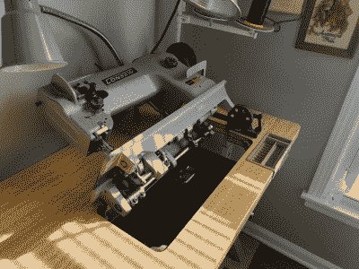
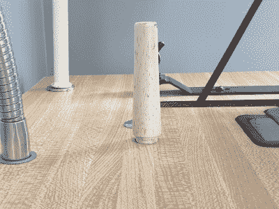
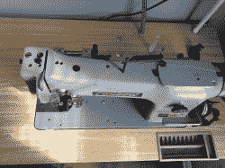
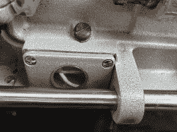
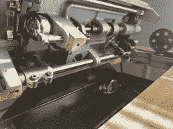
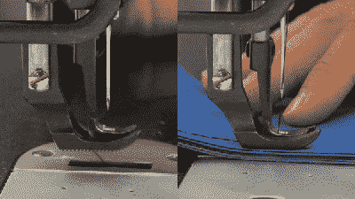
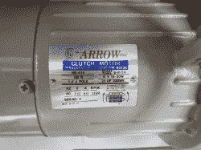
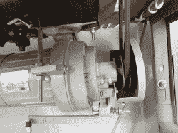
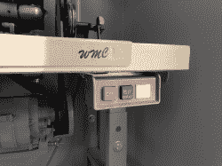

# 工业缝纫机:收购

> 原文：<https://hackaday.com/2022/02/08/industrial-sewing-machine-acquired/>

好了，结束了。在 Craigslist 上搜索了几个星期，和一个聪明的陌生人打了一个小时的电话，讨论另一台不符合我需求的机器，在卖家和我等待无意的 COVID 曝光的两个星期后，我自豪地成为了一台老式 Consew 206RB-3 工业缝纫机的新主人。

到目前为止，这正是我想要的——至少有几十年的历史，外形体面，由一家知名制造商制造，它有一个离合器电机，如果我愿意，我可以升级为伺服电机。我甚至喜欢头的颜色，桌子，还有藏在左边的小抽屉。康妮·康索太完美了！

## 显然不便于携带

互联网是对的——这些东西很重。根据手册，仅机头就重达 25.5 千克(56 磅)。马达可能重 50-60 磅。有一个小木钉从桌子上伸出来，每当它向后倾斜进行维护或更换线轴时，它的作用就是固定机头。我承认一开始我并不相信这个小钉子，但是它在一个直径约一英寸的接触点上很好地支撑了所有重量。

Under the hood.

Peg, it will come back to you.

即便如此，向我买机器的那位好心的女士主动提出把它送到我家，好像它什么都不是一样。我丈夫和我去看它时做的第一件事就是试着抬起桌子。对我们来说不是这样。但是通过肩扛式手推车的魔力和重力物理学，卖家和她的丈夫把这个东西飘到了他们的拖车上，然后开着它穿过城镇回到了我家。

## 低了一夸脱

我们去参观一下，好吗？你可能以前见过缝纫机，但它与工业机器有一些明显的不同。最大的一个就是润滑。然而，一般家庭的使用手册会告诉你每隔几个月在线轴区域滴一滴百合白色缝纫机油，即使频繁使用，工业机器也需要频繁地在几十个地方上油。除此之外，底部还有一个小油箱，可以装大约一盎司的油。这台机器有一个油盘，但它不是用来装满油的——它只是收集油并从加油点滴下的地方。然而，一些机器的油底壳中有一个泵和一条加注管。

说来也怪，我去检查的时候，这台机器一开始并没有去。马达运转良好，但手轮纹丝不动，踏板也不起作用。我建议加油。在所有的港口加满油后，她又开始移动了。显然它已经坐了一会儿了。没关系，因为这意味着我在清洗和重新上油的时候会变得非常熟悉它。

See those holes with red paint? All of those get oil.

There’s a tank in the underside. It was totally empty.

The black thing is the oil pan.

## 这只脚是为行走而生的

Image via [Sailrite](https://www.sailrite.com/Comparing-Sewing-Machine-Feeding-Mechanisms)

这是一个复合步行机。我们来分析一下。“行走的脚”意味着脚——将织物固定在床上的多种多样且可互换的部件——有一组送布牙，在常规送布牙从下方送布的同时，帮助从上方推动织物。“复合”部分指的是中间的小点，它与针同时上下移动，也带动织物前进。

[下面是对下落式、步行式和复合步行式机器之间的区别的生动解释](https://www.sailrite.com/Comparing-Sewing-Machine-Feeding-Mechanisms)。复合步行机非常适合我的需要，因为它们可以通过多层厚织物实现均匀缝合，这是我缝制乙烯、帆布和皮革所需要的。就像我在[的第一篇文章](https://hackaday.com/2022/01/04/what-you-should-know-before-buying-an-industrial-sewing-machine/)中所说的，工业机器是专门制造的。这是重型使用，它花了很多年做室内装潢工作。它甚至做了一个摩托车座椅！

## 不过那个马达

家用标准缝纫机的马达非常小，大约只有拳头大小。即使是我的“重型”歌手 4452 中的马达，它应该比普通家用马达多 50%的功率，与康妮·康索的马达相比也是相当小的。这是一个 1/2 马力的离合器马达。我手上的操作说明是针对 206RB-4 的，我真的不确定 206RB-3 和-4 之间有什么区别，尽管我怀疑它们很小。根据说明书，它每分钟能缝 3300 针！看它跑得多快:

 [https://www.youtube.com/embed/gP2-4eJYwsk?version=3&rel=1&showsearch=0&showinfo=1&iv_load_policy=1&fs=1&hl=en-US&autohide=2&wmode=transparent](https://www.youtube.com/embed/gP2-4eJYwsk?version=3&rel=1&showsearch=0&showinfo=1&iv_load_policy=1&fs=1&hl=en-US&autohide=2&wmode=transparent)

因为是离合电机，通电就连续运转，即使不缝纫也是如此。声音也很大，虽然没有我想象的那么大。尽管如此，我会很高兴把它换成一个更安静、更容易调节速度的伺服电机。不过，我会想念那些很酷的控制器按钮的。也许我可以把马达用在别的地方，比如卡丁车。只需要一个逆变器。

Weird there’s no HP info.

The business end.

So satisfying!

## 多花几美元

尽管我真的很喜欢这台机器，但我还是想做一些升级。他们中的许多人都在效仿[Eric Strebel]对他的工业普法夫所做的——将踏板向右移动更多，将离合器马达换成伺服马达，并用包含许多小 led 的东西来增强内置灯。

我将试着更换膝盖升降器上的衬垫，膝盖升降器将压脚从正常向下的位置抬起。虽然它没有任何问题，但外面都是裂纹和片状。我已经调查过了，看来我得买下整个膝盖升降器组件。也许我会为它做一个浴帽式的小沙发套。我还想买一条链带，因为它们看起来很酷，尽管这可能不是一个好主意。我得去当地的缝纫机店看看他们是怎么想的。

## 缝什么？

现在我有了这个宝贝，我可以更容易、更快地做出更好的包和背包。我甚至可以开始用皮革做东西。我计划和康妮·康索一起开始我的缝纫之旅，先做一个歌手 4452 处理不了的半成品包。但首先，我要检查一下，给她调整一下，确保她有足够的油。