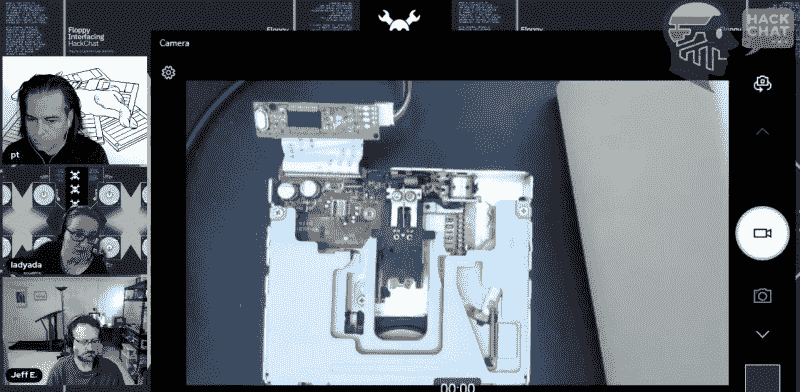

# Adafruit Hack Chat 帮助您复制软盘

> 原文：<https://hackaday.com/2022/02/04/adafruit-hack-chat-helps-you-copy-that-floppy/>

你可能认为 3.5 英寸软盘的时代已经结束，当然，你是对的。但是这以前什么时候阻止过黑客呢？仅仅因为这些磁盘不再生产并不意味着你找不到它们，或者合适的驱动器不容易得到。事实上，正如[【lady ada】在本周*与 Adafruit*](https://hackaday.io/event/183426-floppy-interfacing-hack-chat-with-adafruit) 的软驱接口黑客聊天中解释的那样，持续的芯片短缺意味着追踪这样的旧硬件往往比追踪现代微控制器和其他高科技组件更容易、更便宜。

 勇敢的黑客在当地旧货店捡到一盒随机软盘和一个积满灰尘的旧硬盘，等待他的是什么？超乎你的想象。随着聊天的进行，越来越明显的是，这些古怪的过时技术很难使用。一方面，有比你可能考虑的更多的格式，令人恼火的是，不是所有的驱动器都能够读取所有类型(即使他们说他们可以)。这意味着在一个驱动器上看似无用的磁盘在另一个驱动器上可能工作得非常好，这就是为什么 Adafruit 的团队建议如果你想最大限度地提高成功的机会，就准备一些磁盘。

现在棘手的部分来了:除非你碰巧有一台 20 世纪 90 年代的老式电脑，否则连接这些驱动器绝对不是小事。这就是为什么 Adafruit 一直在研究如何将驱动器与现代微控制器连接起来。[这包括 Adafruit_Floppy 项目](https://github.com/adafruit/Adafruit_Floppy)，该项目旨在将众所周知的 Greaseweazle 和 FluxEngine 固件移植到像 Raspberry Pi Pico 这样的平价 MCU 上。随着[为 CircuitPython](https://blog.adafruit.com/2022/01/11/native-floppy-disk-support-coming-soon-to-circuitpython/) 带来本地软盘支持，也有了令人鼓舞的发展，这将使读取这些磁盘像写几行代码一样容易。

但是等等，这肯定是一个已经解决的问题吗？为什么不从我们都讨厌的在线零售商 A to Z 那里买一个便宜的 USB 软驱呢？不幸的是，这些小工具是一个大杂烩。[Ladyada]在相机上拉开一个，以显示你实际上得到的是一个新的旧库存笔记本电脑软盘驱动器，连接到一个狡猾的专用芯片，连接到原来的 26 针柔性电缆，并提供一个 USB 接口。如果不是因为芯片对读取哪种磁盘非常挑剔，那就太好了。如果你只是担心 bog 标准 IBM 格式的磁盘，它们可以在紧要关头工作，但就像他们说的，你得到你所支付的。

那么这一切都只是学术吗？2022 年真的有什么*理由*用软盘吗？Adafruit 公司的优秀员工会说，从一系列磁通量变化中读取有用数据的必要技能很可能在未来以意想不到的方式派上用场。但即使没有，也至少有一个很好的理由来培养可靠地从这些曾经无处不在的存储设备中读取所需的技术:[在这些磁盘上存储的数据总是屈服于所谓的“比特腐烂”并可能消失在历史中之前归档这些数据](https://hackaday.com/2021/11/23/cracking-open-the-prince-floppy-after-the-purple-reign/)。

 [https://www.youtube.com/embed/KQvzZKNvRM0?version=3&rel=1&showsearch=0&showinfo=1&iv_load_policy=1&fs=1&hl=en-US&autohide=2&wmode=transparent](https://www.youtube.com/embed/KQvzZKNvRM0?version=3&rel=1&showsearch=0&showinfo=1&iv_load_policy=1&fs=1&hl=en-US&autohide=2&wmode=transparent)

* * *

Hack Chat 是一个每周一次的在线聊天会议，由来自硬件黑客世界各个角落的顶尖专家主持。对于黑客来说，这是一种有趣和非正式的联系方式，但如果你不能直播，这些概述帖子以及发布到 Hackaday.io 的文字记录可以确保你不会错过。