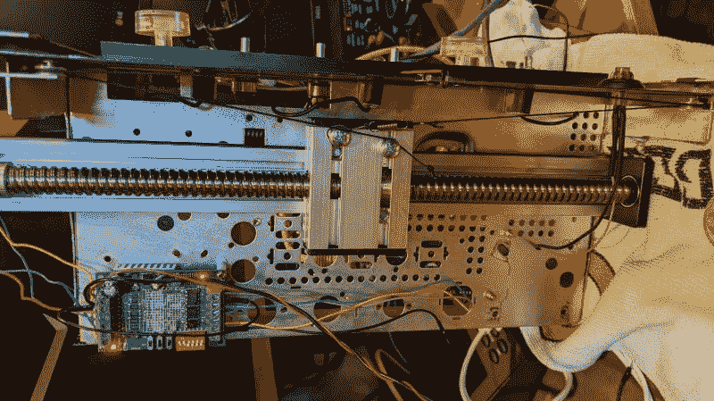

# 20 世纪 60 年代的立体声控制台得到升级

> 原文：<https://hackaday.com/2022/02/05/1960s-stereo-console-gets-an-upgrade/>

面对一台 20 世纪 60 年代的老式控制台音响，它几乎没有什么功能，[Sherman Banks]又名 W4ATL 决定[升级它的内脏，同时尽可能保持它的外观接近原版](https://shermanbanks.net/f/vintage-penncrest-stereo-console-upgrade)。这套音响是一件红木家具，包含一个 AM/FM 立体声接收器和 JCPenny 的 Penncrest 系列的自动转盘。据 best [Sherman]判断，这很可能是一款 1965 年的车型。旧的电子设备变得越来越难修理，调谐器每 15 分钟就会偏离基站。他不想扔掉它，所以他决定更换所有的内脏。

第一件事是拆除旧的电子设备，同时保留底盘本身。娱乐中心的新心脏是一台现代的 Denon AV 立体声接收机。该单元可以通过以太网控制，具有无线电调谐器、SiriusXM 输入和转盘，并支持蓝牙流。[Sherman] next 更换了 1965 年的转盘，然后将注意力转向连接控制和指示器。

电位计被替换为等效的低电阻电位计，霓虹灯立体声指示器被替换为 LED，但线性调谐刻度盘被证明是近两个月的挑战，并导致了一个很酷的黑客。简而言之，他将一个光学旋转编码器连接到调谐钮上，并使用一个带有线性致动器的步进电机来控制刻度盘指示器。所有这些都由 Arduino Mega 2560 控制，它有三个 I/O 和 LAN 屏蔽。但是还有一个问题——没有真空管预热，收音机会在通电后立即播放。[Sherman]通过对 Arduino 进行编程，以与原始电子管接收器相同的速率缓慢提高音量，解决了这个问题。最后，他在角落里安装了一个小型 HDMI 监视器，显示来自 Denon 接收器的辅助信息和元数据。

看看休息时间下面的视频。我们在过去写过几个类似的改造:【2018 年的这个也是 Penncrest ，去年[的这个 COVID 隔离项目强调增加一个新的酒柜](https://hackaday.com/2020/05/30/this-old-console-stereo-hides-a-liquor-cabinet/)。

 [https://www.youtube.com/embed/wLKlO0M1T0c?version=3&rel=1&showsearch=0&showinfo=1&iv_load_policy=1&fs=1&hl=en-US&autohide=2&start=68&wmode=transparent](https://www.youtube.com/embed/wLKlO0M1T0c?version=3&rel=1&showsearch=0&showinfo=1&iv_load_policy=1&fs=1&hl=en-US&autohide=2&start=68&wmode=transparent)

 [https://www.youtube.com/embed/2eQWsOK2KII?version=3&rel=1&showsearch=0&showinfo=1&iv_load_policy=1&fs=1&hl=en-US&autohide=2&wmode=transparent](https://www.youtube.com/embed/2eQWsOK2KII?version=3&rel=1&showsearch=0&showinfo=1&iv_load_policy=1&fs=1&hl=en-US&autohide=2&wmode=transparent)

