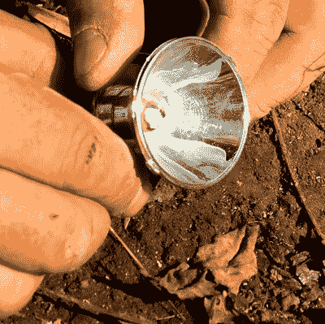

# 25 美元的露营:旧货店出租保持舒适

> 原文：<https://hackaday.com/2022/02/05/camping-for-25-thrift-store-hacks-to-keep-cozy/>

黑客是指总是创造性地思考来解决问题的人，通常使用他们手头的东西。有时候，这意味着使用 555 来构建 CPU，而其他时候，这意味着使用一个死手电筒来点火。在休息时间下面的视频中， [[Kelly]向我们展示了一系列技巧](https://www.youtube.com/watch?v=E0TqnWCuj1U)，你可以在树林中露营一夜，让自己保持温暖、干燥和充足的食物！

 【凯利】开始他的露营之旅不是在森林里，而是在当地的一家旧货店。他的目标是保持低成本，而不是携带数百美元的装备。非常低。经过一番搜寻，他找到了一条毯子、炊具、绳子、刀子、防水布和其他一些营地必需品，只花了 25 美元。

当然，一堆好的篝火是必不可少的，即使你只有一个没有丁烷的打火机或者一个没有电池的旧手电筒,[Kelly]也有很多生火的好方法。该视频的目的是展示任何人如何能够得到他们的布什工艺，即使他们只有几美元和一点知识，他慷慨地分享。看完之后，我们相信你会同意他达到了目标。

下次露营前，你会去逛逛当地的二手商店吗？看完这个视频，你可能会！当你在那里的时候，确保带上你需要的东西[制作你自己的露营友好型法国媒体](https://hackaday.com/2020/02/10/a-french-press-you-can-take-out-camping/)，这样当你[开着你的……嗯……卡罗拉](https://hackaday.com/2017/12/09/camping-in-a-corolla/)出去露营的时候，你就可以喝一些好咖啡了？

 [https://www.youtube.com/embed/E0TqnWCuj1U?version=3&rel=1&showsearch=0&showinfo=1&iv_load_policy=1&fs=1&hl=en-US&autohide=2&wmode=transparent](https://www.youtube.com/embed/E0TqnWCuj1U?version=3&rel=1&showsearch=0&showinfo=1&iv_load_policy=1&fs=1&hl=en-US&autohide=2&wmode=transparent)

