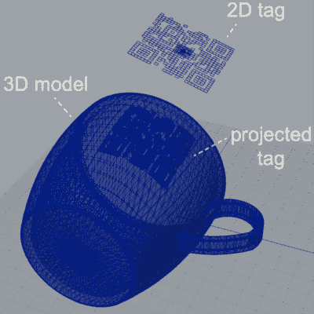

# 不可见的 3D 打印代码使物体互动

> 原文：<https://hackaday.com/2022/02/08/invisible-3d-printed-codes-make-objects-interactive/>

麻省理工学院的一个有趣的研究项目表明[仅仅使用一台 FDM 打印机和一根对红外线透明的灯丝就可以将机器可读的标签嵌入 3D 打印物体](https://news.mit.edu/2022/invisible-labels-identify-track-objects-0128)。这种方法被称为*红外线标签；*通过将类似于[二维码](https://hackaday.com/2018/11/05/a-qr-code-step-by-step/)或 [ArUco 标记](https://docs.opencv.org/4.x/d5/dae/tutorial_aruco_detection.html)的东西嵌入到一个物体的结构中，这种标签可以被相机检测到，互动的可能性就出现了。

一个简单的概念验证是将无线路由器的 SSID 嵌入到设备的侧面，将密码嵌入到底部的不同代码中，以确保需要物理访问才能获得密码。普通对象可以嵌入元数据，或者为增强现实功能提供标记，如在 3D 中跟踪对象。

代码实际上是如何嵌入的？使用合适的工具，这个过程非常简单。该团队使用了供应商 [3dk.berlin](https://3dk.berlin/) 的一种特殊灯丝，这种灯丝在可见光谱中看起来几乎不透明，但在红外光谱中大约透射 45%。通过使用 IR PLA 和空气间隙的组合来表示代码的几何形状，或者通过使用 IR PLA 和常规(非 IR 透射)PLA 进行多材料印刷，机器可读标签被嵌入印刷物体的壁内。两者都为红外敏感相机提供了足够的对比度来检测标签，尽管多材料版本的整体效果略好。可悲的是，普通的手机摄像头本身对红外不够敏感，无法被动读取这些嵌入的标签，所以这项研究使用了容易获得的没有红外阻挡滤波器的摄像头，如 Raspberry Pi NoIR。

对于那些想了解更多信息的人来说，PDF 有更深入的实施细节，您可以在下面嵌入的视频中看到一些不同应用的演示。[确定 3D 打印物体的来源](https://hackaday.com/2019/03/12/no-your-3d-printer-doesnt-have-a-fingerprint/)是业内一些争论的话题，不难看出像这样的技术可以用来秘密识别物体而不损害它们的外观。

 [https://www.youtube.com/embed/Tjs1zH7IMxE?version=3&rel=1&showsearch=0&showinfo=1&iv_load_policy=1&fs=1&hl=en-US&autohide=2&wmode=transparent](https://www.youtube.com/embed/Tjs1zH7IMxE?version=3&rel=1&showsearch=0&showinfo=1&iv_load_policy=1&fs=1&hl=en-US&autohide=2&wmode=transparent)

