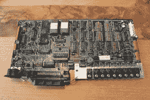
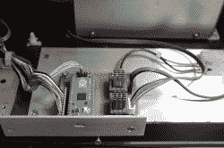

# CX-6000 笔式绘图仪升级

> 原文：<https://hackaday.com/2022/02/10/cx-6000-pen-plotter-upgrade/>

[Terje Io]决定给一台旧的笔式绘图仪注入新的活力 C. Itoh 的 CX 6000,这家日本公司在 20 世纪 80 年代为苹果生产了几台打印机。他保留了大部分框架，但电子设备进行了重大检修。旧的电机被取代，控制器和电机驱动器是现代化的使用树莓派和步进电机驱动器。在处理完控制面板和限位开关等其他辅助电子设备后，是时候处理固件了。

Original Controller Board

Updated Controller Board

与其重新发明轮子，[Terje]不如明智地构建现有的项目，并为他的应用重构它们。g 代码处理由 [grblHAL](https://www.grbl.org/what-is-grblhal) 完成，增加了处理 HPGL 代码的模式。他修改了来自*motri 绘图仪*项目的固件来解析 HPGL，使他的新 CX6000+成为双语的。

早在 2009 年我们就报道过[motri，最近我们写了关于](http://sensi.org/~svo/motori/)[使用 grblHAL](https://hackaday.com/2020/11/11/teensy-controller-for-powerful-cncs/) 的青少年控制器，GRBL 的 32 位老大哥之一。你修复过这些老绘图仪吗？还是说现在自己造一个更容易？