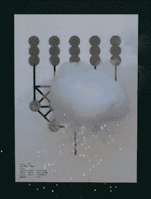

# 烟火海报是画在纸上的烟火

> 原文：<https://hackaday.com/2022/02/11/pyrotechnic-posters-are-fireworks-drawn-on-paper/>

许多人对火有一种深深的爱；它经常被认为是导致文明建立的最重要的发现之一。[法国艺术组合【Pinaffo-Pluvinage】](https://pinaffo-pluvinage.com/Affiches-Artif)的作品肯定会想到这一点，将烟火与纸张结合起来，制作出可能是你见过的最令人兴奋的海报， *Heise Online* 报道[。](https://www.heise.de/news/Pyrotechnik-auf-Papier-6333002.html)

The artworks are made with a variety of powders, including those for blue and red flames and one with a special “scintillating” effect.

海报并不大，50 厘米×70 厘米。然而，它们在尺寸上的不足，用字面上的火焰来弥补。是的，海报中掺有各种烟火粉末，一旦点燃，这些粉末就会以各种设计和图案燃烧，形成一个动态燃烧的艺术品。

因此，每张海报在视觉和易燃领域都是一件艺术品。艺术作品的不同部分以不同的速度燃烧，并带有不同颜色的火焰，增加了海报燃烧时的性能。令人印象深刻的是，艺术品在这个过程中没有被破坏；烟火材料燃烧时产生大量火焰和烟雾，但不会破坏海报本身。

把海报放在一起不是简单的涂鸦那么简单。两人必须开发自己的方法将烟火材料应用到纸上。据报道，这项工作进行了数百次实验才获得成功。

不烧掉整张海报的情况下，究竟是如何达到这种效果的还不清楚；有人怀疑可能使用了某种保护层。与闪光纸完全相反，闪光纸在燃烧中消耗纸张本身。

在任何情况下，烟花专家可能会对用于实现燃烧效果的化学物质有一些好的想法；如果你知道什么是什么，请在评论中大声说出来！

这些作品可以被解释为对所有事物的短暂性的评论，或者艺术家的意图可能是完全不同的。谁能说呢？休息后的视频。

[https://player.vimeo.com/video/622545913?h=bfd2864a8a&dnt=1&app_id=122963](https://player.vimeo.com/video/622545913?h=bfd2864a8a&dnt=1&app_id=122963)