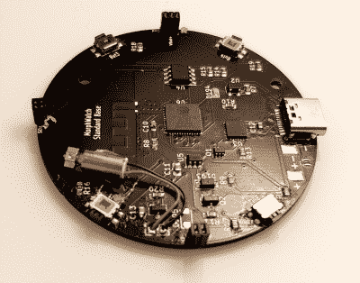
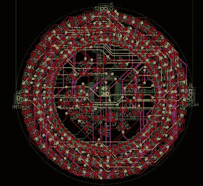

# 这款 ESP32 微型腕表有很大的潜力

> 原文：<https://hackaday.com/2022/02/12/this-esp32-pico-wristwatch-has-plenty-of-potential/>

First hand-built prototype. Nurse! isopropyl alcohol, stat!

多产的黑客[sulfold]白天是医生，晚上是电子爱好者，我们不知道他是如何找到时间的。

我们想要强调的项目是一款基于 [ESP32 的 LED 智能手表](https://hackaday.io/project/181159-the-603-200-watch)，我们相信你会同意，到目前为止看起来开发得非常好，当你深入研究[的 GitHub repo](https://github.com/ccadic/The603-200) 时，你可能会发现【Sulfuroid】有更大的计划。这种模拟风格的设计使用四组 0603 大小的 led，圆形排列，以指示时间的流逝，或任何你喜欢的东西。由于有四个控制按钮，一个扁平的振动电机，以及 Wi-Fi 和蓝牙，所以可能性是无穷的。

为了有希望从单个[ESP32-微微 D4](https://www.espressif.com/en/producttype/esp32-pico-d4) 驱动这 192 个 LED，有必要使用多路复用 LED 驱动器，这要归功于 [Lumissil IS31FL3733](http://www.lumissil.com/assets/pdf/core/IS31FL3733_DS.pdf) 设备，它可以处理多达 12 x 16 个设备的阵列。这个芯片是一个值得记住的，因为它有一些非常好的功能，如减少 CPU 开销的全局电流控制，那些花哨的褪色效果的自动呼吸循环，甚至包括一个方便的开路/短路检测功能，所以它可以报告组装问题，帮助返工你的危险焊接！

Routing circular arrays is such a pain.

电源和接口通过 USB-C 处理，由 TP4054 单锂离子电池充电器芯片处理电池。这是广受欢迎的 LTC 4054 的台湾克隆版，但目前这种芯片可能有点难买到。有一个普通的 USB 芯片 CP2104 处理仿真串口方面的事情，因为出于某种原因，ESP32 仍然不支持 USB。Pico-D4 确实有 RTC 支持，但是[sullo id]决定使用一个 [DS3231M](https://datasheets.maximintegrated.com/en/ds/DS3231M.pdf) RTC 芯片来代替。我们注意到触控功能没有被突破——这可以在下一个版本中轻松添加！

我们已经涵盖了很多手表，因为谁不想要定制的极客服装！这里是[一个光滑的](https://hackaday.com/2019/12/04/led-matrix-watch-is-the-smart-watch-we-didnt-know-we-wanted/)，一个有趣的[展示大脑](https://hackaday.com/2020/01/05/arduino-wristwatch-has-led-hands/)，最后是[一个使用 charlieplexing](https://hackaday.com/2019/08/22/returning-digital-watches-to-the-analog-age-enter-the-charliewatch/) 来减少组件数量。