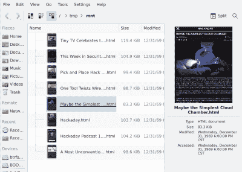

# Linux Fu:融合黑客日

> 原文：<https://hackaday.com/2022/02/16/linux-fu-fusing-hackaday/>

Unix 和 Linux 都有一个让一切看起来像文件的咒语。文件，当然，看起来像文件。而且设备、网络套接字甚至系统信息都以文件的形式出现。这样做有很多好处，因为你可以使用所有好的工具，比如`grep`和`find`来处理文件。然而，让您自己的程序公开文件系统可能很难。文件系统代码传统上在内核模块级工作，在那里错误会毁掉很多东西，调试也很困难。然而，FUSE——用户空间库中的文件系统——允许您编写或多或少普通的代码，并将任何您想要的东西作为文件系统公开。你可能见过 FUSE 通过 ssh 或 Dropbox 安装远程驱动器。我们以前甚至看过 FUSE，甚至是 Windows 的[。](https://hackaday.com/2021/08/31/linux-fu-user-space-file-systems-now-for-windows-too/)

当然，缺少的是 Hackaday RSS 提要，它可以作为普通文件挂载。这就是我们今天要建造的。

[](https://hackaday.com/wp-content/uploads/2022/02/mount.png) 写一个 FUSE 文件系统并不难，但是有很多繁琐的工作。当操作系统要求时，你必须提供 FUSE 用来做事情的回调。打开文件、读取文件、列出目录等。问题是，对于一些简单的项目，这些东西你一半都不在乎，但还是要提供。

幸运的是，有一些图书馆可以让这变得容易得多。我将向您展示一个简单的 C++程序，它可以将您最喜欢的 RSS 提要(当然，假设您最喜欢的是 Hackaday)挂载为文件系统。当然，这并不令人惊讶，但是能够从命令行浏览首页故事或者使用 Dolphin 查看最近的几篇文章还是很不错的。

## 挑选一个图书馆

FUSE 周围有大量的库和包装器。我在 [GitHub](https://github.com/jachappell/Fusepp) 上选了一张【jachappell】的。这是非常简单的，隐藏了足够的引信，方便使用，但不是一个问题。所有的代码都藏在`Fuse.h`里。

需要注意的一点是，这个库假设你使用的是`libfuse` 3.0。如果你还没有它，你必须从你的包管理器安装`libfuse` 3.0 开发包。当然，还有其他的库可供选择，你可以只写底层的`libfuse`实现，但是一个好的库可以让入门变得简单得多。

为了简单起见，我[在 GitHub](https://github.com/wd5gnr/Fusepp) 上分叉了原来的项目，并添加了一个 [fusehad](https://github.com/wd5gnr/Fusepp/tree/master/fusehad) 目录。

## 限制

为了简单起见，我决定不要太担心性能。由于数据是通过网络传输的，所以我会尝试缓存它，并且不会在以后刷新数据。当然，您根本不能写入文件系统。这纯粹是为了阅读 Hackaday。

这些约束使事情变得更容易。当然，如果您正在编写自己的文件系统，您可能会放松其中的一些，但它仍然有助于首先获得尽可能简单的工作。

## 首先让它工作

说到这里，首先要做的是能够阅读 Hackaday RSS 提要，并提取出我们需要的部分。同样，不担心性能，我决定用管道并调用`curl`来实现。是的，这是欺骗，但它工作得很好，这就是为什么我们首先有工具。

`HaDFS.cpp`文件有一些与 FUSE 相关的函数和一些辅助函数。然而，我想专注于让 RSS 提要工作，所以我将相关代码放入我自己编写的名为`userinit`的函数中。我艰难地发现给它取名`init`会和图书馆冲突。

正常的 FUSE 系统处理您的命令行参数——这是一件好事，您很快就会看到。所以`HaD.cpp`中的 main 其实很简单:

```

#include <stdio.h>
#include "HaDFS.h"
int main(int argc, char *argv[])
{
  HaDFS fs;
  if (fs.userinit())
  {
    fprintf(stderr,"Can't fetch feed\n");
    return 99;
  };
  int status;
  status= fs.run(argc, argv);
  return status;
}

```

然而，现在，我只是简单地注释掉了调用`fs.run`的那一行。这给我留下了一个简单的程序，它只调用`userinit`。

阅读提要并不难，因为我正在应征入伍。每个主题都在一个结构中，并且有这些结构的数组。如果你试图加载太多的故事，代码会悄悄地丢弃多余的内容(见`MAXTOPIC`)。`topics`全局变量告诉我们实际加载了多少故事。

```

// The curl line to read our feed
static char cmd[]="curl https://hackaday.com/feed/ 2>/dev/null | egrep '(<title>;)|(<link>)'";
// User initialization--read the feed (note that init is reserved by the FUSE library)
int HaDFS::userinit(void)
{
   FILE *fp;
   char buf[1024]; // working buffer for reading strings
   if (!( fp = popen(cmd,"r") )) return 1; // open pipe
   while ( fgets(buf,sizeof(buf),fp) )
     {
     string line = buf;
     line = trimrss(line); // trim off extra stuff
     if ( line.substr(0,7) == "<title>" ) // identify line type and process
        {
        topic[topics].title = line.substr(7);
        topic[topics].title += ".html";
        }
    else if (line.substr(0,6)=="<link>")
        {
        topic[topics].url = line.substr(6);
        topics++;
        if ( topics == MAXTOPIC ) break; // quietly truncate a long feed
        }
    }
   pclose(fp);
   return 0;
} 

```

`popen`函数运行一个命令行，并将`stdout`流作为一串行提供给我们。处理这些行只是蛮力寻找<标题>和<链接>来识别我们需要的数据。顺便说一下，我通过`grep`过滤了`curl`,以确保我没有得到很多额外的行，并且我假设是小写的，但是一个`-i`选项可以很容易地解决这个问题。重定向是为了防止`curl`污染`stderr`，尽管通常 FUSE 会断开输出流，所以这并不重要。请注意，我为每个假文件名添加了一个 HTML 扩展名，这样打开一个文件名就更有可能到达浏览器。

通过在代码中放入一个`printf`，我能够确保提要获取以我期望的方式工作。注意，我直到过程的后期才获取实际的页面。现在，我只想要标题和 URL 链接。

## 四大功能

我们需要在子类中创建四个函数来获得最小的只读文件系统:`getattr`、`readdir`、`open`和`read`。这些函数很大程度上实现了您的预期。对于我们的根目录(也是唯一的目录)，这个`getattr`调用将返回 755，对于任何其他存在的文件，将返回 444。`readdir`输出条目。和..连同我们的“文件”`Open`和`read`做你认为他们会做的事情。

还有一些其他的功能，但这些是我为了帮助自己而添加的:

*   `userinit`–调用以启动文件系统数据
*   `trimrss`–修剪 RSS 行，使其更容易解析
*   `pathfind`–将文件名转换成描述符(主题数组的索引)
*   `readurl`–返回包含 URL 内容的字符串(使用 curl)

没什么大不了的。您将在代码中看到，有一些事情需要注意，比如发现有人试图写入文件，因为这是不允许的。

## 调试和命令行选项

当然，不管有多简单，第一次都不会成功，不是吗？当然，首先，你必须记住将对`fs.run`的调用放回主函数中。但是，当然，事情不会像你期望的那样运行，原因有很多。在运行和调试时，有一些事情需要记住。

当您构建可执行文件时，您只需运行它并提供一个命令行参数来指定挂载点，当然，挂载点应该存在。我有在调试时使用`/tmp/mnt`的习惯，但它可以在你有权限的任何地方。

在正常操作下，FUSE 会分离你的程序，所以你不能直接杀死它。您需要使用 unmount 命令(`fusermount -u`)并将挂载点作为参数。即使您的程序因段错误而终止，您也需要使用 unmount 命令，否则您可能会得到可怕的“断开端点”错误消息。

脱离导致了一个问题。如果你把`printf`语句放在你的代码中，它们在分离后将永远不会出现。出于这个原因，FUSE 理解`-f`标志，它告诉系统让您的文件系统在前台运行。然后，您可以看到消息和一个干净的退出，如 Control+C，将干净地卸载文件系统。你也可以使用`-d`，它支持一些内置的调试并隐含了`-f`。`-s`标志关闭线程，这可以使调试更容易，或者在处理与线程相关的问题时更难。

你可以用`gdb`，有一些[关于那方面的好文章](https://blog.jeffli.me/blog/2014/08/30/use-gdb-to-understand-fuse-file-system/)。但是对于这样一段简单的代码来说，这并不是真正必要的。

## 下一步是什么？

该库的文档几乎什么都没有。然而，这个库很好地镜像了`libfuse` API，所以它的文档(大部分在 [fuse.h](http://libfuse.github.io/doxygen/fuse-3_810_84_2include_2fuse_8h.html) 中)将帮助你更进一步。如果你想从 FUSE 毕业到一个“真正的”文件系统，你还有很长的路要走。下面的视频给出了 Linux VFS 的一些背景，但这仅仅是开始。

 [https://www.youtube.com/embed/J4qWNNISdJk?version=3&rel=1&showsearch=0&showinfo=1&iv_load_policy=1&fs=1&hl=en-US&autohide=2&wmode=transparent](https://www.youtube.com/embed/J4qWNNISdJk?version=3&rel=1&showsearch=0&showinfo=1&iv_load_policy=1&fs=1&hl=en-US&autohide=2&wmode=transparent)


可能会坚持一段时间。如果你喜欢 Python，[没问题](https://hackaday.com/2013/11/06/writing-a-fuse-filesystem-in-python/)。FUSE 非常流行将[云存储映射到您的文件系统](https://hackaday.com/2020/11/10/linux-fu-send-in-the-cloud-clones/)，但是使用您自己的编码，您可以很容易地暴露您的 Arduino 或您的计算机可以与之通信的任何东西。