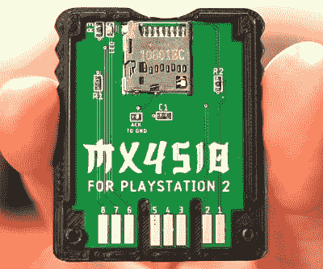

# PS2 存储卡 ISO 加载器提供经典的游戏幸福

> 原文：<https://hackaday.com/2022/02/15/ps2-memory-card-iso-loader-offers-classic-gaming-bliss/>

过去，要玩主机游戏，你只需插上盒式磁带或将 CD/DVD 放入光驱。但是现在，随着现代游戏膨胀到高达 100 GB，你别无选择，只能将它们存储在系统的内部硬盘驱动器上。虽然这可能会导致一些不舒服的数据管理决策，但至少这意味着你不必再从沙发上起来切换游戏了。

这也正是 PlayStation 2 的 MC2SIO 项目如此令人兴奋的原因。正如[【蒂托】在他最新的](https://www.youtube.com/watch?v=3fqhS1QuGcs)
[*Macho Nacho Productions*视频](https://www.youtube.com/watch?v=3fqhS1QuGcs)中解释的那样，这个简单的适配器可以让你将 SD 卡连接到游戏机的存储卡插槽，并使用它来保存你最喜欢的游戏的 iso。随着适当的自制软件加载，你的 PS2 成为一个名副其实的经典游戏点唱机。

Connecting the SD card to the SPI-compatible interface is easy.

现在，在 PS2 装载 ISOs 已经不是什么新鲜事了。最初的 PS2 的所有者可以在系统的扩展舱中安装 IDE 驱动器，并以这种方式玩游戏，即使你有后来的“超薄”版游戏机，删除了扩展功能，你也可以将你的游戏宝藏放在 USB 闪存驱动器上。

但是现在 IDE 驱动器的选择越来越少，PS2 的 USB 1.1 端口的可用带宽只能满足游戏数据流的任务，在一些游戏中可能会出现问题。相比之下，SD 卡便宜得离谱，存储卡接口实际上比游戏机的 USB 端口快得多。

在硬件方面，事情出乎意料地简单。PS2 使用名为 SIO2 的串行接口与控制器和存储卡等外设进行通信，这恰好与 SPI 兼容。这意味着物理适配器不需要任何有源组件，只需要连接适当的引脚。所有的魔法都是在软件中完成的，由于现有的项目可以让你从一个特殊格式的存储卡中运行自制代码，你可以在一个完全库存的控制台上运行所有的东西。

现成的 SD 适配器售价为 20 美元，但令人惊讶的是，它们目前已经脱销。也就是说，据报道，这种适配器可以由一种牺牲性存储卡制成，而且[Tito]在解释软件方面做得非常出色。因此，如果你现在绝对必须用 SD 卡玩*卡塔玛丽·达马西*，你或许可以毫不费力地组合出自己的版本。

就像去年发现的最初 PlayStation 的[软件漏洞一样，我们总是很高兴地看到黑客们仍然在这些旧系统上不停地工作。即使在发布 20 多年后，人们仍然在寻找新的方法来使硬件服从他们的意愿。](https://hackaday.com/2021/03/15/playstation-unlocked-with-new-software-hack/)

 [https://www.youtube.com/embed/3fqhS1QuGcs?version=3&rel=1&showsearch=0&showinfo=1&iv_load_policy=1&fs=1&hl=en-US&autohide=2&wmode=transparent](https://www.youtube.com/embed/3fqhS1QuGcs?version=3&rel=1&showsearch=0&showinfo=1&iv_load_policy=1&fs=1&hl=en-US&autohide=2&wmode=transparent)

