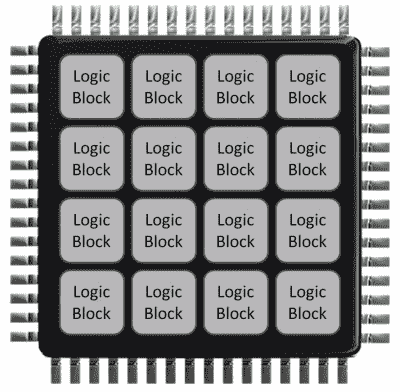

# FPGA 入门视频有助于缓和学习曲线

> 原文：<https://hackaday.com/2022/02/17/fpga-starter-videos-to-help-soften-that-learning-curve/>

Digi-Key 制作 YouTube 视频已经很多年了，如果你不知道，它们绝对值得观看一段时间。[我们在这里强调的播放列表](https://www.youtube.com/watch?v=lLg1AgA2Xoo&list=PLEBQazB0HUyT1WmMONxRZn9NmQ_9CIKhb)很好地介绍了 FPGAs，特别是那些由开源工具支持的低成本硬件。如果你一直想进入黑客 FPGA 平台，但不知道从哪里开始，这将是一个很大的帮助。在首先介绍了 FPGA 是什么和不是什么，以及为什么要使用 FPGA 之后，[Shawn Hymel]将深入到工具链中。

我们真的很幸运，Lattice iCE40 的比特流是由超级天才 Claire(née Clifford)Wolf(AMP hour interview)逆向工程的，这使得[项目 ICEstorm toolchain](https://github.com/YosysHQ/icestorm) 得以创建。利用 [Yosys](http://yosyshq.net/yosys/) 进行合成和逻辑映射， [Icarus verilog](http://iverilog.icarus.com/) 与 [GTKwave](http://gtkwave.sourceforge.net/) 进行仿真， [netpnr](https://github.com/YosysHQ/nextpnr) 进行布局和布线，最后是项目 ICEstorm 比特流工具，用于打包成 iCE40 格式并加载到硬件上。为简单起见，整个工具链流程由 [APIO](https://github.com/FPGAwars/apio) 管理，也就是说，前提是您的 FPGA 板受支持！

 当然，【肖恩】在这个教程系列中使用的是 Lattice 的低成本(对于 FPGA) [ICEStick](https://www.latticesemi.com/icestick) ，它们目前很难买到([你现在知道为什么了](https://hackaday.com/2021/05/24/ask-hackaday-how-is-the-chip-shortage-affecting-you/)！)但是，您可以使用许多其他的板。如果你想玩将 ARM 微处理器耦合到 FPGA 的应用，那么优秀的 [BlackIce Mx](https://www.tindie.com/products/folknology/blackice-mx/) 是一个选择，但现在有许多其他板在 FPGA 旁边放置了一个像样的微处理器和一些外设，以方便使用。

我们应该在这里提到，冰风暴项目和 iCE40 并不是镇上唯一展览。Project Trellis 已经吸引了我们一段时间，它的目标是更复杂的 Lattice ECP5 器件。Yosys 和朋友们确实支持更多的架构，但目前可用的流程通常需要至少一些供应商工具支持(直视你，Xilinx)，但随着更多设备被解码，开源工具将会增长，我们将为你带来消息！

这个 Digi-Key YT 系列的好处在于，它不仅涵盖了基本的工具链流程，还让您进入了一个大的学习曲线的最深处。视频涵盖的主题包括[有限状态机](https://en.wikipedia.org/wiki/Finite-state_machine)(FSM)、测试基准和仿真、使用嵌入式(块)存储器、PLL、更难的主题，如处理[亚稳态](https://en.wikipedia.org/wiki/Metastability_(electronics))和[时钟域交叉](https://en.wikipedia.org/wiki/Clock_domain_crossing)(好的，他涵盖了一种技术——有多种方法来为这只特殊的猫剥皮)，最后看一下软核，如 [RISC-V](https://hackaday.com/2021/02/27/exploring-the-open-source-that-really-goes-into-a-risc-v-chip/) 。要学的东西很多，而且如果你问我们的话，执行得很好！一个 [Github 版本可用，](https://github.com/ShawnHymel/introduction-to-fpga)给那些不能忍受看视频的人！

 [https://www.youtube.com/embed?version=3&rel=1&showsearch=0&showinfo=1&iv_load_policy=1&fs=1&hl=en-US&autohide=2&wmode=transparent&listType=playlist&list=PLEBQazB0HUyT1WmMONxRZn9NmQ_9CIKhb](https://www.youtube.com/embed?version=3&rel=1&showsearch=0&showinfo=1&iv_load_policy=1&fs=1&hl=en-US&autohide=2&wmode=transparent&listType=playlist&list=PLEBQazB0HUyT1WmMONxRZn9NmQ_9CIKhb)

感谢[Mark]的提示！