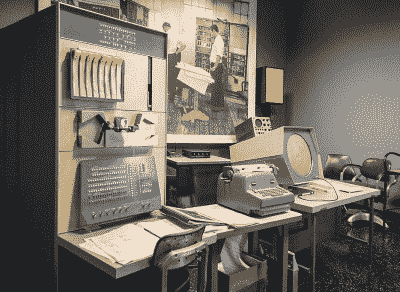

# 经典聊天:保存计算机历史

> 原文：<https://hackaday.com/2022/02/18/classic-chat-preserving-computer-history/>

在现代技术的许多方面中，很少有比计算机发展得更快或更彻底的。在不到一个世纪的时间里，它的本质发生了巨大的变化:今天的智能手机轻而易举地胜过了过去的台式电脑，这些电脑本身的功能比引领数字计算时代的房间大小的庞然大物强大数千倍。这项技术发展如此之快，以至于现在以开发 iPhone 应用程序为生的人很可能已经开始了他们的职业生涯，从事大量打孔卡的工作。

随着事情发展得如此之快，从历史的角度来看，很难确定什么是值得坚持的。去年的 Chromebook 有一天会成为博物馆藏品吗？你车库里的那些旧的 Lotus 1-2-3 软盘呢？在这样一个快速发展的领域里，决定什么样的文物值得保存只是加州山景城计算机历史博物馆(CHM)的高级策展人 Dag Spicer 面临的挑战之一。 [Dag 在 2019 年 6 月的 Hack Chat 上停下来](https://hackaday.io/event/165331-preserving-computer-history-hack-chat)谈论 CHM 和其他类似机构在为后代存储和保护计算历史方面的作用。

为了回答这个最紧迫的问题，即什么值得从垃圾填埋场拯救出来，达格说 CHM 在做决定前通常遵循他们所谓的“十年法则”。也就是说，在对某个特定的人工制品做出决定之前，至少需要十年的时间。他们认为这足够让事后来判断这个问题是否给计算机世界留下了持久的印象。请注意，这样的印象不一定总是正面的；CHM 认为“有趣的失败”的作品也进入了收藏，以及由于专利诉讼而变得重要的硬件。

当然，有时这条规则会被回避。Dag 指出 iPod 和 iPhone 的发布就是一个很好的例子。很明显，无论如何，苹果的大胆之举都将被载入计算机历史的史册，所以这些小玩意很快就被收入了收藏。回顾 2022 年的这个决定，很明显他们做出了正确的决定。当在聊天中被问及 Dag 对当代硬件是否有任何想法可以对计算世界产生类似的影响时，他指出了像谷歌张量处理单元这样的人工智能加速器。

除了硬件本身之外，CHM 还保存了一个蜉蝣的集合，用来捕捉那个时代的一些机构记忆。飞兆半导体(Fairchild Semiconductor)R&D 实验室的笔记本，或者英特尔名人 Andrew Grove 的手写文档，为一系列大铁和米色盒子带来了人情味。这些原始资料对于那些希望研究早期半导体或计算机发展的人来说尤其有价值，几位受访者表示，计算机历史博物馆的工作人员曾亲自协助他们完成这项任务。

在聊天快结束时，一位用户问，当我们有能力以高清晰度拍摄它们，制作它们内部的示意图，并在更强大的系统上模拟它们的功能时，为什么像 CHM 这样的组织要花费大量的费用将所有这些文物保存在气候控制的存储中。虽然 Dag 承认，如果你只担心软件方面的事情，仿真可能是一条出路，但他认为图像和图表不足以捕捉这些机器的真正本质。

The CHM’s PDP-1 Demo Lab, image by [Alexey Komarov](https://commons.wikimedia.org/wiki/File:DEC_PDP-1_Demo_Lab_at_Mountain_View%27s_Computer_History_Museum.jpg).

引用早期数字设备公司工程师戈登·贝尔的话，达格说这些计算机是“美丽的雕塑”，以一种不容易复制的方式“反映了它们创造的时代”。它们不仅代表了最先进的技术，还代表了它们发展的文化环境，每一个设计决策都考虑了从当代美学到材料可用性的各种变量。

虽然对计算机外壳的 3D 扫描和其内部组件的数字传真可以保留这些计算机中的一些工程元素，但它们永远无法捕捉到亲眼目睹真实事物的体验。任何一个小学生都能告诉你《蒙娜丽莎》长什么样，但这并不能阻止每年数百万人排队等候在卢浮宫观看。

* * *

Hack Chat 是一个每周一次的在线聊天会议，由来自硬件黑客世界各个角落的顶尖专家主持。对于黑客来说，这是一种有趣和非正式的联系方式，但如果你不能现场直播，这些概述帖子以及发布到 Hackaday.io 的[文字记录确保你不会错过。](https://hackaday.io/event/165331-preserving-computer-history-hack-chat)