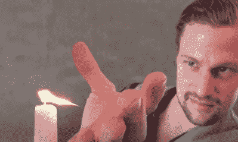
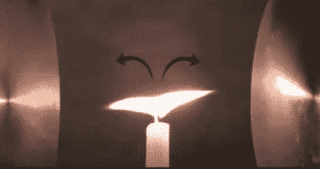

# Remoticon 2021 //杰伊·鲍尔斯投身于等离子厌恶者

> 原文：<https://hackaday.com/2022/03/03/remoticon-2021-jay-bowles-takes-a-dip-into-the-plasmaverse/>

每个黑客都熟悉特斯拉线圈的电击和嘶嘶声，或者神圣地球上闪电的撞击声和雷声。这些现象都与等离子体物理学有关，这是杰伊·鲍尔斯最关心的话题。因此，他在 Remoticon 2021 上做了一个启发性的演讲，带领我们进入*。*

 *杰伊对这个话题的热情是显而易见的，他十几岁时就爱上了高压物理学。他欣赏科学的有形性，无论是霓虹灯的光芒还是普通微波炉的加热魔力。他的演讲涵盖了他在过去 17 年里研究的实验和科学，以及在经营他的 [*等离子频道* YouTube 频道的过程中。](https://www.youtube.com/c/PlasmaChannel)

Physics!

这个演讲是进入高压实验世界的一个很好的开端，杰伊展示了高压科学的三个奇特应用。

第一个演示是人体静电悬浮。这需要通过 Cockroft-Walton 电压倍增器向身体施加-60，000 V 的非常高的静态电压，而 Jay 在凳子上与地面隔离。杰伊提醒观众，高电压本身对身体并不致命，强调了电流的作用。然后使用底板，设置在地电位以实现该效果。

随着电压的施加，一个轻型箔“船”将悬浮在盘子上方和杰伊的手下方。这是一个准稳定系统，很难维持，但是实验成功了，铝箔漂浮在空中。[Jay]然后介绍了这一切背后的科学，讨论了电荷关系和其他物理效应。细节是关键，这不仅解释了箔片如何漂浮，还解释了它如何保持在原位而不会朝一个方向飞去。

它只会变得更加奇特，杰伊重新利用电压倍增器和凳子来静电弯曲火焰。这是可能的，因为火含有许多正负离子，它们会受到电场的影响。这是他偶然发现的一种效应，他将一支燃烧的蜡烛放在高压倍增器附近，并注意到火焰向高压源弯曲。

High voltages can literally split a flame in two.

随着他的身体再次充入高压，杰伊能够将火焰“拉”向他的左手或右手，演示证明是困难的，因为他两次将火焰完全拉离灯芯，熄灭了蜡烛。从某些方面来说，这也是一个危险的实验，因为它实际上是将火引向身体。在[更受控制的情况下](https://www.youtube.com/watch?v=dO0Z6t6z73A)，杰伦已经能够用这种技巧实现一些令人印象深刻的壮举，弯曲和拖动大火焰到他的意志，甚至将蜡烛火焰“分裂”到两个方向。

最后一个演示涉及一种叫做大气电晕电机的装置。与磁力马达使用的“高”电流不同，它依靠高电压，以极低的电流运行。该设计依靠静电荷而不是电磁场来转动转子，杰伊解释了它的工作原理，并将其与传统的重力驱动水车的运行进行了比较。他还指出，在气球或无人机的帮助下，可以通过从大气中提取的静电驱动马达，将电线高高地带到空中。

总的来说，正如标题所承诺的，这个演讲是对厌恶血浆者的一个很好的介绍。杰伊的演示和解释是一个伟大的入门，让任何黑客思考与高压等离子体科学合作的可能性。剩下的就是自己去做实验了！

 [https://www.youtube.com/embed/g6J5lKPSLro?version=3&rel=1&showsearch=0&showinfo=1&iv_load_policy=1&fs=1&hl=en-US&autohide=2&wmode=transparent](https://www.youtube.com/embed/g6J5lKPSLro?version=3&rel=1&showsearch=0&showinfo=1&iv_load_policy=1&fs=1&hl=en-US&autohide=2&wmode=transparent)

*