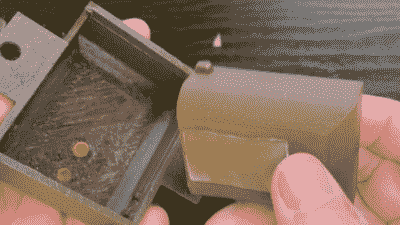

# 被动水培 DIY 浮阀利用 3D 打印

> 原文：<https://hackaday.com/2022/02/19/diy-float-valve-for-passive-hydroponics-leverages-3d-printing/>

[Billy]对被动水培法(也称为 Kratky 方法)特别感兴趣，这是一种在不循环的营养丰富的水中种植植物的方法。随着植物的生长和液位的下降，只有根的尖端保持浸没，而越来越多的根表面以和谐的平衡暴露于氧气中。然而，“口渴”的植物类型(例如西红柿)打破了这种平衡，这个系统需要修改。为了解决这个问题，[Billy]设计并打印了一个被动浮阀系统，该系统只在需要时负责给蓄水池加满水，而不使用泵或任何其他电气设备。

商业或工业浮阀太大，无法在他的小水箱中使用，这导致[Billy]测试了几十个 DIY 设计。他使用了从塑料水瓶到管道末端的所有东西，但没有一样东西完全符合标准。通过 3D 打印，[Billy]能够创建一个密封的轻质浮子，与外壳和管道位置完全匹配。

A strip of silicone works as a sealing agent.

[Billy]的浮阀的工作原理是利用一个中空的物体作为外壳内的浮力塞。当水位高时，浮力物体上升，将一条硅胶压在出水口上，阻止水流动。如果水位低，浮力塞下降，水可以自由流动。由于在种植罐上方放置了一个富含营养的淡水储水池，重力会将新鲜的水推下管道，因此不需要主动泵。结合被动浮阀，该系统几乎可以自行运行。

观看[Billy]在下面嵌入的视频中介绍他的系统和阀门设计。他在处理涉及液体的项目方面很有经验。只有像他这样安逸的人才会自己动手做洗碗机。

 [https://www.youtube.com/embed/dpllL0nMV7w?version=3&rel=1&showsearch=0&showinfo=1&iv_load_policy=1&fs=1&hl=en-US&autohide=2&wmode=transparent](https://www.youtube.com/embed/dpllL0nMV7w?version=3&rel=1&showsearch=0&showinfo=1&iv_load_policy=1&fs=1&hl=en-US&autohide=2&wmode=transparent)

