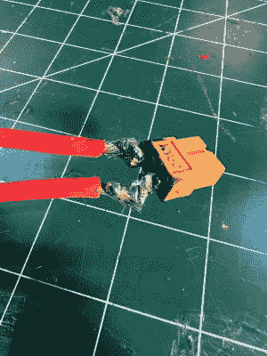
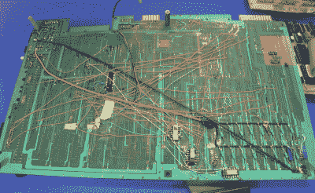

# 问 Hackaday:你最糟糕的焊接工作是什么？

> 原文：<https://hackaday.com/2022/02/24/ask-hackaday-whats-your-worst-soldering-job/>

焊接！在电子世界中，这是将一个组件连接到另一个组件的主要方法。无论您是自由形成电路、将连接器连接到电缆，还是组装 PCB，您最终都会发现自己在做一些焊接工作，无论是手工焊接、回流焊接，甚至是一台别致的波峰焊机。

这是一项基本技能，但对于投身电子爱好的新人来说，这仍然是最大的障碍之一。即使是训练有素的手，处理微小元件或大型散热器的困难工作也会带来挑战。因此，今天我们问这个问题:你最糟糕的焊接工作是什么？

## 这都是因为热

A cold solder joint. Credit: MyName,. CC-BY-SA-3.0, GFDL

焊点不良最常见的原因之一是没有把所有东西都加热到足够的温度。如果你没有得到足够高的温度，焊料将无法坚持。这不仅仅适用于烙铁，或者焊料本身。你还必须将元件引线、PCB 焊盘或要焊接的电线置于高温下。

如果你曾经有一滴熔化的焊料，它不能抓住或弄湿你焊接的零件，你可能没有把东西加热到足够的温度。这一原则在实践中很容易看到。将沾有大量焊料的烙铁头放在一根剥好的铜线上。焊料将无效地滴在导线旁边，直到铜本身达到合适的温度。然后，你会很容易地看到焊丝上的焊芯。

 当然，在某些情况下，很难让事情变得足够热。试图将元件焊接到作为大型接地层一部分的 PCB 焊盘上非常困难，因为接地层相当于一个散热器。同样，焊接大直径电池电缆或大电流连接器也同样困难。一个 20 W 的烙铁可能非常适合焊接小芯片和电阻，但当焊接爱好应用中的大电流 LiPo 电池连接器时，你可能会发现你需要一个 80 W 或更多的烙铁。或者，改变设计也有帮助——许多 PCB 在接地焊盘周围使用散热装置，以减少焊接时焊盘的散热量。

没有足够的热量，焊点会看起来像霜一样，附着力很差。即使在最轻微的物理干扰、弯曲或振动下，它也可能会失效。

## 化学起了作用

其他时候，你可能会发现焊接工作很难，因为所涉及的材料。像铝这样的金属非常难以焊接，因为金属会形成一层氧化皮，防止焊接粘连。此外，这也是一个很好的散热器，只是让事情变得更加困难。在这种情况下，专业人员的流动通常对轻松达成协议至关重要。

或者，自制技术也有帮助。谈到铝，有些人认为成功的方法是在金属上倒一层油，然后用烙铁头或尖锐的物体刮去。这穿透了氧化层，同时油保护它不被重整。

但要注意:在这种情况下，失效的焊点通常看起来像导线或元件引线上光滑、圆润的斑点，但与下方的金属完全分离。

## **随时随地完成任务**

不和谐用户【杨】将这种美提交到 ExpressLRS 社区频道

有时，你会发现自己在不太理想的条件下焊接。也许你正忙着将烙铁连接到发电机上，对现场的关键硬件进行维修，或者你不得不拿出你的丁烷烙铁来修理泥地里卡车下面损坏的电线。或者，打消这个念头，你不得不在凌晨 2 点在你最喜欢的黑客营地的黑暗帐篷里处理一个棘手的四方扁平封装的 SMD 芯片交换，希望你的 USB 电源库中还有足够的电荷来保持你的 USB-C 供电的熨斗打开。

在这些情况下，错误是常见的，受伤和轻度烧伤往往更有可能。然而，正是这些艰难的修正常常带来最大的骄傲和快乐。在后台制作一根重要的音频电缆可能只是挽救一场演出，而一些仓促的跳线可能只是让你公司的产品为[大型年会](https://hackaday.com/2013/12/09/guest-post-the-real-story-of-hacking-together-the-commodore-c128/)做好准备。

## 总是在学习

Jumpers and last-minute bodges are what got the Commodore 128 up and running in time for the 1985 Consumer Electronics Show. Photo credit: [Bil Herd](https://hackaday.com/2013/12/09/guest-post-the-real-story-of-hacking-together-the-commodore-c128/)

事实是，我们每天都在学习，学习我们制作的每一个焊点。一路走来，无论是通孔焊接、SMD 焊接、BGA 焊接，还是数百万计的生产，通常是艰苦的工作和糟糕的接头教会我们如何更好地焊接。

我们很想听听你的故事，看看你的照片，请在评论中联系我们。你最差的焊点是什么，用的工具最差，或者结果最差？在这个过程中你得到了什么或者失去了什么？让我们知道！