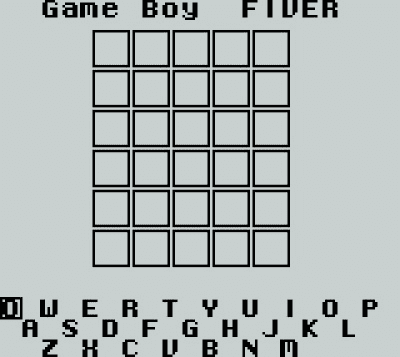

# 把一个沃尔多克隆体挤到游戏机上

> 原文：<https://hackaday.com/2022/03/01/squeezing-a-wordle-clone-onto-the-game-boy/>

流行的文字游戏对一些人来说是令人上瘾的脑筋急转弯，对另一些人来说是永久的社交媒体烦恼。它的巨大成功催生了一大批克隆产品，其中一个是为任天堂游戏男孩设计的，但词汇量减少了。[Alexander Pruss] [接受了改进它的挑战](http://alexanderpruss.blogspot.com/2022/02/game-boy-wordle-how-to-compress-12972.html)，将全部 12972 个 5 个字母单词的词汇表以及 2315 个单词的答案列表与代码一起装入 32K 的盒式磁带中。在资源如此匮乏的平台上进行压缩的挑战是设计一种算法，它不需要比设备所拥有的更多的计算能力或内存。他的解决方案既优雅又容易理解。

 从按首字母将单词分成列表开始，这样他可以忽略该字母，他可以将每个单词减少到 20 位，作为 4 个 5 位的字母。聪明的地方在于他按字母顺序组织单词，这意味着代表每个单词的 20 位数字是按数字顺序排列的。

因此，他可以存储它和它的前一个数字之间的差，而不是存储完整的数字。通过一些额外的调整，他能够将完整的列表压缩到令人印象深刻的 20186 字节，但仍然面临空间不足的问题。转向 *Wordle* 代码，他发现库函数调用可以被切换到一个更有效的替代方式，从而产生一个所有单词都就位的新 ROM[并准备好播放](https://arpruss.github.io/fiver/)。

当然，我们的社区已经将他们的想法应用到了 *Wordle* 上，并且我们已经基于它精选了不止一个黑客。[它们大多涉及自动解决](https://hackaday.com/2022/02/08/wordle-reverse-engineering-and-automated-solving/)，所以这个复古游戏版本开辟了新天地。

Header image:集合媒体和科学， [CC BY 4.0](https://commons.wikimedia.org/wiki/File:Original_Game_Boy.jpg) 。