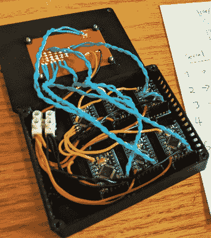

# 飞船维修 CTF 涵盖硬件黑客的本质

> 原文：<https://hackaday.com/2022/03/03/spaceship-repair-ctf-covers-hardware-hacker-essentials/>

即使在与 infosec 模糊相关的会议上，CTF 也是一个主要议题。对于 KernelCon 2021，[Tyler Rosonke] [决心创造一个挑战](https://zonksec.com/blog/hacklives-hardware-challenge/)打破传统，以不同的方式娱乐和教育人们，同时满足当年远程参与计划的限制。他的想象力在所有正确的地方发挥到了极致，一个完美执行的多步骤硬件挑战被构建出来——只有两个副本！

挑战背后的故事？你的坏掉的宇宙飞船必须被修理，这样你才能逃离你被困的星球。我们的想法是找一个熟练的、经验丰富的黑客来解决我们学习和娱乐的挑战——结果不是别人，正是[【乔“金并”格兰德】](https://hackaday.com/tag/joe-grand/)！

 模块本身就是吸引我们注意力的东西。旨在涵盖广泛的硬件黑客技能，它们涵盖焊接，信号嗅探，逻辑门，EEPROM 转储等-你必须成功地应用所有这些起飞。如果你认为“肯定有一个 555 涉及”，你也没有错，有一个模块，你必须重新配置一个电路！

KernelCon 是一个由志愿者推动的奥马哈信息安全会议，它的 2022 部分将在一个月后开始——我们迫不及待地想看看它会带来什么！似乎任何做硬件 CTF 的人都可以从他们的故事中学到一些东西。黑客会议，从开始到结束，被记录下来供我们观赏；下面的链接是一个半小时的视频，它应该是你自己休闲逆向工程之夜的一个很好的背景！

这也不是我们第一次报道[泰勒]的作品了。2020 年，他编写了一批 KernelCon 徽章[，同时使用晒衣夹作为 ISP 夹子](https://hackaday.com/2022/02/27/need-to-probe-circuits-remember-about-clothespins/)。安全会议肯定已经了解了硬件可以带来多少乐趣，如果你需要这方面的案例研究，[我们对 2019 年 CypherCon](https://hackaday.com/2019/04/21/whats-the-secret-of-cyphercon/) 的评论不会让你失望。

 [https://www.youtube.com/embed/AQpv_6Se6VM?version=3&rel=1&showsearch=0&showinfo=1&iv_load_policy=1&fs=1&hl=en-US&autohide=2&wmode=transparent](https://www.youtube.com/embed/AQpv_6Se6VM?version=3&rel=1&showsearch=0&showinfo=1&iv_load_policy=1&fs=1&hl=en-US&autohide=2&wmode=transparent)

