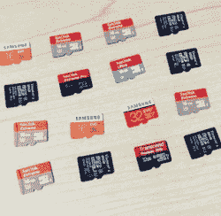

# 树莓派和 SD 卡腐败的故事

> 原文：<https://hackaday.com/2022/03/09/raspberry-pi-and-the-story-of-sd-card-corruption/>

关于 Raspberry Pi SD 卡损坏的故事在网上随处可见，并且在 Pi 附近的社区中绝对是一个常数。很明显，当 Raspberry Pi 遇到 SD 卡时，会出现一些问题——这听起来很讽刺，因为 SD 卡是官方推荐的启动 Pi 的方式。这一切是怎么回事？

我可以从历史课开始。回到 Raspberry Pi 在 2012 年推出的时候—[,也就是 10 年前的](https://hackaday.com/2022/02/28/its-official-the-raspberry-pi-is-now-10/)——SD 卡控制器驱动程序出现了问题，这是有道理的，因为市面上有各种各样的 sd 卡。它们在某个时间点被一个接一个地修复，随着调试的进行，它们的影响减少了，单个卡的错误被消除了。“Pi SD 卡腐败”迷因最初就是这样诞生的；然而，如果问题到此为止，迷因也就结束了。然而，SD 卡损坏的故事困扰我们至今——远没有一开始那么严重，但足够明显，你会不时看到人们遇到它们。

这些年来，Pi SD 卡憎恨者的忠实基础已经增长。他们的要求很简单——Raspberry Pi 必须能够从其他地方启动，这在很大程度上是因为损坏的原因，但不可否认的是因为 SD 卡的速度和容量/成本限制。由于他们的需求和工作，我们已经看到一系列项目从非官方的努力和黑客发展成为官方支持的 Raspberry Pi 功能——USB boot 最初更多的是一种变通方法，但现在[你可以开箱即用](https://hackaday.com/2016/08/04/raspberry-pi-3-gets-usb-ethernet-boot/)，配备 SSD 的 Pi 外壳[变得更加规范](https://hackaday.com/2020/09/28/an-elegant-modular-enclosure-system-for-the-raspberry-pi-4/)，现在 [NVMe boot 出现在地平线上](https://hackaday.com/2021/03/29/nvme-boot-finally-comes-to-the-pi-compute-module-4/)。每隔几年，我们就会有新的方法来启动一个 Pi。

# 应该抛弃 SD 卡吗？

我想澄清一下——从固态硬盘或 USB 驱动器启动是一个非常好的选择，当你希望你的 Pi 速度快、响应快、可靠时，你绝对可以尝试。SD 卡插槽一直存在，不会消失，我们抽屉里的 SD 卡也不会消失。你个人应该抛弃 SD 卡吗？答案更可能是“不”，而不是“是”。

不是每个人都会遇到 SD 卡问题，只要你看到一个很酷的新项目，SD 卡图像就是第一件可用的东西，配备 SD 的 Pi 仍然是一个普通制造商的主要产品。USB 和网络引导的支持者还列举了 Pi-as-desktop 使用的延迟改善，网络引导情况下更容易的 Pi 管理，这些都是很好的理由-但肯定不是对每个项目都是如此。SD 卡仍然是启动 Pi 的最简单和最便宜的选择。

你也不能总是避免 SD 卡启动。从 u 盘引导 Pi Zero 需要您浪费您唯一的 USB 端口或者添加整个 USB 集线器，这进一步使设置变得复杂，增加了讨厌的电缆和故障点。当谈到使用 Pi 构建的便携式和电池供电设备时，SD 卡在功耗方面很难超越——USB 闪存驱动器并不以低功耗优化而闻名，USB 集线器也是如此，如果你检查 USB 集线器 IC 在传递相对少量的 USB 数据包后可以变得多热，你就会注意到这一点。

最后，即使是最热衷于外部 SSD 启动的人也可能仍然希望为它带来的独立额外存储添加 SD 卡。插槽就在那里，如果你有多余的卡，为什么不使用它呢？除非你遇到问题，也就是说，让我们来解决这些问题。

# 为什么卡还是会失效？

 首先，假冒伪劣卡毁了大家的兴致。MicroSD 卡的克隆版无处不在，很难与合法制造的卡区分开来，但肯定不符合同样的质量标准。便宜的卡都有“低质量标准”的部分，但至少，你可以通过看它来识别一张没有名字的卡。无论是假的还是便宜的卡通常都不适合运行整个操作系统。它们不仅会使您的 Pi 比它实际运行的速度更慢，而且还会导致神秘的失败，并在以后导致非常明显的损坏。[从声誉好的地方得到体面的卡](https://hackaday.com/2015/12/10/which-sd-card-to-use-in-a-pi/)是平静的 Pi 探索之旅的一部分，如今，考虑到你花的钱得到的大量存储，它甚至不再真正打破银行。

即使是正版卡也会惹麻烦。早在 2014 年，我们的黑客空间就为我们的 Pi 购买了一批正版三星卡，每一张卡最终都死于相同的症状——因为每个 Pi 都使用同一批卡，所以最终黑客空间的基础设施一个设备一个设备地消亡，让依赖它的成员感到沮丧。毕竟，SD 卡是一个复杂的高度集成的设备，控制器是一个小型的专用 CPU——固件错误、制造缺陷和旧硬件随机性都有存在的空间。按理说，我们已经过了这一关，[但要小心谨慎](https://hackaday.com/2022/02/20/hackaday-links-february-20-2022/)。

# 现在关闭你的单板机是安全的

像当今大多数存储设备一样，SD 卡内部有两个独立的实体——控制器和闪存。每当控制器被发送一些要写入的数据时，它都有一些闪存管理的繁忙工作要做，但是当场这样做将是耗时的，会延迟后续的写入操作，并且可能是浪费。随后，SD 卡控制器必须有一小块高速缓冲存储器，并保存尚未执行但尚未执行的操作的列表。

这就是“安全关闭您的 Pi”也就是“拔下电源前运行`poweroff`”话题背后的基本原理——如果您不给 SD 卡一点时间，甚至没有来自操作系统的自动提前通知，可能会有永远无法完成的挂起写入操作，导致下次给卡通电时存储混乱。一些经验丰富的工程师声称，由于 SD 卡的内部工作方式，这种关机最终肯定会不可逆转地长期损坏普通 sd 卡，我不会就此与他们争论。

即使不安全的关机时有发生，你还能依赖 SD 卡吗？我的经验是肯定的。我的第一份“工程”工作就是针对这个问题测试一款基于 Pi 的商业设备，我建立了一个测试设置，在 SD 卡写入期间关闭 Pi，并运行了几天，我们的软件仍然通过了所有测试。据我所知，我们成功地长期发运了该硬件组合。有了 ZeroPhone，[非常规的电源管理](https://hackaday.io/project/19035/log/69596)没有软件来弥补它的缺点，导致在几年的时间里，每当我忘记充电时，每隔几天就有规律地(有时甚至是周期性地)停电。我用过的 SD 卡长期保存得很好，一直保存到今天，除了偶尔有一次平安无事。

我的结论是，虽然安全断电是可取的，但松懈并不是世界末日，许多不小心将电源电缆从 Pi 中拔出的爱好者都会证实这一点。然而，如果你的软件在运行你的操作系统的同一个 SD 卡上做了大量的写操作，也许你想把它卸载到别的地方。

# 也不要廉价出售你的 PSU

有一个不寻常的疑点需要提及，那就是供电质量。有时会不经意地提到，这是一个不被重视的原因，我已经进行了多年的腐败困扰的黑客空间 Pi 调试探索，结果证明这是罪魁祸首。有问题的 Pi 是整个 Pi 网络中唯一一个遇到这些问题的 Pi，它也由一个手工焊接的 LM2576 SMPS 供电，看不到接地层，显然是构建时唯一可行的解决方案，由于“嘿，它工作了”的人为因素，它在那里呆了很长时间。

虽然 DC-DC 并不直接为 SD 卡供电——板上有一个 5 V 至 3.3 V 的调节器——但该设置的每个部分，从 Pi 到文件系统，都被替换了。pi 可能非常耗电，尤其是在为其他 USB 设备供电时。细电缆和规格不足的供应可能导致限电，而劣质的 SD 卡为此付出了代价。

将 DC-DC 换成一个普通的蓝色“LM2596”模块，用额外的电容器和更粗的电线加固，是实际上使腐败问题消失的解决方案。这里面可能有关于噪音传播的课程。对你来说，基于这个和其他类似但不那么令人困惑的经历，我建议的结论是——在精神上遵守欧姆定律，并确保果汁流向你的 Pi 的路径不会被极细极长的 MicroUSB 或 Type-C 电缆，或者被证明是不合格的 DC-DC 设置所限制。

# 新的和不受重视的帮手

这些年来出现了一些巧妙的技巧，如果适合您的使用情况，它们将为您提供额外的反腐败保护，无疑会让您安心。其中一个就是[Raspbian](https://forums.raspberrypi.com/viewtopic.php?f=63&t=253104&p=1549229#p1549117)中的 OverlayFS 选项，这是 2019 年某个时候添加的`raspi-config`中的一个小菜单项。如果您启用它并重新启动，您的 Pi 将表现相同，但您所做的任何更改都不会实际写入您的 SD 卡-这也意味着它们不会被保存，并将在您重新启动后消失。如果您想要更改 SD 卡上的文件，您需要禁用 OverlayFS，重启，进行更改，重新启用 OverlayFS，然后再次重启。也许有一种方法可以解决这个问题，但是[那是你自己去解决](https://forums.raspberrypi.com/viewtopic.php?t=288863)。

一个类似的选项是[也可用于`sdtool`](https://hackaday.io/project/26096-dementia-friendly-music-player/log/65039-avoiding-corruption-with-sd-card-write-protection) ，这是一个小软件，你可以在你的 Pi 上运行，而不是指导你的 MicroSD 卡进入只读模式——这[所有大小 SD 卡都能够](https://hackaday.com/2013/11/12/keep-your-sd-cards-data-safe-with-the-sd-locker/)。如果你没有运行最新的 Raspbian，或者你想在不重启的情况下切换你的卡的只读状态，这种方法可能基本上适合你。

你可能想尝试的其他东西是 eMMC 薯片。为了适合操作系统运行而设计，它们也恰好与 Raspberry Pi 上的 SD 卡接口兼容，使用您选择的搜索引擎，您会发现一些 Pi 兼容的产品出售。最近，有人发誓说他们持有这些虚构的 Pi 4 计算模块之一(据报道，有几秒钟)，告诉我他们使用板载 eMMC 存储。这并不是说缺货警告让我觉得我有希望能够真正验证，但如果真的是这样，情况会有多糟呢？

# 一点腐败没什么坏处

关于 Raspberry Pi 卡腐败的故事数量令人生畏，但当你考虑到已经售出 4000 万张时，这只是沧海一粟。这是一个典型的 SD 卡损坏案件的要点。如果您曾经需要处理讨厌的 SD 损坏问题，您现在知道要寻找什么，并且可能了解了一些可以调整的新变量。弄个好卡，好电源，不要让别人的负面经历，不管是真的还是传言的，让你沮丧！