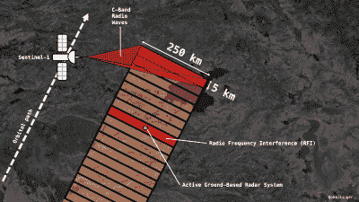
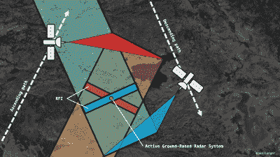
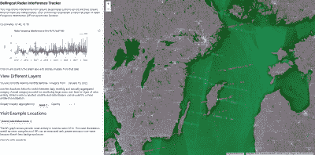
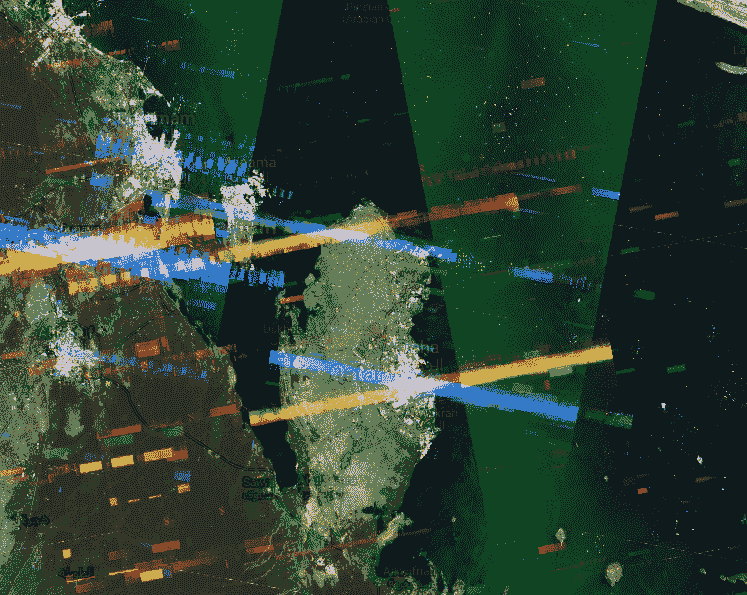

# 你可以在公开的卫星数据上找到军用雷达

> 原文：<https://hackaday.com/2022/03/02/you-can-find-military-radars-on-publicly-available-satellite-data/>

当谈到追捕军事雷达装置和相关硬件时，我们通常会想到那些在国家及其军队的价格范围内的设备。无论是早期预警雷达、用于防空的雷达，还是用于海军目的的雷达，你都会认为拦截或追踪这些辐射相对来说比较困难。

然而，地理计算讲师 Ollie Ballinger 开发的一个新工具表明情况并非如此。事实上，通过卫星[捕获的公开可用数据可以用来寻找各种形式的军用雷达辐射源](https://www.bellingcat.com/resources/2022/02/11/radar-interference-tracker-a-new-open-source-tool-to-locate-active-military-radar-systems/)。让我们来探索如何！

### 公开数据揭示了令人惊讶的事情

A diagram indicating how interference from military radars shows up on SAR satellite images. Credit: Ollie Ballinger, used with permission

来自以色列的地理空间工程师 Harel Dan 发现，公开的卫星数据可以揭示军用雷达的位置。丹正在查看欧洲航天局哨兵卫星的合成孔径雷达捕捉到的数据。在意外地将合成图像上的噪音和干扰显示最大化后，他注意到在中东的不同地点出现了奇怪的条带，并开始了对原因的调查。

由欧洲航天局(ESA)运营的“哨兵-1A”和“哨兵-1B”卫星携带了在 C 波段运行的[合成孔径雷达(SAR)](https://hackaday.com/2014/03/17/radar-imaging-in-your-garage-synthetic-aperture-radar/) 仪器，频谱涵盖 4.0 至 8.0 GHz 的频率。合成孔径雷达基本上利用航天器的运动来创建一个大的“合成”天线孔径，用于捕捉地面的雷达图像。由于航天器的运动，这项技术允许 SAR 对地面成像，就好像它有一个比实际大得多的天线。它为 SAR 提供了远高于传统扫描波束雷达的空间分辨率。

SAR images captured from two satellites can be overlaid to narrow the area in which a interfering radar emitter could be located. Credit: Ollie Ballinger, used with permission

哨兵卫星上的合成孔径雷达成像系统与许多军用雷达工作在相同的频率范围内。当卫星经过头顶时，向地面发送雷达信号并接收回波，它们也接收到军用雷达系统的发射，这些发射在 SAR 雷达图像上显示为明亮的蓝色和红色波段。

事实证明，丹看到了安装在中东各州的 MIM-104 爱国者 PAC-2 防空系统造成的干扰。鉴于 ESA 将 Sentinel 卫星的所有数据公之于众，这意味着任何想要深入研究这些数据的人都可以看到这种干扰。

Sentinel 卫星通常以一种模式运行，用其雷达设备对 250 公里长和 5 公里宽的狭长地带进行成像。当一个军用雷达系统在这样一片土地上运行时，它会在整个 250 公里×5 公里的地带产生明亮的条纹。当“哨兵-1A”和“哨兵-1B”的图像叠加在一起时，可以看到受干扰影响的两条条纹相互交叉的地方。这可以缩小雷达系统可能位于的区域——两条干涉条纹之间的重叠区域。

Interference bands caused by radar systems in Sweden. Source: Radar Interference Tracker

凭借对这一现象的了解，Ollie Ballinger 开始开发一种工具，使研究人员能够更容易地使用 Sentinel-1 卫星的公开数据来寻找雷达—[雷达干扰跟踪器(RIT)。它可以显示从各种军用雷达中拾取的干扰，从美国建造的爱国者系统到日本的 FCS-3、中国的 381 型，甚至俄罗斯的 S-400 地对空导弹系统。如果这些系统在哨兵-1 卫星经过头顶时打开了雷达，它们应该在 RIT 上可见。](https://ollielballinger.users.earthengine.app/view/bellingcat-radar-interference-tracker#lon=49.9507;lat=26.6056;zoom=4;)

A particularly strong interference band is readily visible in Qatar. Source: Radar Interference Tracker

该工具允许用户查看给定时间点的数据，帮助研究人员找出军用雷达系统在何时何地被开启。卫星采集的干扰曲线图有助于快速找到相关时间段。

值得注意的是，RIT 本身并不是一个决定性的情报工具。通常，在这些图像上发现的干扰必须得到其他光学卫星成像数据或其他情报报告的证实，以确认军事硬件的移动。另一个问题是，卫星需要几天时间才能重访一个特定区域；如果雷达在卫星通过之间打开和关闭，它不会显示在数据中。然而，RIT 对于快速识别与军用雷达硬件相关的感兴趣区域仍然是有用的。

很高兴看到欧空局共享卫星数据供任何人使用，也很高兴看到开源工具改善了这些数据的用途。那些对 RIT 感兴趣的人甚至可以在 Github 上自己钻研代码[。它显示了当信息对所有人开放时，更广泛的社区可以做些什么！](https://github.com/bellingcat/sar-interference-tracker)

(编者注:本文是在俄罗斯入侵乌克兰之前构思并撰写的。)