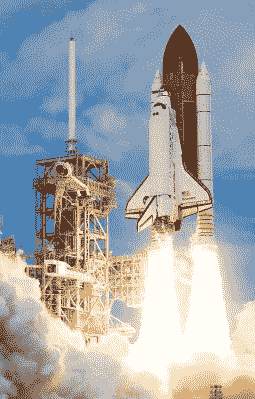
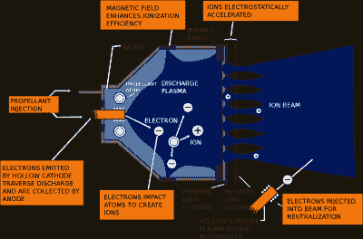
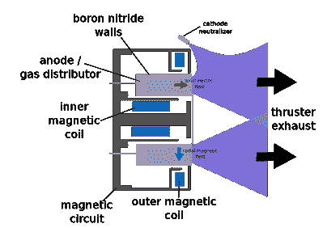
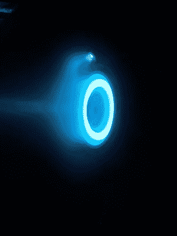
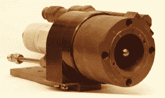

# 离子推进器:不再只是 TIE 战斗机的专利

> 原文：<https://hackaday.com/2022/03/03/ion-thrusters-not-just-for-tie-fighters-anymore/>

航天器火箭发动机有多种形式，使用多种燃料，但大多数依靠化学反应将推进剂从喷嘴中喷出，反作用力驱动航天器向相反方向运动。这些火箭提供高推力，但它们的燃料效率相对较低，因此，如果你想改变速度，你需要携带大量的重燃料。将燃料送入轨道也很昂贵！

各种形式的离子推进器提供了另一种解决方案——推力极小，但燃料效率高。这个小小的推力不会让你离开地球。然而，当在真空空间中应用大量时间时，它会导致速度或δv 的巨大变化。

这种操作方式意味着离子推进器和少量燃料理论上可以产生比化学火箭大得多的 delta-V，非常适合火星的远程太空任务和其他应用。让我们来看看离子推进器是如何工作的，以及它们在航天器领域的一些有趣的应用！

## 这都是关于具体的冲动

Chemical rocket engines provide huge thrust but are thirsty when it comes to fuel.
Ion engines won’t get you out of Earth’s gravity well, nor do they work in the atmosphere, but become useful when you’re in the vacuum of space. Credit: NASA, public domain

在我们进入离子推进器的世界之前，理解各种火箭推进器的比冲和燃料效率的概念是很重要的。比冲衡量的是火箭发动机通过化学或其他方式从后面抛出的质量产生推力的效率。火箭推进器的比冲越高，单位质量燃料产生的推力就越大。

冲量是力对时间的积分，单位为牛顿-秒。比冲，我们看的是推进剂单位重量的冲量，因此是用牛顿-秒除以牛顿，或简称为秒来测量的。这有点令人困惑，但对于新入门的人来说，请记住，更高的比冲代表更高的燃油效率。

相比之下，航天飞机的固体火箭助推器的比冲只有 250 秒，而液氧-液氢火箭发动机可能接近 450 秒。静电离子推进器几乎好一个数量级，大约为 2000-3000 秒，有些在实验中达到接近 10000 秒，而实验性 VASIMR 电磁离子推进器预测的比冲高达 12000 秒。

这种更好的燃料效率对太空旅行有实际意义。这意味着离子推进器可以用少得多的燃料为航天器实现给定的速度变化——在某些方面少了一个数量级。[在一项关于国际空间站轨道保持的应用中，](https://www.newscientist.com/article/dn17918-rocket-company-tests-worlds-most-powerful-ion-engine/)一项计算表明，离子推进器可以将空间站每年的燃料使用量从 7500 公斤减少到 300 公斤。这已经产生了影响，运载燃料到空间站的运载火箭需要更少的燃料来将它送入轨道，全面提高了效率。

## 电力推力是如何工作的

离子推进器有多种形式，但基本原理很简单:电用于将离子加速到高速，迫使它们离开推进器，从而产生反作用力，推动航天器本身。中性气体被用作燃料，通过从原子中剥离电子来电离中性气体，从而产生正离子，正离子可以容易地通过静电或电磁手段加速以产生推力。氙、氪或氩是这些推进器的常见选择，尽管其他材料，如镁、锌和碘已经在一些设计中试验过。然而，绝大多数的离子推进器都依赖气体推进剂。

### 静电推进器

A schematic of an gridded electrostatic ion thruster. Wear on the grids over time limits the life of these thrusters. Credit: NASA

静电离子推进器使用各种方法来加速离子以产生推力。网格静电离子推进器是一种更受欢迎的设计，其中推进气体受到电子轰击，形成电离等离子体。然后，一组网格电极被充上电位差，加速正离子离开推进器。然后，一个单独的阴极将低能电子释放到推进器的废气流中，以确保航天器不会带净负电荷。

霍尔效应推进器用一个气体分布阳极和一个磁约束电子云代替了网格电极作为阴极。较重的正离子被加速排出推进器，而较轻的电子仍被限制在磁场中。类似地，外部阴极用于中和排气流，如在网格推进器设计中。

A schematic of a Hall Effect thruster. Hundreds of such thrusters were used for stationkeeping in Soviet satellites in the 20th century. Credit: Finlay McWalter, public domain

这些设计在现实世界的任务中有着重要的用途。最早的应用之一[是在苏联卫星](https://beyondnerva.wordpress.com/electric-propulsion/hall-effect-thrusters/)上，它使用霍尔效应推进器代替化学火箭进行位置保持。这就是卫星需要随着时间的推移周期性地施加推力来抵消它们所经历的微妙的大气阻力的地方。霍尔效应推进器提供的微小推力很适合这个目的，在很长一段时间内用于显著的整体速度变化。这些推进器的功率消耗大约为 1.35 千瓦，对于大约 1，500-3，000 秒的比冲产生 83 mN 的推力。

该技术最近的一个应用是在中国天宫空间站，它使用四个霍尔效应推进器来维持其轨道。美国宇航局还希望在即将到来的 Psyche 航天器上飞行这项技术[，该航天器将使用四个 SPT-140 霍尔效应推进器。工程师们估计，如果 Psyche 依靠化学火箭，装载 922 公斤氙推进剂将需要 15 倍多的推进剂。](https://www.nasa.gov/feature/jpl/solar-electric-propulsion-makes-nasa-s-psyche-spacecraft-go/)

An SPT-140 Hall Effect thruster under testing. Four of these thrusters will be installed on NASA’s Psyche spacecraft. Credit: NASA, public domain

网格离子推进器也有很多用途。美国宇航局的 NSTAR ion 发动机安装在[深空 1 号探测器](https://solarsystem.nasa.gov/missions/deep-space-1/in-depth/)上，该探测器于 20 世纪 90 年代末被一颗彗星和小行星发射升空。网格离子发动机在 2.1 kW 的功率下仅输出 92 mN 的推力，但其 1000-3000 秒的高比冲使其与化学火箭解决方案相比，在星际旅行中实现了显著的质量节省。以氙气为燃料的离子推进器在任务期间总共运行了 16，265 小时，提供了每秒 4.3 公里的总速度变化(delta-V)，这是任何依靠自身机载推进系统的航天器中最大的。

其他深空任务也依赖于这项技术。JAXA 的隼鸟号探测器依靠离子推进器帮助它与丝川小行星会合。美国宇航局的黎明任务也使用了这项技术，配备了三个与深空一号项目相同的氙离子推进器，尽管在实践中每次只发射一个。美国宇航局非常愿意指出推进系统的低推力，[指出 0-60 英里每小时需要 4 天](https://solarsystem.nasa.gov/missions/dawn/technology/spacecraft/)，这与现代法拉利平均 3.5 秒的成绩相比很差。

### 电磁推进器

A prototype magnetoplasmadynamic (MPD) tested by NASA. Credit: NASA, public domain

电磁离子推进器从中性等离子体中产生推力，表面上由等量的正离子和负电子组成，在文献中通常被称为“等离子体推进器”。它们有各种各样的设计，其中大多数都是利用无线电能量来电离室内的气体。然后产生一个磁场来加速整个中性等离子体离开推进器。这些设计通常具有这样的优势，即它们不需要特殊的中和电极来校正废气的电荷不平衡，也不使用气流中的电极来加速离子，与静电设计相比，减少了磨损源。

开发得最好的一个例子是 VASIMR VX-200 推进器，Ad Astra 火箭公司自 2008 年以来一直在开发各种形式的推进器。目的是在 100 千瓦的功率水平下运行推进器 100 小时，以表明推进器如何能够为长期任务产生巨大的 delta-V。2021 年 7 月，公司[28 小时达到 82.5 kW 的里程碑](https://www.adastrarocket.com/pressReleases/2021/20210709-PressRelease.pdf)。推进器的排气速度约为 50 公里/秒，比冲约为 5000 秒。

电磁设计通常比静电推进器有更大的推力，尽管大多数仍处于研究阶段。这种设计的问题包括高功率消耗的问题和处理废热的问题。如果这些可以被克服，像按比例放大的 VASIMIR 电磁推进器这样的设计可以在短短 39 天内将航天器从地球推进到火星，而传统的化学火箭需要 6 个月的旅程。唯一的事情是，你需要一个能够提供 10 到 20 兆瓦电力的电源，并将其安装在航天器上。

## 展望未来

各种形式的离子推进器在某些方面是一项尚未证明其全部能力的技术。他们已经做了很多伟大的事情，将小型太空探测器带到遥远的目的地，同时一路上需要的燃料也少得多。然而，要用它们来帮助我们把人类带到自己轨道之外的目的地，我们还有很长的路要走。在你乘坐离子动力飞船去未来的太空度假之前，还有很多发展要做，但在 50 年或 100 年左右，离子飞船可能会成为去火星的热门门票！