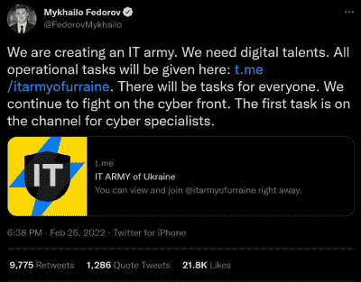
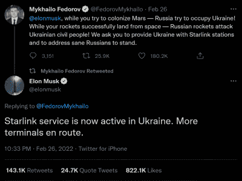
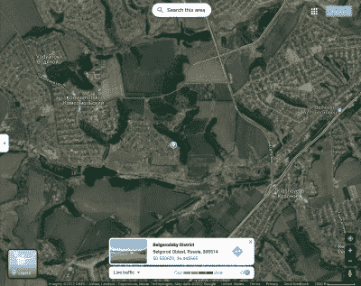

# 俄乌战争的隐形战场

> 原文：<https://hackaday.com/2022/03/07/the-invisible-battlefields-of-the-russia-ukraine-war/>

2 月 24 日清晨，加州米德尔伯里国际研究学院(Middlebury Institute of International Studies)教授杰弗里·刘易斯(Jeffrey Lewis)通过覆盖在高分辨率卫星图像上的军队调动，实时观察了俄罗斯入侵乌克兰的情况。这不是特权信息——任何有互联网连接的人都可以访问它，如果他们知道去哪里找的话。他正看着谷歌地图上的交通堵塞慢慢向俄罗斯和乌克兰边境移动。

当他看着入侵和世界其他地方一起开始时，这场新兴战争的另一个不太明显的方面开始在一个模糊的在线战场上展开。数字间谍、社交媒体和在线监控已经成为现代军队工具箱中不可或缺的工具，冲突双方都在使用这些工具。再加上前所未有的平民获取信息的渠道，这将是一场前所未有的战争。

## 现代网络战

在这场战争的在线部分，首当其冲的受害者是网站。两周前，在入侵大规模开始之前，俄罗斯网络战特工对乌克兰政府和金融网站发起了分布式拒绝服务(DDoS)攻击。随后的攻击暂时瘫痪了乌克兰安全局、外交部和政府的网站。DDoS 攻击是快速使服务器离线的一种相对简单的方法。由攻击者拥有或感染了恶意软件的互联网连接设备组成的网络向目标发出大量请求，就好像数百万用户同时重复点击同一网站的“刷新”按钮一样。目标是压倒服务器，使其无法跟上并停止回复合法请求，就像用户试图访问网站一样。俄罗斯否认参与了袭击，但美国和英国情报部门有证据表明莫斯科参与了袭击。

Fedorov’s tweet introducing the IT Army

DDoS 攻击似乎是双方都选择的工具，因为包括克里姆林宫和俄罗斯军方网站在内的几个俄罗斯网站在上周因一系列类似的反击而被关闭。目前还不清楚这些攻击是直接来自乌克兰政府，还是来自同情他们的第三方。为了招募有助于这些努力的人，政府[呼吁网络安全专家帮助保卫他们国家的数字领土，并对俄国发起攻击性反击。](https://www.reuters.com/world/exclusive-ukraine-calls-hacker-underground-defend-against-russia-2022-02-24/)奇怪的是，第一个电话来自 Yegor Aushev 的论坛帖子，他是基辅一家网络安全公司的合伙人，据说代表国防部发帖。后来，政府推出了副总理兼数字转型部长米凯洛·费多罗夫[在推特上称之为该国的“IT 军队”](https://twitter.com/FedorovMykhailo/status/1497642156076511233)这个通过电报频道组建的组织已经获得了俄罗斯网站和服务的列表，以供成员锁定目标。

名为 [Anonymous 的独立网络安全组织也决定与乌克兰站在一起对抗俄罗斯。](https://twitter.com/YourAnonOne/status/1496965766435926039)他们已经对各种攻击负责，包括替换俄罗斯新闻站的宣传，关闭俄罗斯政府和媒体网站，以及泄露俄罗斯经济发展部的数据库。

乌克兰政府机构和银行也成为了恶意软件的攻击目标，特别是一种旨在擦除硬盘数据的病毒。在入侵开始的前一天，安全公司赛门铁克和 ESET 发现了恶意代码，几个小时后，微软得到了风声。[又过了三个小时，微软的 Defender 软件已经打好补丁，可以扫描并阻止这个包。](https://www.nytimes.com/2022/02/28/us/politics/ukraine-russia-microsoft.html)虽然没有具体数据表明该计划与俄罗斯有关，但人们普遍认为这是源头。这种攻击似乎没有勒索软件等类似恶意程序的金钱导向动机。当一台计算机感染了勒索软件时，用户通常会收到一条消息，大意是“给我们汇钱，否则你的所有数据都会被删除。”这种病毒跳过中间步骤，直接删除数据，这意味着它只是为了禁用受感染的机构和制造混乱而创建的。为了进一步实现这一目标，似乎[勒索软件诱饵也被部署](https://symantec-enterprise-blogs.security.com/blogs/threat-intelligence/ukraine-wiper-malware-russia)，要么是为了转移对数据擦除病毒的关注，要么是为了掩盖其踪迹，以便它可以更长时间不被发现。

当站起来反对乌克兰正在发生的事情时，所有这一切看起来都相对温和——当人们死去时，谁会在乎一个网站被关闭？在危机时期，无论是战争还是自然灾害，政府最困难也是最重要的任务之一是向其公民提供可能挽救生命的信息。削弱政府传播此类信息的能力，往好里说会增加混乱和错误信息的传播，往坏里说会导致无辜的人死亡。2015 年，[众所周知，俄罗斯主要情报总局(GRU)](https://www.wired.com/2016/03/inside-cunning-unprecedented-hack-ukraines-power-grid/) 完全远程入侵乌克兰电网，企图制造动荡和恐惧，导致约 23 万人断电。

## 监控和(社交)媒体

虽然幕后的网络战基本上是看不见的，但战争的其余部分却完全不同。那些生活在世界各地的积极冲突中的人们每天晚上 7 点从前线获得每日新闻的日子已经一去不复返了——社交媒体意味着我们几乎实时地不断与信息流保持联系，尽管区分事实和虚构可能会被证明是困难的。

以“基辅的幽灵”为例——一个传说中的乌克兰飞行员已经单枪匹马击落了六架俄罗斯战斗机。虽然没有证据表明这样的飞行员存在(或者不存在)，但一个飞行员击落另一架飞机的流行视频被证明是假的——它实际上是视频游戏《动态战斗模拟器》中的片段，被断章取义，并在 Twitter、脸书和 Reddit 上引起轰动。

此外，莫斯科内部有大量故意造谣的案例。俄罗斯政府在决定其公民能够消费哪些信息以及如何获取这些信息方面一直非常挑剔。俄罗斯媒体接到指示，只能报道由政府官方渠道发布的信息，政府对脸书的访问受到限制。俄罗斯新闻媒体非常小心地将这场战争(这本身是一个被禁止的词)描绘成一场小规模的军事行动——尽管并非所有的俄罗斯媒体都屈从于政府的要求。科技巨头也被迫压制虚假信息和宣传，其中最引人注目的是副总理费多罗夫。他呼吁流媒体服务，包括网飞和 YouTube，以阻止俄罗斯的宣传，并呼吁其他服务，如贝宝和谷歌，以禁用俄罗斯境内的访问。上周，YouTube 禁止了俄罗斯频道的货币化。

Fedorov’s request to Musk for Starlink service

[费多罗夫还通过推特联系了埃隆·马斯克，](https://twitter.com/elonmusk/status/1497701484003213317)询问 Starlink 互联网终端。作为回应，马斯克启用了 [Starlink 在乌克兰的卫星互联网服务](https://hackaday.com/2021/05/24/starlink-a-review-and-some-hacks/)，并运送了一卡车终端，这些终端几天前就到达了。目前还不清楚费多罗夫计划如何部署终端，但很可能它们将被用于连接难以到达的地区，或恢复基础设施受损地区的连接。

正如你可能怀疑的那样，即使是最善意的社交媒体使用在战争时期也会被证明是有问题的。Twitter 用户相互警告，不要通过在网上发布乌克兰防御工事的照片来表示支持，以避免向俄罗斯情报部门提供有关部队调动或其他军事行动的信息。

The advancing Russian army viewed as a traffic jam (image from Dr. Lewis’s Twitter account)

即使只是携带一部智能手机也可能引发问题——地理定位服务使手机被跟踪成为可能，而不仅仅是被侵入苹果“查找我的 iPhone”服务的网络安全专家跟踪。

这里一个主要的例子是刘易斯博士 24 日观察到的交通堵塞。这可能是由于军队前进时，平民被困在路障后造成的。同样，大型集会，如抗议或公共场所的会议可以被记录显示在谷歌地图(通过[“实时繁忙信息”](https://blog.google/products/maps/maps101-popular-times-and-live-busyness-information/)功能)和其他服务上。为了解决这一问题并保护其用户，[谷歌暂时禁用了乌克兰的实时交通数据。](https://www.reuters.com/technology/google-temporarily-disables-google-maps-live-traffic-data-ukraine-2022-02-28/)即便如此，对用户来说，考虑他们的设备记录哪些类型的数据以及这些数据被发送到哪里可能是谨慎的。

## 展望未来

尽管这次入侵只有几天时间，但它似乎已经为如何发动混合战争开创了一个新的先例，这是一个非常令人不安的前景。对于我们中的许多人来说，安全地坐在世界各地的前线，通过手机观看事件的发展，很容易忽视这是一场非常真实的冲突，每天都有无辜的人丧生。

我们这里的所有人都希望战争能够迅速、和平、公正地结束。编剧波特·普里卢茨凯在为一集 *MASH* 写剧本时说得很好:“战争不是地狱。战争就是战争，地狱就是地狱。在这两者中，战争要糟糕得多……地狱里没有无辜的旁观者。”