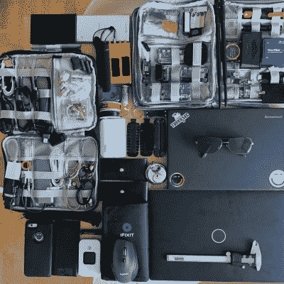

# 硬件黑客 101 需要配套的工具包

> 原文：<https://hackaday.com/2022/03/03/hardware-hacking-101-needs-matching-toolkit/>

在一个设备齐全的工作台上，每个工具都触手可及，你不可能一边舒服地品茶一边加工一件硬件。为了解决这个问题，[Zokol]分享了一个正在开发的[硬件黑客工具包](http://heikki.juva.lu/hardware/2021/11/12/hardwarehacking_101.html)，其目的是尽可能提高黑客会话的效率，同时将大小和重量保持在合理的范围内。现在还没有零件清单，但是有一些关于创建自己的零件清单的好建议。

 要组装一个有效的硬件黑客工具包，必须仔细考虑需要执行什么类型的任务，以及以什么顺序执行。一旦确定了基本的工作流程，就可以将一组互补的硬件工具和资源放在一起，以满足预期的需求。我们的目标是在一次会议中尽可能多地使用工具，并确定以后需要的任何专用设备。这样，后续会议可以尽可能有效。

由于硬件黑客攻击都是关于检查(并可能修改)电子设备的行为，[Zokol]观察到第一步总是从外部接口开始。这意味着普通电缆和适配器都应该是硬件黑客工具包的一部分，否则会话可能会过早结束。下一步是打开设备，因此需要常用的工具和方法来处理像粘合剂这样的东西。之后，像万用表这样的诊断工具开始发挥作用，随着调查的进行，这些工具变得更加专业。这是一种非常明智的方式来处理硬件黑客工具包中带什么(不带什么)的问题，我们迫不及待地想看看最终版本是什么样子。

硬件黑客有时会涉及到不损坏就无法打开的硬件。谷歌 Stadia 控制器就是这样的一个硬件，【Zokol】通过精确计算在哪里钻孔，解决了如何[永久禁用麦克风的问题。](https://hackaday.com/2021/01/10/careful-drilling-keeps-stadia-from-listening-in/)