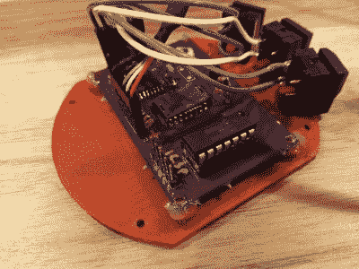

# 德普拉兹老鼠克隆有一个 USB 尾巴

> 原文：<https://hackaday.com/2022/03/05/depraz-mouse-clone-has-a-usb-tail/>

1980 年，罗技开始销售一种圆形三键输入设备，名为 Depraz mouse 或 Swiss mouse，由一家名为 Depraz 的瑞士公司制造。当时，罗技主要是一家软件开发公司，但他们在销售 Depraz 鼠标中看到的成功使他们放弃了逻辑和循环，以永久追求外设。

 【约翰·弗洛伦】最近决定让[成为一只现代克隆老鼠，名为](https://jfloren.net/b/2022/3/2/0)。你可能还记得[John] [之前修复了一辆复古德普拉兹](https://hackaday.com/2021/08/09/this-old-mouse-building-a-usb-adapter-for-a-vintage-depraz-mouse/)的工作状态。唯一的问题是，对于一只 40 岁的老鼠来说,“工作条件”在现代计算机上并不令人印象深刻。

这款领头羊鼠标配备了高端 Pixart PMW3389 传感器，并使用 PIC16F1454 作为控制器。最复杂的部分是处理电压水平，因为 PIC 想要 5 V，而传感器只有 2 V。固件是 Microchip 的 USB HID 演示代码和[Daniel Kao]的 PWM3389 传感器的 Arduino 代码的混合。

与最初的 Depraz 的公 DE-9 连接器不同，这一更新版本通过 USB 连接。我们喜欢[约翰]学习 FreeCAD 来制造车身，特别是他在车身底部粘上钓鱼砝码来增加重量。休息之后，请查看实际情况。我们对这些开关非常好奇，乍一看，它们可能是带 DSA 键帽的按键开关。但不，它们只是 Digi-Key 深处的一些[酷开关。](https://www.digikey.com/en/products/detail/e-switch/5501M1BLKX/101654)

想给自己打印更符合人体工程学的东西？也许你会点击开源轨迹球。

 [https://www.youtube.com/embed/yRf85UxZtDk?version=3&rel=1&showsearch=0&showinfo=1&iv_load_policy=1&fs=1&hl=en-US&autohide=2&wmode=transparent](https://www.youtube.com/embed/yRf85UxZtDk?version=3&rel=1&showsearch=0&showinfo=1&iv_load_policy=1&fs=1&hl=en-US&autohide=2&wmode=transparent)

