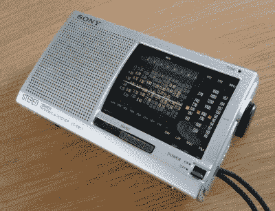
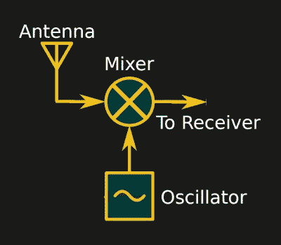
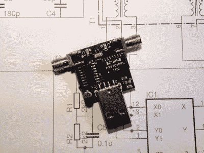
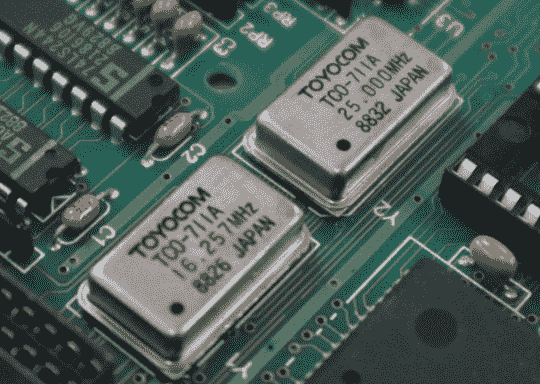
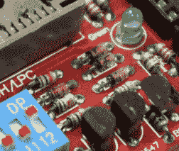
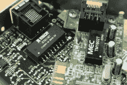
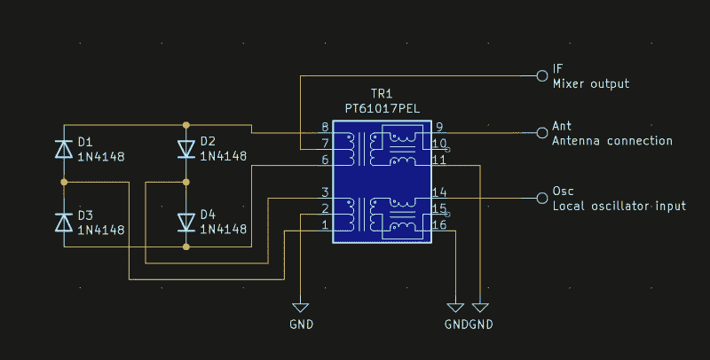

# 拥有一台短波收音机再次成为一种颠覆活动

> 原文：<https://hackaday.com/2022/03/17/owning-a-shortwave-radio-is-once-again-a-subversive-activity/>

对于一个在 20 世纪 70 年代和 80 年代迷上电子和无线电的青少年来说，一个永久的记忆是覆盖短波频谱的宣传电台的扩散。其中一些有点不切实际，例如阿尔巴尼亚的地拉那电台自豪地告诉 1980 年代的西欧，该国的每个村庄现在都有电话，但大多数电台是美国之音和莫斯科电台的更主流的意识形态娱乐。

这是一个早已过去的时代，因为冷战是一个遥远的记忆，东西方的公民都从互联网上获取信息，但也许在入侵乌克兰后，那些时代会有回音。随着大多数外部新闻机构被赶出俄罗斯，他们的网站被封锁，国际广播公司正在推出新的短波服务来传播新闻。在俄罗斯拥有一台短波收音机可能会再次成为一种颠覆活动。我们来造一个吧！

## 便携式收音机到底怎么了？

A typical small world band radio. Donald Trung Quoc Don (Chữ Hán: 徵國單) [CC BY-SA 4.0 International](https://commons.wikimedia.org/wiki/File:Sony_ICF-SW11_12-band_World_Band_Radio,_Winschoten_(2019)_01.jpg).

曾经有一段时间，每个人都有一台收音机，听广播是一种普遍的职业。从 20 世纪 30 年代围着装饰华丽的家庭收音机的家庭，到 20 世纪 60 年代和 70 年代拿着手提电脑的青少年，这是 20 世纪的典型形象。虽然我们中的许多人在 2022 年仍然在这里收听广播，但我们可能不再通过 AM 收听，当然也不会通过短波收听。我们可以即时访问几乎任何在线内容，所以这绝不意味着某些人会有收音机。如果那些短波广播又开始了，他们的目标听众怎么能收到呢？也许是时候用 2022 年的眼光来看待短波收音机了。

如果你缺少一台短波收音机，而且翻遍了你家所有的垃圾也没有找到几十年前的遗物，那么得到它最简单的方法当然是买一台。全球速卖通到处都是起价低于 20 美元的“世界波段”收音机，如果你不介意等待从中国发货，那么这是阻力最小的途径。

但有一个问题，国际活动发展迅速，可能没有等待三周的奢侈，甚至没有在战区订购的奢侈。你怎么能做一个？此外，在 Silicon Labs 系列单芯片无线电中还有一个极其简单的选项。这些为[提供了一个高性能的短波接收机](https://hackaday.com/2020/03/02/multi-band-receiver-on-a-chip-controlled-by-arduino/),只需要最少的外部部件，这真是一个集成的奇迹。但同样，在战区和芯片短缺的情况下，它们可能不是一个选项。那么，如何利用现有消费电子产品中的零件来制造短波收音机呢？我们将首先看看一些可能的途径，然后介绍几个现成的构建模块。

## 你从哪里开始？

最好的开始方式是看看你可能已经拥有的东西。诸如电池供电的调幅收音机、汽车收音机，甚至 10 美元的 RTL-SDR 棒等电子废弃物。所有这些都可以修改或转换，以接收短波广播波段，往往与现成的部分。

最简单的方法可能是直接修改现有的 AM 收音机。我很感激[Phil M6IPX]给我传递了一个关于做这件事的方法的说明链接。它涉及到改变无线电中铁氧体棒天线线圈的谐振频率，我猜，是依靠本地振荡器的谐波比基波来进行混频。它没有覆盖所有的广播波段，但在必要时也可以。

Block diagram of a receive converter

下一个方法是将短波信号从原来的频率转换成你现有的收音机可以接收的频率。业余无线电爱好者对接收转换器很熟悉，这是一种将来自天线的信号与固定频率本地振荡器混合，以产生两者差的中频的设备，使用这种技术应该相对简单。

调幅收音机的调谐频率约为 1 MHz，可与转换器配合使用，仅覆盖众多短波广播波段中的一个。[Phil]再次建议，16 MHz 晶体振荡器模块可以与混频器一起使用，将 15 MHz (19 m)广播波段调谐到 AM 收音机上，而常见的 4.433 MHz PAL colourburst 晶体和简单的晶体管振荡器可以对 5 MHz (60 m)波段做同样的事情。如果我要为 AM 收音机制作这样一个粗略的转换器，我会试图找到一个汽车 AM 收音机作为我的中频，因为这些收音机屏蔽良好，有一个方便的同轴天线输入。

My one-inch converter PCB

同时，RTL-SDR 可以通过修改或使用转换器来修改，以用于短波接收。[直接采样黑客](https://www.rtl-sdr.com/rtl-sdr-direct-sampling-mode/)绕过板载调谐器芯片，将信号直接传输到 SDR 芯片，具有良好 SMD 焊接技能的任何人都可以执行，对于那些不愿意尝试的人，另一种方法是使用带有 50 MHz 振荡器的转换器。几年前[我制作了这样一个使用 CMOS 芯片的转换器](https://hackaday.io/project/8486-hf-receive-converter-for-rtl-sdrs-and-similar)作为我在 Hackaday 平方英寸竞赛中的参赛作品，但是[还有更简单的电路可以找到](https://qrp-gaijin.blogspot.com/2017/07/rtl-sdr-upconversion-with-diode-ring_30.html)。

最后，也许最简单的可用短波收音机是直接转换接收器。其原理类似于接收转换器，来自天线的信号与来自振荡器的信号混合，产生两者之间的差值，当本地振荡器与所需电台的频率相同时，该差值可以被馈送到音频放大器并被收听。它需要振荡器、混音器和音频放大器三个相对简单的电路，虽然它不能为音乐广播提供可接受的性能，但它对语音很好。

## 本质:零件和电路

已经让大家对接收转换器和直接变频接收机有所了解，现在是时候看看这些构建模块了。在无法进入全球电子零件供应链的情况下，你如何用你在电子垃圾中找到的零件来制造它们呢？

  Crystal oscillator modules on an old graphics card  A row of through-hole diodes on a PCB  The VALOR and MEC parts are Ethernet transformers

制造振荡器和混频器的方法有很多，但就我们的目的而言，我们感兴趣的器件是用于本振的晶体振荡器模块、用于 RF 耦合的宽带 RF 变压器以及作为混频器元件的二极管。可变频率振荡器的制作[要稍微复杂一些，但是可以用最基本的元件](https://pe2bz.philpem.me.uk/Comm/-%20Receivers/-%20Misc/CWr-01-40-80meters-4tran/VFO/vfo.html)制作，但是如果你有一个信号发生器，甚至[一个带有适当软件的树莓派](https://github.com/JennyList/LanguageSpy/tree/master/RaspberryPi/rf/freq_pi)，你就可以用它们来代替。

晶体振荡器普遍存在于各种 PC 扩展卡和其他计算机主板上，当提供 5 V 电压时，它会在其输出引脚上提供逻辑电平方波。同时，任何快速以太网接口都将包含一个 RF 变压器，多种不同类型的电子设备中都可以找到小信号二极管。除了这些器件，可能还需要晶体管和无源器件等常规分立器件，但这些器件也可以从各种来源获得。

This is the basic made-from-junk diode ring mixer. It’s not perfect, but it works.

二极管环形混频器是一个非常简单的电路，使用一对 RF 变压器和四个二极管。它的工作原理是使用二极管作为开关，以本地振荡器频率工作，交替通过和阻止信号频率。结果是中频(IF)，即输入信号和本振之间的差值。利用所示电路，用一个以太网变压器和四个信号二极管就可以很容易地实现。对于 100 Mbit 以太网变压器，它应该有 100 MHz 带宽。有多种方法可以将该电路与合适的振荡器一起用作 AM 无线电的接收转换器或直接转换接收器。

对于转换器，只需将晶体振荡器模块的输出连接到本地振荡器引脚，并将输出馈入 AM 收音机，而对于直接转换，则使用可变振荡器，并将输出连接到麦克风或唱机放大器等灵敏的音频放大器。AM 收音机的耦合既可以直接连接到汽车收音机的天线插座，也可以通过缠绕在便携式 AM 收音机外壳上的几圈电线。这个电路有一个问题，因为它没有滤波，因此拾取本地振荡器和 IF 频率的和与差，但它应该足以吸引短波广播。

这些并不是制造短波接收器的唯一方法——毕竟从一个水晶装置开始的所有东西都可以被哄着工作——但是我们认为它们可能是利用手边的电子设备制造短波接收器的最佳方法。也许你有一些新的想法？把它们留在评论里吧！