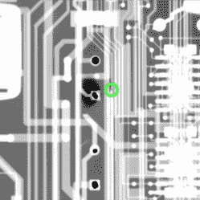

# 老式电表维修？用 x 光更容易

> 原文：<https://hackaday.com/2022/03/06/vintage-mmu-repair-its-easier-with-x-rays/>

这里有一个有趣和详细的[拆卸和修理吉时利 2001 年 7.5 数字万用表](https://thesignalpath.com/blogs/videofeed/tnp-13-teardown-repair-of-a-keithley-2001-7-5-digit-multimeter/)是积极滴细节。我们也不是每天都能看到有人使用 x 射线成像来评估失效电解电容导致的 PCB 损坏程度。

Dark area is evidence of damage in the multi-layer PCB.

可悲的是，这种特殊的模型特别容易受到精确的老式电子问题:电解电容器故障和泄漏。这些故障会导致迹线被破坏，这个特定的单元有许多这样的故障(除了几个被破坏的二极管，只是为了更好地测量。)这就是 x 光机派上用场的地方，因为一些损伤隐藏在多层 PCB 内部。

[Shahriar]可能以[信号路径]而闻名，它在一个视频中讲述了修复高质量台式万用表的整个过程，嵌入在下面(或者你可以[直接跳到正在拆卸的 x 光机](https://youtu.be/eLGWGXfDqxg?t=217))。)[Shahriar]能够修复该设备，部分原因是它的形状相对较好，并且有合适的工具可用。旧的电子产品并不总是如此合作；设备越老，越有可能[遇到不再存在的物理和逻辑标准](https://hackaday.com/2021/02/20/vintage-calculator-design-shows-just-how-much-we-take-for-granted-today/)。

 [https://www.youtube.com/embed/eLGWGXfDqxg?version=3&rel=1&showsearch=0&showinfo=1&iv_load_policy=1&fs=1&hl=en-US&autohide=2&wmode=transparent](https://www.youtube.com/embed/eLGWGXfDqxg?version=3&rel=1&showsearch=0&showinfo=1&iv_load_policy=1&fs=1&hl=en-US&autohide=2&wmode=transparent)

