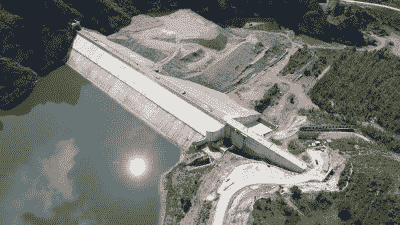
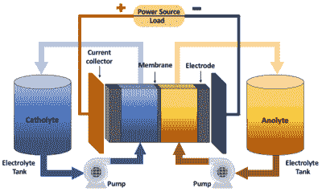
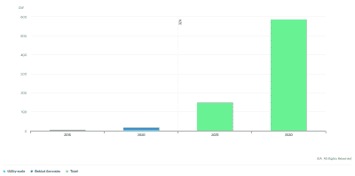
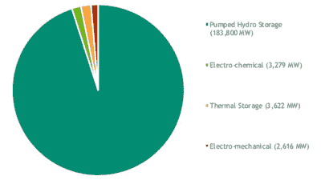
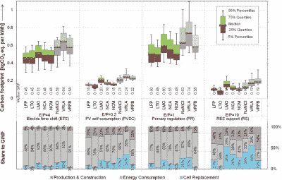

# 电网级储能和高效储能的挑战

> 原文：<https://hackaday.com/2022/04/06/grid-level-energy-storage-and-the-challenge-of-storing-energy-efficiently/>

虽然每个电网都是从发电开始的，但有时以某种形式储存电能而不是立即使用是非常方便的。今天的电池供电设备是这种时移的一个明显例子，但能量存储在电网本身也起着重要作用，无论是以电化学、机械还是其他形式。

公用事业级能量存储不仅对稳定电网至关重要，而且对时移过剩能量也至关重要，并通过吸收过剩能量提供了一种应对需求突然激增(调峰)和需求下降的方法。电网的健康基本上可以被认为是其交流(AC)频率的函数，强烈的偏差可能导致电网崩溃。

自然，这种能量存储不是免费的，将它加入电网的好处必须与费用以及潜在的替代方案相比较。随着电网上以不可调度的可变可再生能源形式出现的高度不稳定的发电机(例如风力涡轮机和光伏太阳能)的快速增加，除了使用能量存储来促进电网健康之外，还推动了存储更多的过剩功率而不是减少它。

## 存储类型

The Fengning pumped storage power station in north China’s Hebei Province. (Credit: CFP)

如上所述，对电网稳定性的最大威胁来自电网频率的损失，因为这表明连接的发电机和其他输入不再能够同步的情况。其结果通常是[连锁故障](https://en.wikipedia.org/wiki/Cascading_failure)停电，需要缓慢而痛苦地重启系统才能恢复。因此，电网上的存储必须能够应对需求的起伏，以便不断调整供给和需求。

这些需求的增加和下降是高度动态的，通常需要能量存储系统在几毫秒内做出响应，而其他需求变化则更加平缓，间隔时间长达几分钟到几小时。为了尽可能快地做出反应，[飞轮](https://en.wikipedia.org/wiki/Flywheel_energy_storage)和电池储能非常合适，而抽水蓄能( [PHS](https://en.wikipedia.org/wiki/Pumped-storage_hydroelectricity) 和压缩空气储能( [CAES](https://en.wikipedia.org/wiki/Pumped-storage_hydroelectricity) )则适合在更长的时间内更加渐进地吸收和释放能量。

当谈到这些电网稳定系统时，能源的实际成本是次要的，因为它们的主要功能是防止电网崩溃。在这方面，这种存储系统是电网不可分割的一部分。这不同于“电网存储”进入公共领域的方式，即通过风力涡轮机和光伏太阳能电池板等可再生能源产生的大量能量的时移。

在最极端的情况下，设想中的国家电网只使用可变的可再生能源和水力发电，同时将多余的能量储存在电网中，以便在几周到几个月的时间内随着供应波动而转移和释放。自然，在这种情况下，像热电厂这样的可调度发电机被大多数不可调度的电源和电网存储所取代，许多因素是必不可少的。首先是系统成本，其次是运营成本，因为这些成本决定了这些存储解决方案释放的任何能量的价格。

为了将能量存储扩展到该场景所需的水平，需要在系统和运营成本方面能够与 PHS 和 CAES 相匹配的技术。几十年来，回流流动电池已经被开发为一种可能的解决方案。

## 氧化还原液流电池

Redox Flow Battery (RFB) schematic layout. (Credit: Clemente et al. 2020)

氧化还原(来自还原-氧化)液流电池–或[RFB](https://en.wikipedia.org/wiki/Flow_battery)–是一种使用液体阳极和/或液体阴极电解质的电化学电池。在大多数实施方式中，用于阴极和阳极的流体被允许电荷交换的膜分开。理论上，这种系统将允许非常大的能量存储容量以及非液流电池的大部分优点，例如快速充电和放电响应时间。

不幸的是，尽管经过几十年的研究，即使是最有前途的液流电池类型，[钒-钒](https://en.wikipedia.org/wiki/Flow_battery)的电解液比能量也非常低，约为 20 Wh/kg，而老式铅酸电池的电解液比能量为 25-50 Wh/kg，锂离子电池的电解液比能量超过 200 Wh/kg。这意味着电解液罐必须非常大，以匹配例如基于锂离子或铅酸的电池存储系统的能量容量。这里的密度限制是由将氧化还原化合物溶解到溶剂中的能力设定的，对于全钒液流电池，溶剂通常是硫酸(H [2] SO [4] )。

[Clemente 等人(2020)](https://www.mdpi.com/1996-1073/13/17/4514/htm) 讨论了液流电池的这些和其他问题。所涉及的问题还包括寿命，特别是膜材料，以及电解质本身，因为它会与氢气和氧气发生不必要的反应。由于液流电池依赖于电解液的流动，电解液的流动特性，以及泵送电解液和获得最佳流速所消耗的能量，给乍一看似乎简单的系统增加了工程复杂性。

另一个复杂因素是难以确定充电状态。因为电池电极上的电压并不对应于多少氧化还原对物质已经转化为充电/放电状态。对于钒液流电池，一种选择是使用电解液的颜色进行评估，因为氧化还原过程会改变钒物质的物理性质。对于全自动充电控制，这些只是许多工程问题。

如[徐等人(2018)](https://www.researchgate.net/publication/322505915_Evaluation_of_redox_flow_batteries_goes_beyond_round-trip_efficiency_A_technical_review) 所述，液流电池的系统效率>为 60%，全钒电池的系统效率可能会提高到 82%左右。除了欧姆损耗和流阻损耗之外，液流电池的一个不利方面是由电泵引起的寄生损耗。由于氧化还原反应是放热的，在操作过程中不可避免地会损失一些能量。

对液流电池完全充电意味着让所有氧化还原对物种经历期望的氧化还原操作。因为这涉及在分隔两种电解质流的膜表面的相互作用，这种可能性随着电荷状态而降低，因为更少的氧化还原对将相互作用。增加的电解液流量在某种程度上补偿了这一点，但是这可能增加寄生损失，并且使得简单地通过增加槽的尺寸来扩大系统变得没有吸引力。

与高得多的往返效率和低得多的复杂性(例如锂离子电池(> 90%)相比，今天商业运行中的大多数大规模电网级电池解决方案采用这种锂离子电池并不令人惊讶。

## 成本图

Total installed battery storage capacity in the Net Zero Scenario, 2015-2030\. (Credit: IEA)

在当前的网格存储应用中，不需要大量的容量。通过几兆瓦的战略性飞轮和电池系统，应该有足够的容量来响应一些有限的时移需求的变化。

对于长期储存(约 4 小时)，在环境允许的情况下，最好使用 CAES 和 PHS。这种长期存储系统的常见用途包括在低需求时存储热电厂产生的能量。火力发电厂通常有最佳的运行水平，这使得将过剩的电力时移用于以后的排放具有成本效益。

随着越来越多的不可调度资源被添加到电网中，随着整个电力市场商业模式的发展，存储容量必须增加以适应前所未有的时移。火力发电厂和水力发电厂使用多年合同在容量市场上出售它们生产的电力，而可变可再生能源装置在能源市场上出售生产的电力，这意味着它们生产的电力是机会性的和不可预测的。本质上，电力是在可用时卖给电网的，而不管当时是否需要。

这意味着，为了成功的电网整合，这些系统需要大量的[旋转储备](https://en.wikipedia.org/wiki/Operating_reserve)来补偿供应的下降，并储存过剩的电力，例如国际能源署的[净零情景预测](https://www.iea.org/reports/energy-storage)中详细描述的，该预测认为目前 10 GW 的公用事业级储存(除了电表后的 7 GW)到 2030 年将增加到 600 GW。

Global installed storage capacity in 2018\. (Source: DOE)

在 2013 年由普渡大学[州立公用事业预测小组](https://www.purdue.edu/discoverypark/sufg/)进行的[分析](https://www.purdue.edu/discoverypark/sufg/docs/publications/SUFG%20Energy%20Storage%20Report.pdf)中，比较了许多存储解决方案的预计成本。值得注意的要点是，随着时间的推移，系统成本在 PHS 和 CAES 的情况下都非常小，因为这些系统往往需要相对较少的维护，同时持续许多次充电/放电循环。当时，锂离子电池在储能市场并不是一个大玩家。

在桑迪亚国家实验室 2018 年的一项更近的分析中，我们可以看到绝大多数的电网存储是 PHS ( > 183 GW)。那一年在美国的电池存储中，锂离子电池已经占了 78%的安装电池存储，这个数字从那以后已经增长了几个吉瓦。例如 [Vistra 位于加利福尼亚州蒙特利县莫斯兰丁的 1.2 GWh](https://www.powermag.com/vistra-energizes-massive-1-2-gwh-battery-system-at-california-gas-plant/) (300 MW)锂离子设施及其后续二期扩建。虽然两个装置目前都处于离线状态，但[已经着火](https://www.pv-magazine.com/2022/02/17/worlds-largest-lithium-ion-battery-is-down-again/)，显示出电池存储的内在风险。

根据美国能源信息署(EIA)的数据，美国的用电量将在 2023 年达到约 4,000 TWh，这在一定程度上表明了如果世界电力需求的很大一部分要通过公用事业级电网存储来满足的挑战。以 Vistra Moss Landing 存储为例，要覆盖 1 TWh(美国需求的 0.025%)，将需要 625 个这种 1.6 GWh 的设施，足以满足美国短期的需求。桑迪亚国家实验室的报告中也提到了缺乏大规模、长期储存的问题。

## 环境影响

Carbon footprint of battery storage technologies (Baumann et al., 2016)

很明显，至少目前锂离子电池系统正在夺取电网存储的战利品，因为 PHS 和 CAES 都不能合理地扩展，因为它们在地质和类似方面存在局限性。除了锂离子的成本较高之外，一个重要的考虑因素是这些电池的环境成本，因为电池的制造是能源密集型的，并产生大量的温室气体( [Baumann 等人，2016](https://onlinelibrary.wiley.com/doi/10.1002/ente.201600622) )。

随着这种电池系统的增加，当考虑到生命周期排放时，可变可再生电力的有效碳排放可以达到大约 100 gCO2e/kWh 的水平。当考虑碳排放的经济成本和环境影响时，从环境的角度来看，这似乎是相当自我挫败的，更不用说成本高昂了。

使用可调度的水电、煤、天然气和铀，从重力势、碳或裂变物质到电力的转换按需进行。相比之下，使用大部分间歇性电源为国家电网供电似乎是一个未解决的问题，因为这需要储存大量的电力。尽管将来可能会找到一个合理的解决方案，但至少目前还没有一种成熟的、可扩展的技术能够以一种经济的方式实现这一功能。

[标题图片:巴斯县抽水蓄能电站(鸣谢:查)]