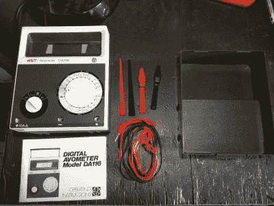

# 老式万用表得到液晶显示器移植

> 原文：<https://hackaday.com/2022/03/08/vintage-multimeter-gets-an-lcd-transplant/>

黑客通常是多愁善感的类型，爱上了高质量的老硬件的外观和感觉。当然，有时旧的硬件需要一点小心来保持它在现代世界中的运行。[Lex]有一台漂亮的老式万用表，可惜屏幕坏了，于是他开始精心修理，让它恢复正常工作。

It’s a handsome thing.

HSN Avometer DA116 是一个漂亮的东西，由两个表盘控制，具有干净的双色调美学。甚至印刷电路板上的字体也非常漂亮(有人能认出来吗？).但是，原来的液晶屏无法正常工作。遗憾的是，没有直接替换零件。相反，为了纠正这一点，[Lex]首先找到了另一个具有相同分段布局的分段 LCD 屏幕。

然而，新屏幕的引脚排列与原器件完全不同。因此，在做了一些笔记并弄清楚所有引脚的作用后，[Lex]迅速拿出一个适配器板来安装新屏幕。有了一些原型板、一些引脚头和一些点对点布线，新屏幕工作得很好，[Lex]又有了一个正常工作的老式仪表！

这个故事实际上是在 Twitter 上发生的，我们在那里邀请大家讨论最好的博奇布线工作。请随意在对话中分享您自己的故事！如果你在市场上寻找更多的液晶黑客，一定要去[看看【乔伊·卡斯蒂略】在 2021 Remoticon](https://hackaday.com/2022/02/24/remoticon-2021-joey-castillo-teaches-old-lcds-new-tricks/) 上的精彩演讲。