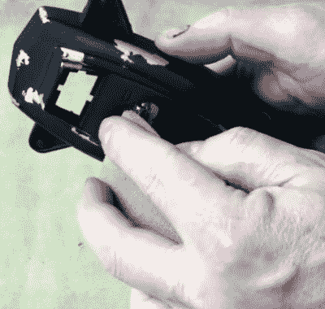

# 廉价的捉鬼敢死队玩具变成了令人信服的道具

> 原文：<https://hackaday.com/2022/03/14/cheap-ghostbusters-toy-turned-convincing-prop/>

正如你所料，去年发布的《捉鬼敢死队:来世》不仅引发了人们对上世纪 80 年代的旧玩具和搭售商品的兴趣，还催生了全新一代的闪亮塑料小玩意，让所有年龄段的孩子都喜欢。当然，对于像我们这样的人来说，这意味着需要更多的硬件来入侵。

在最近官方*捉鬼敢死队* YouTube 频道的一篇帖子中，[专业道具制作人【Ben Eadie】展示了一些交易技巧](https://www.youtube.com/watch?v=VbZ1Hjalevs)，他从孩之宝拿了一个 15 美元的“PKE 米”玩具，并把它变成了一个屏幕质量的道具。即使你不想早早开始制作万圣节服装，这段视频中展示的技巧也可以很容易地应用到其他项目中。对于那些下一个理想的家庭改善是一个消防队员的杆和一个外质激光限制网格，你可能想抓住一对夫妇这些玩具，而他们最终转换仍然很便宜。

Uncovering the silver makes the piece look worn down.

从视频中最大的收获可能是完成技术，因为它们可以用于任何种类的现实道具制作。[Ben]首先使用橱柜刮刀抹平塑料玩具上的线条，然后用熟悉的小苏打和氰基丙烯酸酯胶水填充任何孔洞。一旦表面已经准备好，所有的主要部分都喷上一层附着力促进剂，然后是一层银，最后是黑色。

这使得他可以通过战略性地打磨或刮擦面漆，创造出令人信服的“油漆碎裂”效果。在喷最后一层之前，在你想让设备看起来磨损的地方涂抹一些牙膏会使这个过程更快，因为这将首先防止面漆粘到银上。

不幸的是[Ben]并没有花太多的时间来解释电子方面的事情，但是看起来并没有什么太复杂的事情发生。所有原来的齿轮被剥离，取而代之的是一个微控制器，我们*相信*是一个水果其系统 nRF52840 快递。这连接到两串微小的 APA102 可寻址 led，它们沿着“翅膀”(我们特别喜欢用于取代原始固体点的 3D 打印透镜)运行，其中一个用于提供标志性的正弦波显示。

虽然我们看到的上一个 [PKE 测量仪确实检测到了辐射](https://hackaday.com/2019/07/24/a-pke-meter-that-actually-detects-radiation/)，但我们不得不承认，就外观而言，这个占据了首位。尤其是当你想到这东西有多便宜的时候。[你现在需要的只是一个质子包](https://hackaday.com/2019/12/14/replica-proton-pack-is-a-great-halloween-build/)，你就可以为万圣节做好准备了。

 [https://www.youtube.com/embed/VbZ1Hjalevs?version=3&rel=1&showsearch=0&showinfo=1&iv_load_policy=1&fs=1&hl=en-US&autohide=2&wmode=transparent](https://www.youtube.com/embed/VbZ1Hjalevs?version=3&rel=1&showsearch=0&showinfo=1&iv_load_policy=1&fs=1&hl=en-US&autohide=2&wmode=transparent)

