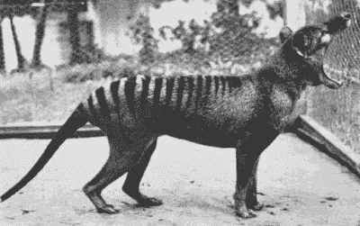
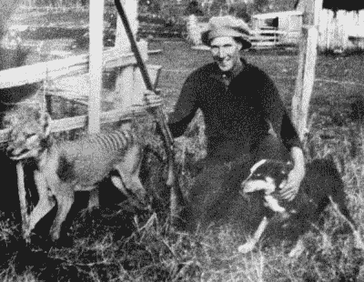
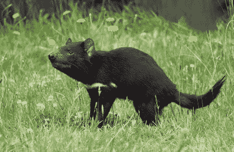

# 科学驱动的塔斯马尼亚虎回归之旅

> 原文：<https://hackaday.com/2022/03/14/the-tasmanian-tigers-comeback-tour-powered-by-science/>

科学家们估计，仅在过去的五个世纪里，就有大约 900 个物种灭绝了，更不用说在那之前的几十亿年里从生命中消失的成千上万的物种了。

传统观点认为，一旦一种动物灭绝，它就永远消失了。然而，墨尔本大学的一个团队希望改变这一切，他们的新项目旨在让塔斯马尼亚虎起死回生。

## 一个不起眼的图标

“Benjamin” was the last known living thylacine, passing away at Hobart Zoo in 1936\. Credit: [public domain](https://en.wikipedia.org/wiki/File:%22Benjamin%22.jpg)

塔斯马尼亚虎，也被称为袋狼，最后一次被看到是在 1936 年，当时一只名叫本杰明的雄性袋狼在霍巴特动物园去世。在野外，人们怀疑该物种大约在 2000 年前在其大部分栖息地开始濒临灭绝，人类因素和气候变化被认为是主要的原因。

食肉有袋动物的野生例子最后一次被报道是在 19 世纪 30 年代的澳大利亚大陆。栖息地的破坏、狩猎和疾病最终导致袋狼在塔斯马尼亚岛灭绝，最后一只袋狼于 1930 年被一位农民杀死。

袋狼有着独特的“长条纹狗”的外表，从鼻子到尾巴大约有 180 厘米长，58 厘米高。事实上，正是这些条纹让这种动物获得了“塔斯马尼亚虎”的名字，尽管它与任何猫科动物都没有任何关系。

热切的爱好者们仍然不时地报告看到袋狼，但是在过去的 86 年里，没有一次得到证实。无论是动物的默默无闻，它好奇的样子，还是简单的事实，人们想要他们不能拥有的东西，袋狼继续吸引着澳大利亚和其他地方的野生动物爱好者的心灵和思想。

## 灭绝的候选人

Farmer Will Batty killed the last known wild thylacine, pictured here, in 1930\. Credit: [public domain](https://en.wikipedia.org/wiki/Thylacine#/media/File:Wilf_Batty_last_wild_Thylacine.jpg)

尽管袋狼很受欢迎，但它是灭绝物种的主要候选动物还有其他原因。多亏了 20 世纪早期收集的一个婴儿，科学家们后来能够对这种动物的全部基因组进行测序。这是一项重大成就；只有部分基因组阻碍了许多其他灭绝物种的努力，比如 T2 拯救长毛象的工作。

有了这些数据和 500 万美元的捐款，墨尔本大学正在建立一个实验室，明确的目的是复活塔斯马尼亚虎，并进行灭绝和有袋动物保护研究。这个实验室将被称为袋狼综合基因恢复研究实验室，简称 TIGRR。

该实验室的首要目标是复活袋狼，但它也将研究干细胞技术，以及基因编辑和代理人的使用，以推动灭绝领域的发展。希望实验室的工作能有助于防止一些有袋类物种像塔斯马尼亚虎那样成为灭绝的牺牲品。

The Tasmanian devil is a potential candidate for surrogacy of a lab-developed thylacine embryo. This marsupial population faces its own challenges, particularly due to a contagious facial tumor disease. Credit: [JJ Harrison,](https://en.wikipedia.org/wiki/Tasmanian_devil#/media/File:Sarcophilus_harrisii_taranna.jpg) [CC BY-SA 3.0](https://creativecommons.org/licenses/by-sa/3.0)

最初的努力将是研究利用有袋动物干细胞创造一个有活力的袋狼胚胎的可能性。这个胚胎将被移植到代孕母亲体内。代孕的主要候选动物是邓纳特或袋獾，它们被认为与袋狼足够接近，可以使怀孕成为可能。

作为一种有袋动物，袋狼怀孕时有几个好处。一旦一个胚胎被创造出来并被移植到一个替代物种的子宫中，它将会经历妊娠。然而，与(有胎盘的)哺乳动物不同，有袋动物的妊娠期更短，也更简单，幼小的幼仔会被转移到母亲的育儿袋中进一步发育。在实验室里，育儿袋生活和哺乳的这段时间可以很容易地用奶瓶喂养来代替，这进一步简化了年轻的新生袋狼的早期发育。

这在理论上听起来很简单，事实上，墨尔本大学的团队已经为他们希望实现的目标设定了一条清晰的前进道路。然而，这将需要数年的工作来发展干细胞培养，胚胎创造和子宫植入技术，以真正达到生产袋狼的地步。不管怎样，类似的工作以前已经在克隆非灭绝动物方面做过了，所以这不是不可能的。

当然，从一百年前的遗传物质中克隆出一只袋狼是一回事，建立一个兴旺的种群是另一回事。由于只有一个基因组，缺乏遗传多样性可能会使建立一个自我维持的袋狼群体变得困难或不可能。可悲的是，几乎没有现存的有袋类动物近亲能够与袋狼杂交，从而产生新的种群。

不管怎样，现在钱在那里，科学家在工作，所以从现在开始到我们看到一个世纪内第一只袋狼在地球上出生可能是一个非常短的时期。