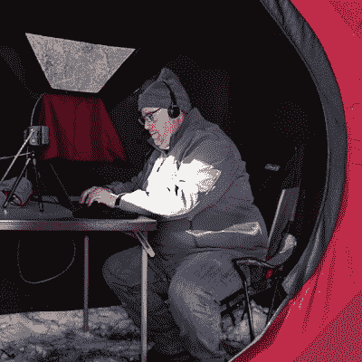

# 冰上钓鱼帐篷让冬季火腿收音机变得舒适

> 原文：<https://hackaday.com/2022/03/12/ice-fishing-tent-makes-winter-ham-radio-comfy/>

不同活动和行业之间的交叉授粉可以产生一些非常有用的技术或产品组合，【Steve】分享了一些关于[使用冰渔具使冬季火腿广播活动更加舒适和便携的细节](https://hvdnnotebook.blogspot.com/2022/02/fishing-in-woods-looking-for-radio.html)。

 在一个折叠帐篷避难所的帮助下，【史蒂夫】能够创建一个最小的自给自足的野外工作站，容纳他所有需要的设备，并在一个小型丙烷加热器的帮助下，在 [24 小时冬季活动](https://www.winterfieldday.com/)中保持相当舒适。

对于那些对[史蒂夫]正在做的无线电方面感兴趣的人，他详细介绍了他使用的无线电设备和天线，这些设备和天线本身很容易装进包里，并成功地经受住了大风。该活动的目标毕竟是应急准备，虽然无线电可以在没有更广泛的基础设施支持的情况下运行，[天线设计对于最佳效果至关重要](https://hackaday.com/2019/03/04/justin-mcallisters-simple-post-apocalypse-friendly-antennas/)。

至于在整个过程中保持操作者的安全和健康，事实证明，一个既轻便又紧凑的弹出式冬季庇护所的问题已经由冰渔民解决了；虽然推出自己的解决方案很有趣，但并不总是需要重新发明轮子。