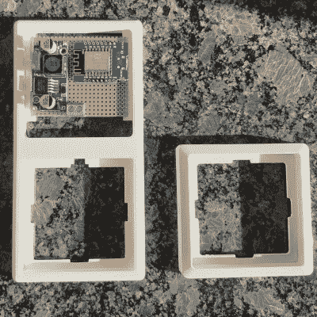

# 可逆通风黑客让房东高兴

> 原文：<https://hackaday.com/2022/03/13/reversible-ventilation-hack-keeps-the-landlord-happy/>

当一个人拥有他们居住的房子时，通常他们需要的唯一批准就是来自他们重要的另一半或室友。在最坏的情况下，也许需要许可证。但是那些租房子住的人几乎在每种情况下都受到更多的限制，当涉及到环境控制时，他们绝对是被禁止的。除非你是一个像[Nik]一样足智多谋的黑客，也就是说，他已经将[他公寓的通风系统无缝集成到他的智能家居控制器](https://hackaday.io/project/184366-smart-apartement-ventilation)中——所有这些都没有任何永久性的修改！

控制器本身只给出三种设置来给公寓通风:低，中，高，然后高 30 分钟，所有模式都必须用手动按钮来启动。[Nik]想要自动化并与他的智能家居集成。

A clean 3D printed enclosure wraps things nicely

令人欣慰的是，设计[Nik]公寓中使用的控制器的工程师非常方便地对其进行逆向工程。扁平带状电缆方便地断开所有按钮*和* 12 VDC，他可以使用其连接器直接接口。第一次破解:完成。

接下来，[Nik]需要一根更长的电缆连接控制器和基于 ESP8266 的控制模块。在全球速卖通上找到连接器很容易，但找到一个长度兼容的电缆需要更多的资源。电缆最终来自雷诺梅甘娜的安全气囊控制器！第二次破解，在控制器中使用汽车部件:干得好！

融入他的智能家居的不仅仅是电子设备。该模块看起来就在原来的控制器上方，如果你不知道更好，你永远不会认为这不是原来的设备。最终破解:完成！

一定要在 Hackaday.io 查看他的构建日志，如果你喜欢家庭自动化，就看看这个[自动泡茶器](https://hackaday.com/2015/01/28/automated-tea-maker/)。