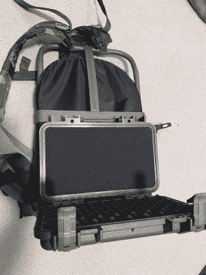

# ApocaPi 现在是一个为以后的事情准备的网络平台

> 原文：<https://hackaday.com/2022/03/15/apocapi-now-is-a-cyberdeck-for-what-comes-after/>

世界末日似乎比以往任何时候都更近，即使是在 20 世纪 80 年代。但是你，亲爱的 Hackaday 读者，想要的不仅仅是一个装满口粮和防水火柴的袋子。你需要一个科技版的窃听器包，一个军用规格的电脑平台，这正是[hammandhanmi]正在完善的东西。

 那不是什么花哨的蛋糕烤盘——那是一个内衬导电箔带的鹈鹕 1170 盒子。你看，[hammerandhandmi]有各种各样的原因没有详细说明这样做，包括 EMP 防护。里面是一个 8 GB 的覆盆子 Pi 4B，戴上 Pi Juice UPS 帽子，从一个别致的电源中啜饮。旧 Mac book 电池的主要充电来源是太阳能，通过 cyberdeck 外部的一个大型面板。一个较小的二级面板位于内部，作为备用。还有一个 MPPT 充电控制器，用于支持不同的电池化学成分。[hammerandhandmi]选择了 Pelican 1170，因为他们需要将它安装到 LC2 Alice 背包框架的背面。1170 比流行的 1150 更宽，事实上几乎是 LC2 框架的精确宽度。

这种构建的要点是为了保存知识而保持力量——所有我们重建人类所需要的东西。通过自由/开源软件的离线浏览器 Kiwix 可以获得很多信息，加上一个地图集，一些军事领域的手册，大量的生存信息，古腾堡计划提供的所有书籍，再加上一些电影和一些游戏光盘，这样[hammerandhanmi]就可以在希望是某种太阳能朋克乌托邦中度过余生。

如果有足够的时间来实现这一切，[hammandhanmi]计划添加一个带天线连接的 SDR、GPS 单元、12 V 端口、几个固态硬盘、一个有源 USB 集线器，可能还有一个 RFID 阅读器。但最酷的部分是，他们最终希望将一切连接到安装在弹道头盔上的 HUD。看到了吗？世界末日可能会很可怕。这取决于我们！

我们经常看到带有机械键盘的电脑平台，就像这个樱桃圆周率数字。但是从 1989 年康柏笔记本电脑中抢救出来的 keeb 可能也是经得起未来考验的。