# 参观世界上最大的计算机博物馆:海因茨·尼克斯多夫

> 原文：<https://hackaday.com/2022/03/30/visit-the-worlds-largest-computer-museum-the-heinz-nixdorf/>

计算机历史上的大多数故事都发生在少数地方之一。布莱奇利公园的战时密码破译工作催生了第一台可编程电子计算机——巨像。20 世纪 40 年代末，英国和美国的各个大学校园是第一代计算机的家园，如 ENIAC、EDVAC 和曼彻斯特宝贝。20 世纪 70 年代，硅谷凭借家用电脑革命抢尽了风头。自然，所有这些地方都有自己的博物馆来庆祝当地的成就，但世界上最大的计算机博物馆并不在硅谷或著名大学的校园里。相反，你必须去一个叫做帕德博恩的德国小镇，那里有海因茨·尼克斯多夫博物馆，也就是 HNF。

海因茨·尼克斯多夫可能不像杰克·特拉米尔或史蒂夫·乔布斯那样在美国家喻户晓，但他是欧洲最伟大的计算机先驱之一。从 1952 年基于真空管的机器开始，Nixdorf 逐渐将他的公司发展成为 20 世纪 70 年代最大的计算机制造商之一。他的产品在金融领域的大型企业中特别受欢迎，如银行和保险公司。然而，到了 20 世纪 80 年代末，销售额开始下滑，该公司最终被西门子收购。今天，Nixdorf 这个名字作为自动取款机和收银机的主要生产商 Diebold-Nixdorf 的一部分继续存在，反映了最初公司对金融行业的关注。

该博物馆的根基在于海因茨·尼克斯多夫个人收藏的打字机和其他办公设备。尽管他已经设想建立一个专门的计算机博物馆，但他在 1986 年的突然去世阻止了这一想法。然而，他的几名员工使该计划得以延续，1996 年，HNF 在帕德博恩开业。今天，该博物馆由一个非营利基金会运营，旨在向广大观众提供信息和通信技术教育。

这些收藏品位于 Nixdorf Computer AG 的前全球总部，这是一座颇为壮观的 20 世纪 70 年代的办公楼，覆盖着金色的窗户。在里面，]]通过紧凑的布局和低矮的天花板，你会想起它以前作为办公楼的生活。它确实给了博物馆一点舒适的感觉，不像，比如说，伦敦科学博物馆的洞穴大厅，但是不要让这欺骗了你:在 6000 米 ² 的高度，主要展览区域大约是硅谷计算机历史博物馆的两倍。

## 一楼:通信和计算基础

主要展览从 5000 年前的手工艺品开始:苏美尔的泥板展示了古代人是如何记录他们的思想、保存清单和进行计算的。像算盘和南美的 quipu 这样的设备展示了物理设备如何帮助算术，否则算术就是一门完全抽象的科学。书写通过一系列不同的媒体发展到印刷媒体，使得比以往更多的人可以获得书面材料。

计算和交流这两个孪生概念贯穿整个展览。在大厅的一侧，各种印刷技术展示了打字机的发明之路，博物馆收藏了大量的打字机。另一方面，算盘演变成复杂的机械计算器。

 [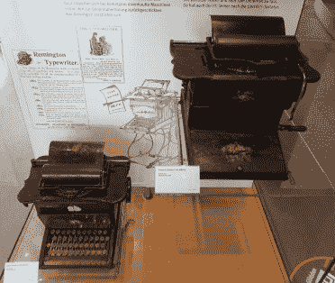](https://hackaday.com/2022/03/30/visit-the-worlds-largest-computer-museum-the-heinz-nixdorf/ancient-typewriters/) Sholes & Glidden introduced the familiar QWERTY layout on their typewriters in the 1870s. [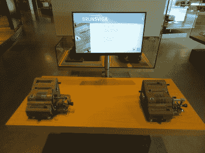](https://hackaday.com/2022/03/30/visit-the-worlds-largest-computer-museum-the-heinz-nixdorf/mechanical-calculators/) Flip those levers and turn those cranks: mechanical calculators can add, subtract, multiply and divide without electricity.

如果你从未接触过这些充满凸轮、曲柄和杠杆的机器，那么你的机会来了。一个有用的电脑屏幕解释了重置计算器、输入数据和启动齿轮以获得预期结果所需的各种步骤。齿轮的呼呼声和十进制显示器的噼啪声表明，为了进行哪怕是一个简单的计算，到底需要做多少工作。

HNF 充分利用现代技术，让其古老的文物焕发生机。例如，一个交互式展览将一个算盘链接到一个计算机显示器上，实时显示珠子的状态，为用户的行动提供即时反馈。但到目前为止，这一层最引人注目的现代科技产品是 PETRA，一个蒸汽朋克风格的机器人导游:问她一个具体的展览，她会亲自带你去那里，并在她的集成显示器上讲述这件艺术品的故事。

一个广泛的名人堂庆祝 15 位先驱科学家和工程师的贡献，他们为信息技术的发展奠定了基础。他们中有威廉·席卡德、布莱士·帕斯卡和戈特弗里德·威廉·莱布尼茨，他们发明了第一台计算机器；查尔斯·巴贝奇和阿达·洛芙莱斯将这些概念进一步发展成可编程计算机；艾伦·图灵和约翰·冯·诺依曼奠定了信息科学的理论基础。

 [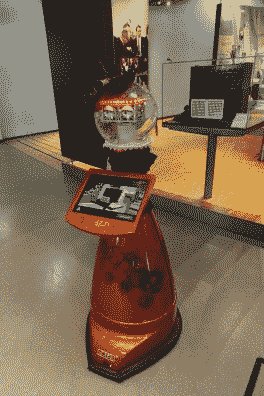](https://hackaday.com/2022/03/30/visit-the-worlds-largest-computer-museum-the-heinz-nixdorf/hnf-petra/) Petra will gladly guide you to specific exhibits and tell you all about them. [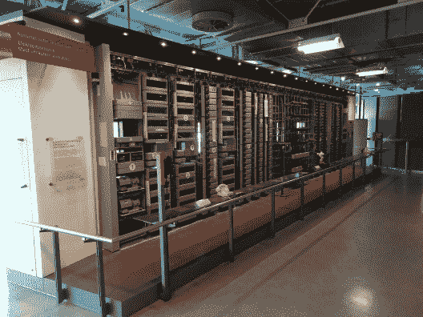](https://hackaday.com/2022/03/30/visit-the-worlds-largest-computer-museum-the-heinz-nixdorf/relay-based-telephone-exchange/) Petra will gladly guide you to specific exhibits and tell you all about them.

一楼尽头令人印象深刻的是一个功能齐全的中继电话交换机。在它的前面是几个不同的电话模型，都连接到一个本地电话系统。你只要拿起一个听筒，拨另一个的号码，听到它响，然后等待有人拿起听筒和你通话。然而，最有趣的事情就发生在你的面前:当你的电话通过线路发送脉冲时，你可以听到继电器发出的滴答声，并实时路由你的呼叫。即使是伴随着智能手机长大的孩子也喜欢玩这些手机(“你能听到我说话吗？”“是的，我也能听见！”)，尽管出生于 1990 年左右的访问者可能首先需要一些关于如何使用那个奇怪的旋转盘来输入数字的指导。

## 二楼:从大铁到口袋大小的小玩意

第二层是物品开始出现的地方，大多数人会认为是电脑。这里许多最古老的设备是由德国的 Zuse 和西门子等公司制造的，它们使用继电器和真空管处理数据，同时将数据存储在穿孔卡上。这些设备经常占据整个房间；一个角落里放着典型的 ESER 1055，它是 IBM System/360 大型机的东德复制品。

漫步在那些堆满手工电路板的货架上，你会很好地感受到计算机时代最初几十年取得的巨大进步:所有硬件的处理能力几乎无法接近 20 世纪 90 年代的台式电脑。

 [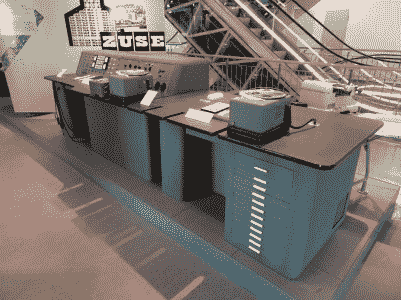](https://hackaday.com/2022/03/30/visit-the-worlds-largest-computer-museum-the-heinz-nixdorf/zuse-z11/) The Zuse Z11 from 1956 had 1,665 relays and could perform five additions per second. [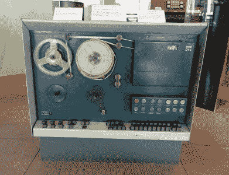](https://hackaday.com/2022/03/30/visit-the-worlds-largest-computer-museum-the-heinz-nixdorf/d4a-computer/) Designed in 1963, the fully transistorized D4a was aimed at scientists and engineers.

说到个人电脑，第一台个人电脑是什么？虽然 1974 年的 Altair 8800 可能会出现在许多人的脑海中，但一位曾经参观过博物馆的前东德工程师声称，他的设计，1962 年的 D4a，应该有这个头衔。毕竟，它是一个可编程的计算设备，可以存储数据，供一个人使用，可以放在(坚固的)桌子上。仅用 200 个晶体管，它每秒就能完成约 2000 次运算，并能在磁鼓存储器上存储 4096 个字，每个字 33 位宽。

博物馆的几个角落致力于计算的社会方面。该办公室的历史被详细描述，从中世纪僧侣抄写圣经的桌子到现代通过视频链接的远程工作。

另一个将计算和通信联系起来的有趣的社会概念是密码学。该博物馆有两台原始的恩尼格玛密码机，以及其他几台来自不同国家的密码机。一个单独的展示柜包含了与黑客和窃听场景有关的艺术品，包括一个原始的 Cap'n Crunch 哨子——它发出了著名的 2600 赫兹频率，可以在 20 世纪 70 年代用于免费拨打长途电话。特别值得一提的是几件属于混沌计算机俱乐部的艺术品，该俱乐部是现存最古老的黑客组织之一。CCC 于 1981 年在西柏林成立，因在 20 世纪 80 年代侵入银行系统和其他反叛行为而闻名，如分发使德国计算机用户能够上网的调制解调器，当时将未经授权的设备连接到电话网络是严格禁止的。

世界上最著名的密码破译者艾伦·图灵也在其中，两个谜中的一个就在他的展位上。但他当然也因图灵机而闻名，图灵机是以他的名字命名的通用计算设备的抽象模型。为了说明它的工作原理，HNF 委托制作了一个机电图灵机模型，参观者可以进行实验。

题为“人人都有电脑”的部分包含了 20 世纪 70 年代到 90 年代的家用电脑和专业电脑。这是那个时代所有大牌的综合收藏:Commodore PET、Apple Lisa、IBM 的个人电脑，当然还有所有展品中最昂贵的:一台工作中的 Apple I 。事实上，这些计算机中的大多数仍在工作，并在特殊活动中得到演示。在其他时候，你仍然可以在几个模拟器中的一个里试用他们的软件。

 [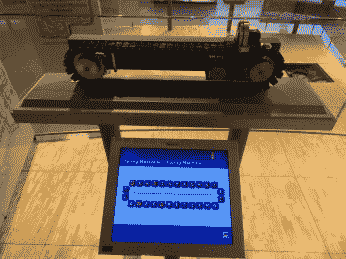](https://i0.wp.com/hackaday.com/wp-content/uploads/2022/03/Turing-Machine-exhibit.jpg?ssl=1) The Turing machine moves data between cells according to its program. [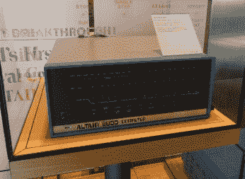](https://i0.wp.com/hackaday.com/wp-content/uploads/2022/03/Altair-8800.jpg?ssl=1) The 1974 Altair 8800 is often considered the first true personal computer. [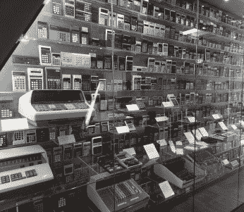](https://i0.wp.com/hackaday.com/wp-content/uploads/2022/03/Calculator-wall.jpg?ssl=1) TI or HP? Sharp or Casio? Algebraic or RPN? LED, VFD or LCD? They’re all here. [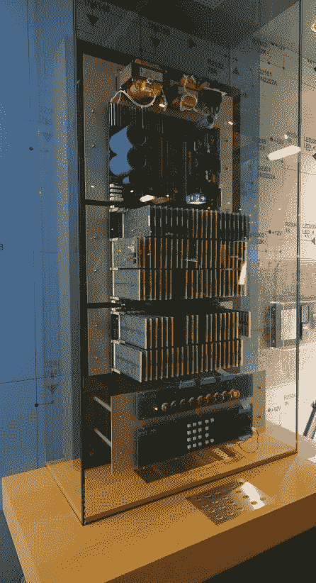](https://i0.wp.com/hackaday.com/wp-content/uploads/2022/03/1960s-tech-pocket-calculator.jpg?ssl=1) Just a decade later, all of this could fit in your pocket.

一楼有机械计算器，二楼有电子计算器。而且不仅仅是几件:一个巨大的陈列柜展示了从 20 世纪 60 年代到 90 年代末的 700 多种不同的类型。如果你在那个时候上过学，很有可能你会在这个收藏里找到你用过的那个。再次，所有的大牌都有代表:早期的佳能 Pocketronic，科学的 HP-35，运行 BASIC 的夏普 PC-1210，以及今天仍然流行的 TI-84 和卡西欧 Fx 系列图形计算器。

紧挨着计算器墙的是一个展览，展示了如果使用 20 世纪 60 年代的技术来建造一个简单的四功能计算器会是什么样子。它不是一个集成电路，而是一大堆电路板，上面有数百个分立的晶体管；它有一个数码管显示器，而不是低功耗的液晶显示屏。它执行计算的方式与袖珍计算器完全一样，尽管速度要慢得多。实际上非常慢，以至于你可以实时跟踪其电路中的数字流。这个美丽的展品是由同一位工程师制作的，他也是 Elektronensaldierer ES 24 的现代复制品。

主展区的尽头是机器人和人工智能展区。克劳德·香农的粉丝会很高兴地发现，香农的机电迷宫导航鼠标机器人忒修斯(Theseus)又重新出现了。

[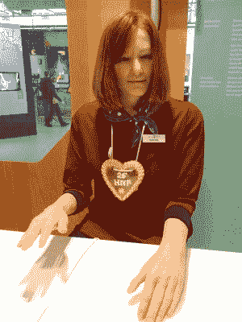](https://hackaday.com/wp-content/uploads/2022/03/Nadine-the-Robot.jpg)

Nadine felt like a clear demonstration of the [uncanny valley](https://en.wikipedia.org/wiki/Uncanny_valley).

Nadine 实现了一种更现代的人工智能，这是一个类似人类的机器人，可以与你交谈，尽管在我们的访问中，她努力提供比“我不知道那个”更有用的答案；你可能会和智能手机里的语音助手进行更有意义的对话。话说回来，Nadine 建于 2013 年，这让她有点像计算机时代的恐龙。

此外，还有几款 80 年代和 90 年代的经典家用机器人，如 Omnibot 和艾博，以及各种类型的工业机器人。一只名叫 Beppo 的猴子整天用扫帚清扫它的围栏，偶尔与游客互动。自然地，你也可以得到由独臂挥笔机器人艺术家文森特为你画的肖像。

HNF 自称为世界上最大的计算机博物馆，这一点并没有让人失望:即使在里面呆上一整天，也不足以充分欣赏其庞大的收藏。但是简单地称它为计算机博物馆并不完全公平，因为它的收藏不仅仅包括计算机。无论你是对电信设备、密码术、信息技术的社会方面还是编程基础感兴趣，博物馆的某个角落一定会让你着迷。

欣赏博物馆不需要德语知识，因为大多数展品都有德语和英语的双语说明。对于少数不知道的人来说，任何移动翻译应用程序都应该能够提供帮助；如果你仍然困惑，博物馆的人类和机器人工作人员总是在你身边。简而言之，如果你在这个地区，HNF 绝对值得一游，而且每位成人只需 8 欧元，绝对划算。