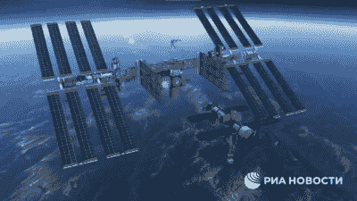
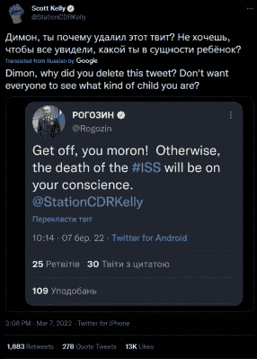

# 人类的一次巨大飞跃:俄乌战争对国际空间站意味着什么

> 原文：<https://hackaday.com/2022/03/21/one-giant-leap-backwards-for-humankind-what-the-russia-ukraine-war-means-for-the-iss/>

国际空间站不仅是以科学和探索的名义建造的，也是团结的象征。五个太空机构，其中一些代表了在国际空间站发射前不到十年一直是冷战死敌的国家，走到一起建立了一个科幻小说中的东西:一个星球之间的家园(嗯，在低地球轨道上),供来自全球的人类为了科学进步而相互合作，高于统治下面岩石的地球政治。至少，这是个想法。

到目前为止，虽然社交媒体渠道上有相当多的声音和愤怒，但国际空间合作似乎继续不受阻碍。我们该如何看待这种咆哮，它会对实际的国际空间站产生什么影响？

## 政治和推特

Astronaut Mark Vande Hei

自从空间站的第一个模块发射到太空以来的 25 年里，发生了很多变化。冷战后开始慢慢愈合的政治关系多年来一直在瓦解，俄罗斯入侵乌克兰是全球不和的最新催化剂。因此，国际太空站的理想高地今天比以往任何时候都更加岌岌可危。

最近的挑战直接来自俄罗斯航天局 Roscosmos。在最近的一份声明中，Roscosmos 负责人 Dmitry Rogozin 威胁要将美国宇航员 Mark Vande Hei 遗弃在空间站，并拆除俄罗斯舱，以惩罚美国新实施的制裁。

范德黑目前计划在几周内乘坐俄罗斯联盟号太空舱离开空间站，结束他创纪录的 355 天太空停留。返回舱预定在哈萨克斯坦着陆，之后凡德·黑和两名宇航员将被运送回拜科努尔航天发射场。令人欣慰的是，在宇航员们走出太空舱的第三个座位之前，Roscosmos 撤回了他们的威胁，并承诺将 Vande Hei 送回地球——但分裂空间站的威胁仍然存在。

## 什么是可能的？

Roscosmos’s depiction of the Russian section detaching

国际空间站是一个模块化的野兽。它是在多年的时间里分块发射的，每块不同的模块有一天会成为一个完整的空间站。总装包括一个美国部分(八个模块)和一个俄罗斯部分(六个模块)，加上两个日本模块和一个欧洲模块。罗戈津威胁的基本上是打包走人——脱离俄罗斯部分，实质上退出国际伙伴关系。Roscosmos 甚至制作了一个相当疯狂的视频，展示了模块的分离和漂浮。目前还不清楚俄罗斯部分是否会退役和脱轨，或者 Roscosmos 是否能够以某种方式将俄罗斯部分变成自己的独立空间站。

美国国家航空和宇宙航行局表示不相信俄罗斯能够简单地漂浮到日落中并维持一个操作站。上周，美国宇航局国际空间站项目负责人乔尔·蒙塔尔巴诺说，“国际空间站是相互依存的，我们一起工作，这不是一个群体可以分离和运作的过程。”没有俄罗斯的推进器和燃料，美国部分无法运行，没有美国的电力和通信，俄罗斯部分也无法运行。正如[罗戈津自己最近所说的那样](https://edition.cnn.com/2021/09/02/world/russian-space-chief-iss-nasa-roscosmos-scn/index.html)，“一个家庭，在这个家庭里，站内离婚是不可能的”。

Kelly calling Rogozin out for deleting his threatening Tweet

虽然这看起来像是把腿从俄罗斯的威胁下拿了出来，但相互依赖使它们更加可怕。如果 Roscosmos 兑现了承诺，国际空间站的其余部分可能很难维持其轨道——尽管 [Elon Musk 已经建议(当然是通过 Twitter ), SpaceX 可以提供一个解决方案](https://www.cnet.com/science/space/elon-musk-says-spacex-can-keep-the-iss-flying-if-russia-wont/)(也许使用龙 2 太空舱？)将国际空间站保持在轨道上。

到目前为止，Twitter 在俄乌战争的许多方面都发挥了独特的作用，航天业也不例外。前宇航员斯科特·凯利与德米特里·罗戈津(Dmitry Rogozin)展开了一场推文大战，罗戈津再次发出了一个几乎不加掩饰的威胁，暗示国际空间站的日子可能屈指可数了。他很快删除了这条推文，但在此之前[凯利截屏让所有人看到](https://twitter.com/StationCDRKelly/status/1500850816558592003)，并且[质疑罗戈津是如何访问 Twitter](https://twitter.com/StationCDRKelly/status/1500558816026394624) 的，该网站在本月早些时候被俄罗斯政府屏蔽。

凯利还在推特上写道，他将归还俄罗斯授予他的“太空探索功勋”奖章，并写道“请把它交给一位俄罗斯母亲，她的儿子死于这场非正义的战争”。我会把奖章邮寄到华盛顿的俄罗斯大使馆。祝你好运。”

对于所有来自罗斯科莫斯的武力威胁，美国国家航空航天局都泰然处之。管理员吉姆·纳尔逊说:“那只是德米特里·罗戈津。他时不时地滔滔不绝。但最终，他还是和我们一起工作了。”

## 明天

所有这些关于空间站分裂的讨论可能会让你感到疑惑——它到底还剩下多少年？

没有你希望的那么多。目前的计划是让国际空间站在 2031 年 1 月，离现在不到 9 年的时间里，在一座水葬墓中结束它火热的生命。美国国家航空航天局和参与该项目的大多数其他航天局已经同意，他们将努力使空间站至少存活到 2028 年，但即使在最近与俄罗斯的紧张局势升级之前，Roscosmos 也不会承诺在 2024 年之后支持空间站。在这种背景下，俄罗斯威胁提前退出国际空间站计划实际上只是空间站老化墙壁上西里尔文字的一部分。

失去 Roscosmos 作为国际航天界的合作伙伴，至少可以说是一个挫折，而且肯定会终结国际空间站。几十年来，太空探索和科学进步是将俄罗斯与美国和欧洲联系在一起的少数几件事情之一——国际空间站的乘员通常由来自世界各地的探险家组成，他们以 7.7 公里/秒的速度绕地球跨栏时一起工作和生活。

在美国宇航局航天飞机和商业机组计划之间的近十年里，美国宇航员依靠联盟号火箭进入太空，俄罗斯宇航员仍然定期在德克萨斯州的约翰逊航天中心进行训练。俄罗斯和美国/欧盟的能力相辅相成，相得益彰。二十多年来，国际空间站一直是全球合作的理想灯塔，如果看到下一代空间站单独建造，而不是联合建造，那将是一种可怕的耻辱，是人类发展的巨大倒退。