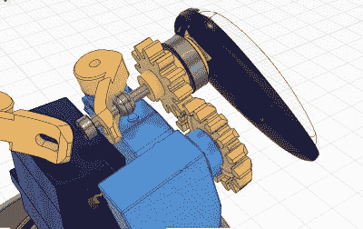

# 电子机器人:一个可爱的迷你桌面机器人，可以勾选所有的选项

> 原文：<https://hackaday.com/2022/03/20/__trashed-6/>

[彭志惠]似乎已经找到了一些空闲时间和精力来开发另一个可爱的机器人版本，[这一次它是一个更小、更可爱的表情机器人](https://github-com.translate.goog/peng-zhihui/ElectronBot?_x_tr_sl=auto&_x_tr_tl=en&_x_tr_hl=en) ( [最初的 GitHub 链接](https://github.com/peng-zhihui/ElectronBot)，)具有通常的生产就绪的对细节的关注程度。3D 打印模型中有很多细节，这是一个用于尼龙 SLS 打印的模型，但至少在中国，这可以以合理的费用完成。电子封装由几个完全定制的微型 PCB 组成，这些 PCB 使用 Altium Designer 设计，带有用于圆形 LCD 和摄像头的现成模块。主板承载一个 STM32F405 并处理显示器和 SD 卡，选择 STM32 的原因是需要连接到外部 USB3300 高速 USB PHY。有一个处理手势传感器的传感器 PCB、一个 USB 集线器、MPU6050 9 轴传感器以及 USB 摄像头模块。该板通过 FFC 电缆连接到底座中的 USB-C 连接器，允许机器人在其底座上旋转。

Cunning two-servo shoulder mechanism

[彭]很明显，对于如何工作有着严格的标准，我们猜测是想让手臂能够反向驱动，使主机能够跟踪和记录电机位置，以便以后重放。回到控制器的连接是通过 I ² C，允许所有五个伺服系统挂在同一条总线上，节省了以前的资源。聪明！在如此小的空间内安装处理器和电机驱动器是一个挑战，但对[彭]来说就像在公园里散步一样，正如下面嵌入的视频所示(我们相信英文字幕待定！)手臂机制特别有趣，而且制作得相当优雅，他似乎对这部分设计相当自豪，他也应该如此！就像(彭的)其他项目一样，有很多可看的，也有很多功能爆炸的空间。很高兴看到机器人被用作输入设备，不仅通过专用传感器进行手势感应，还通过 OpenCV 使用摄像头来跟踪用户姿势并采取相应行动。这个东西可以作为真正有用的人工智能设备，同时也是一个非常可爱的东西！

我们知道你来 Hackaday 是为了你可爱的机器人修理，我们不会让你失望的。这里有一个可爱的机器人灯，一个强制性的 [spot(一只机器狗)类型的项目](https://hackaday.com/2020/10/23/the-adorable-robot-spot-now-in-affordable-form/)，如果你更喜欢猫，那么我们[也有这个基础](https://hackaday.com/2019/11/03/smallkat-an-adorable-and-dynamic-robot/)。

 [https://www.youtube.com/embed/FmKTiH5Lca4?version=3&rel=1&showsearch=0&showinfo=1&iv_load_policy=1&fs=1&hl=en-US&autohide=2&wmode=transparent](https://www.youtube.com/embed/FmKTiH5Lca4?version=3&rel=1&showsearch=0&showinfo=1&iv_load_policy=1&fs=1&hl=en-US&autohide=2&wmode=transparent)

