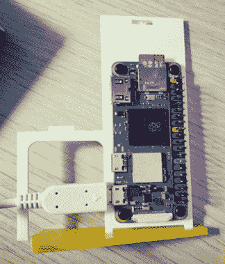

# 使用 3D 打印的 Cray-1 将您的 Pi 零点按风格分组

> 原文：<https://hackaday.com/2022/03/21/cluster-your-pi-zeros-in-style-with-3d-printed-cray-1/>

从性能的角度来看，我们知道构建一个自制的 Raspberry Pi 集群没有太大的意义，因为即使是相当运行的 mill 桌面 x86 机器也肯定会绕着它转。也就是说，有一种观点认为，装配十几个小型 Linux 主板可以为您提供一个紧凑且价格合理的平台，让您尝试并行计算和负载平衡之类的东西。这是一个完美的论点吗？不完全是。但是如果你和我们一样，当你意识到你的π0 簇可以被构建成看起来像标志性的 Cray-1 超级计算机时，整个事情就变得更有意义了。

 这个聪明的 3D 打印外壳来自【Kevin McAleer】，他说他希望了解更多关于使用 Ansible、Docker、Flask 和其他听起来很有趣的现代框架部署软件的信息。在设法购买了一打覆盆子 Pi Zero 2 后，他需要一种方法把它们都放在一个整洁的包装里。除了看起来非常酷之外，Cray-1 的对称设计让他能够以这样的方式设计他的微型版本，即每个单独的楔形物都是由相同的 3D 打印部件组成的。

在休息后的视频中，[Kevin]解释了设计经历的一些变化。我们很欣赏他最初的目标，即让你不需要任何额外的硬件来组装这个东西，但最终你需要拿起一些 M2.5 支架和匹配的螺钉，如果你想自己建造一个的话。我们特别喜欢你如何在一些 90 度电缆的帮助下，将所有 USB 电源线隐藏在较低的“垫子”区域内，让中心芯保持开放。

这不是我们第一次看到有人建造他们自己的微型 Cray-1。早在 2010 年，一名特别敬业的黑客[建造了他自己的 10 分之一比例的由 FPGA 驱动的 20 世纪 70 年代超级计算机](https://hackaday.com/2010/09/29/tiny-cray-1-courtesy-of-an-fpga/)的复制品，并最终达到了[试图在其上启动原始软件](https://hackaday.com/2012/01/10/help-chris-boot-his-cray-1-supercomputer/)的地步。

 [https://www.youtube.com/embed/Wi8qPuMMo-0?version=3&rel=1&showsearch=0&showinfo=1&iv_load_policy=1&fs=1&hl=en-US&autohide=2&wmode=transparent](https://www.youtube.com/embed/Wi8qPuMMo-0?version=3&rel=1&showsearch=0&showinfo=1&iv_load_policy=1&fs=1&hl=en-US&autohide=2&wmode=transparent)

感谢 [Hackaday Discord 服务器](https://discord.gg/NkbHrAW7NG)上的【Xark】提供的提示。