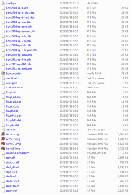
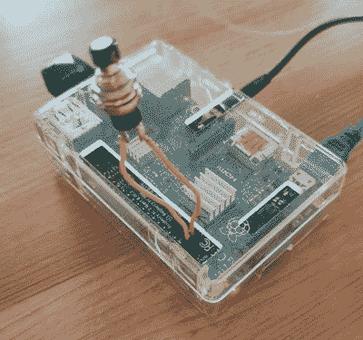
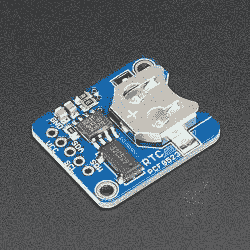
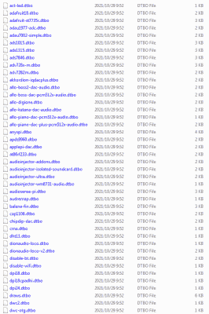

# Raspberry Pi 的电源按钮，由设备树覆盖提供

> 原文：<https://hackaday.com/2022/04/04/a-power-button-for-raspberry-pi-courtesy-of-device-tree-overlays/>

作为 Linux 内核的标准功能，[设备树覆盖图](https://en.wikipedia.org/wiki/Devicetree)(dto)允许轻松启用和配置功能和驱动程序，例如包含在 Raspberry Pi 系统的标准固件中的那些功能和驱动程序。使用这些 dto，无需修改操作系统或使用定制脚本，即可轻松设置软关机按钮、触发外部电源以及为从外部实时时钟(RTC)到各种显示器、传感器和音频设备的所有设备启用驱动程序等功能。

还可以添加您自己的 DTO 来创建一个自定义的覆盖图，将多个 DTO 命令合并成一个命令，或者为目标硬件创建一个自定义的设备树二进制文件(DTB)。本质上，这个 DTB 是由 Linux 内核在启动时加载的，让它知道连接了哪些设备以及它们的配置设置，这与基于 x86 架构的 BIOS 组件自动处理的内容非常相似。

最终，DTB 概念和覆盖层的使用使得这种可选器件和 GPIO 引脚设置的配置变得简单，尤其是在 Raspberry Pi SBC 平台上通过简单的文本文件进行配置时。

## Linux 设备树

[](https://hackaday.com/wp-content/uploads/2022/03/rpi_boot_device_tree_dtb.png)

List of files including board-specific Device Tree Binaries (DTBs) for a Raspberry Pi SBC.

如前所述，设备树被编译成二进制文件，并在启动时提交给内核。此设备树中包含已连接设备、其驱动程序和其他相关设置的列表。在不使用类似 BIOS 的系统来自动检测设备的平台上，如显卡和网卡，对于没有自动检测和自动配置选项的设备，如 I2C 和 SPI 设备，必须以这种方式构建设备树。

使用这样的外部设备树可以省去每次硬件改变时重新编译内核的麻烦，为系统设备配置提供一个中央 DTB 文件，就像为 Raspberry Pi SBCs 提供的那些[。为任何新添加或更改的设备重新编译这个 DTB 就像重新编译整个内核一样麻烦。这就是叠加发挥作用的地方。](https://github.com/raspberrypi/firmware/tree/master/boot)

内核加载 DTB 后，根据 Linux 内核关于 dto 的文档，应用 dto。覆盖本身被指定为设备树源，使用设备树编译器编译成设备树二进制覆盖(DTBO)文件。对于树莓 Pi，这些 dtbo[可以在](https://github.com/raspberrypi/firmware/tree/master/boot/overlays)找到，就像树莓 Pi GitHub 帐户上的 dtb 一样。

在 [Bootlin 博客](https://bootlin.com/blog/using-device-tree-overlays-example-on-beaglebone-boards/)上，一篇精彩的文章解释了如何使用 BeagleBone Black 平台编写自己的覆盖图并应用它们。这展示了如何从 U-Boot bootloader 加载 DTBOs，这是一个比其他平台提供的过程更复杂的[过程。](https://u-boot.readthedocs.io/en/latest/usage/fdt_overlays.html)

以 Armbian 为例，可以从`armbianEnv.txt`文件中设置和更改 dto，假设用户使用的平台映像[支持](https://docs.armbian.com/User-Guide_Allwinner_overlays/)这一特性。假设它是所用 Armbian 图像上支持的特性，那么只需编辑`/boot/armbianEnv.txt`来添加必要的覆盖名称及其参数。这种方法非常类似于在 Raspberry Pi SBC 平台上选择的方法，从`/boot/config.txt`加载了一个类似的文本文件。

## 软电源按钮

[](https://hackaday.com/wp-content/uploads/2022/03/rasperry_pi_soft_power_button_installed.jpg)

Momentary NO switch installed on a Raspberry Pi 2B.

作为 Raspberry Pi SBCs 上的 dto 可以实现什么的一个简单但非常有用的示例，让我们看看如何只使用默认的 Raspberry Pi 操作系统映像、一个瞬时(常开)开关和一些将该开关连接到 GPIO 接头上的两个引脚的布线来实现软电源开/关按钮，如右图所示。

要做到这一点，有两个因素在起作用。首先是关于软实力的问题。在 Raspberry Pi 板上，当 CPU 处于暂停状态(通电，但 CPU 不运行)时，GPIO3 由于外部上拉电阻而保持高电平状态。每当 GPIO3 在此状态下被拉低时，CPU 就会恢复工作。

这是通过将我们的 NO 开关放在 GPIO3 和一个接地(GND)引脚上实现的。当系统进入暂停状态时，我们按下按钮，GPIO3 被拉低，系统恢复。

对于软断电，我们需要使用第一个覆盖层。由于我们还将使用 GPIO3 来关闭系统，我们将把以下设备树覆盖图(dtoverlay)添加到`/boot/config.txt`:

```

dtoverlay=gpio-shutdown,gpio_pin=3,active_low=1,debounce=1500

```

在[叠加自述文件](https://github.com/raspberrypi/firmware/blob/master/boot/overlays/README)中描述了`gpio-shutdown` DTO:

```
Name: gpio-shutdown
Info: Initiates a shutdown when GPIO pin changes. The given GPIO pin
is configured as an input key that generates KEY_POWER events.
This event is handled by systemd-logind by initiating a
shutdown.

```

如果当我们触发这个事件时系统被引导，它将会像我们按下桌面系统上的“电源”按钮一样，关闭系统并停止 CPU。

除了 GPIO 引脚编号，我们还可以配置引脚触发事件的状态(此处为拉低时)，由于我们使用的是机械开关，因此我们希望在事件触发前有一个内置的去抖延迟。

当然，由于我们可以在这里配置 GPIO 引脚，我们不一定要在这里使用 GPIO3，这可能是可取的，因为 GPIO3 也是(不可重新映射的)I2C1 SCL 引脚，失去对主 I2C 总线的访问可能是一个问题。相反，可以使用另一个 GPIO 引脚(如 17 ),复杂的是，如果不跳过一些额外的环节，就不可能像上例那样使用单个瞬时开关。

另一个有趣的与电源相关的覆盖图是`gpio-poweroff`图:

```
Name: gpio-poweroff
Info: Drives a GPIO high or low on poweroff (including halt). Using this
overlay interferes with the normal power-down sequence, preventing the
kernel from resetting the SoC (a necessary step in a normal power-off
or reboot). This also disables the ability to trigger a boot by driving
GPIO3 low.
```

当使用外部电源模块时，该信号用于关闭 SBC 的电源，并可能关闭电源本身，直到被其他信号再次唤醒。这在需要某种程度的自动化和/或节能的工业和偏远地区可能是有用的。

## 实时时钟

[](https://hackaday.com/wp-content/uploads/2022/03/pcf8523_rtc_module.jpg)

PCF8523-based Real Time Clock (RTC) module.

Raspberry Pi SBCs 上非常缺少的一个功能是实时时钟(RTC)，因为这意味着如果没有互联网接入，系统时间将几乎没有意义。幸运的是，它很容易安装任何数量的 RTC 模块，如无处不在的 PCF8253，DS1307，DS3231 和更高端的选项。

大多数这些 RTC 模块使用 I2C 总线通信，这意味着布线 3.3V，GND 和 I2C SCL/SDA 线。请注意，如果使用软断电功能，我们已经有了潜在的冲突，因为默认情况下，我们假设使用主(`i2c_arm` ) I2C 总线。之后，我们必须为我们正在使用的模块启用适当的覆盖。

根据覆盖文件:

```
Name: i2c-rtc Info: Adds support for a number of I2C Real Time Clock devices Load: dtoverlay=i2c-rtc,<param>=<val>
```

如果我们不能使用主 I2C 总线，则使用软件 I2C 选项作为后备:

```
Name: i2c-rtc-gpio
Info: Adds support for a number of I2C Real Time Clock devices
using the software i2c controller
Load: dtoverlay=i2c-rtc-gpio,<param>=<val>
```

有了所有这些，我们只需要处理默认使用的假硬件时钟( [fake-hwclock](https://manpages.debian.org/jessie/fake-hwclock/fake-hwclock.8.en.html) )，否则我们必须从 RTC 手动设置(假)hwclock 时间。例如，在基于 Debian 的操作系统上，如 Raspberry Pi 操作系统:

```
sudo apt-get -y remove fake-hwclock 
sudo update-rc.d -f fake-hwclock 
sudo remove systemctl disable fake-hwclock
```

## 仅仅是开始

[](https://hackaday.com/wp-content/uploads/2022/03/rpi_boot_device_tree_dtbo.png)

Some of the Device Tree Binary Overlay (DTBO) files that are part of a Raspberry Pi OS image.

有些人可能已经注意到了这一点，如果他们曾经在 Raspberry Pi 系统上安装过类似 I2S 声卡的东西，那么这个覆盖过程看起来很熟悉。原因是这些设备的 DTBOs 已经存在，因此可以在引导时加载，无需进一步修改。

虽然许多这种功能可以通过操作系统本身的各种 shell 和 python 脚本来复制，但通常以设备树覆盖的形式来实现更简单，因为所需的一切都已经是默认操作系统映像的一部分。这意味着它也可以保证继续工作，即使是在 Linux 内核和包升级期间。

简单地看一下带有 Raspberry Pi 操作系统映像或类似映像的 DTBO 文件，就可以很好地了解有多少覆盖。从 DAC、旋转编码器、各种(LCD、有机发光二极管)屏幕、PoE HAT 等官方 Raspberry Pi 设备、声卡以及无数 GPIO、SPI 和 I2C 相关的功能和设备。

考虑到这一点，通读 overlays README 来了解它支持什么，并在开始一个关于 Raspberry Pi SBC 的新项目之前参考它似乎是一个好主意。同样，检查其他(ARM)平台上可用的覆盖图也无妨。据你所知，你想要的功能是一个简单的覆盖切换。