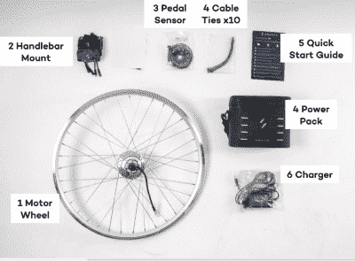
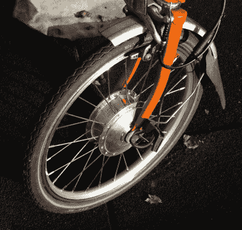
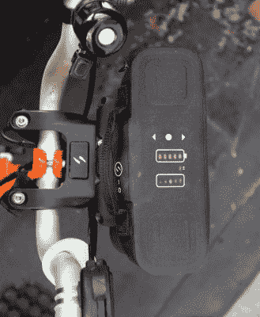
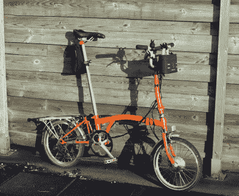

# 把你的自行车换成电动的:为什么你应该，什么时候你不应该

> 原文：<https://hackaday.com/2022/03/29/converting-your-bike-to-electric-why-you-should-and-when-you-shouldnt/>

十年前，我有幸为一家向员工提供自行车贷款计划的雇主工作，我借此机会买了一辆 Brompton 折叠自行车。这种伦敦制造的机器可能是市场上最有效的折叠自行车之一，它的有用特点是适合长途旅行，而不仅仅是从火车上快速奔跑。一个 3 速轮毂变速箱是很好的不慌不忙的旅游，但可悲的是，我的小文件夹一直有点痛的山上。因此，在疫情开始的时候，我又挥霍了一次，为它买了一个 Swytch 电动升级套件，经过几次后勤和生活上的剧变后，我终于把它安装到了自行车上。我骑过几辆电动自行车，但从来没有过自己的，所以是时候坐下来分析一下这次经历了。电动自行车是不是你应该拥有的东西？

## 一盒比特变成了电动自行车

All the parts of a Swytch kit. From [the Swytch assembly manual](https://www.swytchbike.com/manual.pdf).

Swytch 通过众筹轮出售他们的工具包，所以我已经在等待名单上待了一段时间，并获得了我的工具包的早期价格。它花了很长时间才到达，由于疫情的原因，比预计的 2020 年年中的时间长得多，最终在去年 2 月的某个时候交付。它装在一个大小适中的纸箱里，可以方便地放在 Brompton 的行李架上，里面有一个包装整齐的新前轮和电机，以及电池和所有各种零件。

安装套件应该不会扩展黑客阅读器的功能，最棘手的部分可能是曲柄附近霍尔效应传感器的定位。该套件通过在您踩踏板时提供电机辅助来工作，因此它的一部分是一组塑料盘上的磁铁，带有各种附件，用于不同的曲柄和踏板组。Brompton 前轮被拆下，其轮胎和内胎被转移到 Swytch 前轮上，然后被放在自行车上。一旦连接了磁盘和霍尔传感器，电缆就会沿着现有电缆延伸，并在安装了电池盒坚固支架的把手处出现。

## Swytch 套件第一印象

The motor is a compact unit, more so than I expected.

电池还包含电子设备和电机驱动器，以及制动传感器和手油门，这是我没有订购的规定。我的工具包是痛苦的英国道路法律与踏板传感器，软件限制的 250 W 功率，和大约 15 英里每小时的最高速度。我本来可以订购它，没有限制和所有额外的玩具，使它更像一个小型电动摩托车，但即使我可以删除软件限制，我也不能否定路边检查的风险，如果我这样做，我会被罚款。

Swytch 提供 30 公里和 50 公里范围大小的两个电池组，其中我买了较大的一个。充好电后，我把它打开，夹在支架里。准备在我的黑客空间后面的水泥围裙上测试一个新玩具！

Swytch 电池组顶部带有一些控制装置，其主要功能是改变电气辅助的数量。这最好用谁负责来描述；在最大程度上，是自行车在拉动，你需要做的只是移动踏板，而在最小程度上，它是一个方便的辅助工具，可以平滑努力，使骑自行车成为一种不太费力的运动，同时让你完全控制自己。

The Swytch battery pack on the Bromptoon handlebars.

有一个小问题:在某些情况下，电机会振动，而不是平稳启动。根据我对 Hacky Racers 和其他机器的交流电机的经验，我猜测这是由于电机通过反电动势感测而不是霍尔效应设备反馈到控制器，所以我看到的是反馈的暂时损失。它通常可以通过停止踩踏板并在电机停止后重新启动来快速治愈，这不会明显阻碍进展。

我经常在一般骑行中使用这辆自行车，但我也开始通过几次较长的越野测试骑行来计算出现实世界中可达到的范围，让它在低功率模式下辅助而不是取代我的骑行。正如所料，我从未成功突破 50 公里，但我已经非常接近了。

我的路线不是很理想，有一些斜坡，其中一个在我做的那天有一些强烈的逆风，但即使如此，我还是达到了 40 公里到 45 公里，我认为对于一个 50 公里的电池来说，这还不算太坏。一旦电力耗尽，会有明显的电机阻力，但这不会使自行车无法行驶。

## 那么电动自行车用起来怎么样呢？

除了对 Swytch 套件的描述，现在是时候对电动自行车有一些更全面的印象了，这是基于一段时间以来使用电动自行车作为日常交通工具。甚至还有操控角度，因为自行车现在是全轮驱动车辆。它是如何改变骑行体验的？

The electric Brompton in all its glory

电动日常骑行者的第一印象似乎很明显，因为它现在快得多。我以前可以达到 15 岁左右的速度，但只需要一些努力，现在我随时都可以达到。这对于从 A 地到 B 地很好，但是我也敏锐地意识到我会更快地陷入麻烦。奇怪的是，我发现自己骑得更小心了，尤其是在有行人和车辆的城镇里。

由于电力在前，踏板动力在后，自行车现在是两轮驱动的车辆。两轮驱动摩托车非常罕见，仅限于极少数小批量生产的车型，但由于我的朋友 Russ 的电动 minimoto conversion，我获得了在 EMF 2018 上骑摩托车的难得机会。

它在 EMF 营地的砾石路上非常稳健，但在启动时遇到了裤子填充的问题，因为前轮会旋转，而后轮有牵引力。相比之下，Swytch 踏板传感器系统提供的瞬时延迟足以确保 Brompton 在动力到达前轮之前移动，从而确保即使在松软的路面上也不会出现任何意外的车轮打滑。

由此产生的两轮驱动在通常会挑战 Brompton 的草地和松散的砾石等表面上产生了明显的差异，当在柏油路面上给它一个活跃的骑行时，额外的牵引力可以帮我摆脱困境。然而，沉迷于后轮滑行的快速急转弯是很危险的，因为当不可避免的事情发生时，前轮缺乏将我拉出的购买力，我可以看到结果可能是痛苦的。一个中年妇女在折叠通勤自行车上驱走她十几岁的小轮车梦的场景看起来一定很有趣，但至少我很开心。

那么，你应该骑电动自行车吗，还是这一切都有点毫无意义？毕竟，它并不完全便宜，而且你还得花钱买一辆自行车。答案是，如果你很健康，或者只是短距离骑行，那么也许这不是必须的。但是如果你骑的是中等距离，也许最重要的是如果你骑到的地方不能汗流浃背，那么电动自行车是值得升级的。Brompton 不是我的主要自行车，所以我在需要乘坐火车或汽车的旅行中使用它，我很重视 Swytch 套件，因为它给了我额外的行程，同时让我看起来不会过度劳累。

奇怪的是，有一个用例不适合电动自行车，即长距离骑行。克服发动机的额外阻力骑超过短距离的想法并不吸引人，所以 Brompton 现在是一辆有效最大行程为 50 公里的自行车。我经常使用我的日常自行车进行长途旅行，但对于你唯一的自行车，这一点值得记住。

电动自行车并不适合每个人，但也许 2022 年是时候尝试一下了？