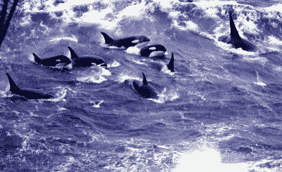
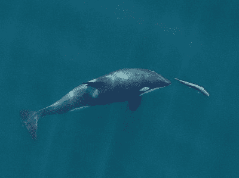

# 鲸鱼帮助科学家研究更年期之谜

> 原文：<https://hackaday.com/2022/04/06/whales-help-scientists-investigate-the-mystery-of-menopause/>

更年期是生命中月经停止的时期，女性不再能够生育。绝经最明显的原因是当卵巢耗尽卵子时，尽管它也可能由各种其他医学过程引起。虽然更年期在许多方面已经被很好地理解了，但是更年期的生物学原因，或者说它在人类中的进化方式仍然是一个谜。这一过程曾被认为在动物王国几乎不存在，这引发了进一步的问题。

然而，令人惊讶的是，最近科学家们开始了解到，人类并不是唯一具有这种特征的人。事实上，少数海洋哺乳动物也会经历这种独特而令人困惑的过程。

## 超越生殖的生命

动物界的绝大多数物种通常不会经历更年期。这些生物通常在死亡后仍能与配偶一起繁殖。那么，智人是局外人；典型的人类卵巢在 48 岁至 52 岁之间耗尽卵子，这与全球人类预期寿命超过 70 岁形成鲜明对比。事实上，人类在月经结束后还能活几十年并不罕见。

直到 20 世纪 80 年代早期，科学家才开始了解到人类并不是唯一经历更年期的群体。科学家海伦·马什和 Toshio Kasuya 一直在合作研究短鳍领航鲸的生殖系统。Kasuya 收集了 300 只动物的样本，通过计算牙齿的年轮来确定它们的年龄，这与树木的方法非常相似。与此同时，马什检查了卵巢。数据显示，大多数鲸鱼在 36 岁左右停止生育，但它们通常会比平均寿命多活大约 14 年。

这是科学家第一次找到强有力的证据，证明一个动物物种在超过繁殖年龄后还能继续生存。虽然这在当时是对科学正统的挑战，但多年来，越来越多的证据支持这一发现。从那以后，科学家们发现虎鲸、独角鲸和白鲸也经历更年期。

## 为什么的问题

更年期发生的原因仍然是个谜。存在各种相互竞争的理论来解释这一现象，其中大多数都有困难的解释，使问题复杂化，超出了令人满意的解决方案。

A pod of killer whales swimming together in the open ocean.
Killer whales live in close-knit social units, working together to hunt and sharing resources. Credit: [NOAA](https://commons.wikimedia.org/wiki/File:Pod_killer_whales.jpg), Public Domain

现代医学对人类预期寿命的益处经常被引用为一个潜在的原因，其论点的主旨是人类从来没有打算活得这么长。然而，即使在没有这种治疗的狩猎采集社会，更年期仍然存在。各种也经历更年期的海洋哺乳动物只会进一步质疑这个看似直觉的理论。

祖母理论是另一种解释，某种程度上基于生物共同生活的社会结构。它认为更年期的到来是因为它鼓励祖母帮助照顾孙辈，而不是继续生产更多的后代。从进化的角度来看，这将允许他们的遗传物质以间接的方式传播到未来。然而，大象和其他一些物种反驳了这一理论，许多年长的雌性既要抚养自己的孙辈，也要抚养家族中的其他后代，同时还要继续繁衍后代。

《对虎鲸的进一步研究》的作者提出了一个令人信服的理论，认为生殖竞争可能是原因。这项研究查看了几十年来收集的虎鲸繁殖数据，并注意到老年虎鲸所生的孩子比年轻虎鲸的后代死亡率高 1.7 倍。

随着年龄的增长，黑仔鲸会和包含它们母亲的群体呆在一起，但是交配会在本地群体之外进行。因此，随着雌鲸年龄的增长和子女的增多，雌虎鲸与群体中其他成员的亲密程度也会随着年龄的增长而增加。

A killer whale hunts down a tasty salmon.
Older killer whale mothers are often adept hunters, who use their skills to help their pod secure enough food to sustain themselves. Credit: [Oregon State University](https://commons.wikimedia.org/wiki/File:Killer_Whale_chasing_Chinook.jpg), CC-BY-SA-2.0

一群虎鲸中的母亲们为了食物而竞争，只有有限的食物来养活孩子。一只年长的母鲸因此有了选择。她可以在年轻母亲生育的同时生育更多的孩子。然而，如果有过多的孩子，圆荚体不能获得足够的食物来支持，这将伤害所有与她相关的圆荚体成员。

或者，她可以干脆不要更多的孩子，花更多的精力为整个豆荚寻找食物。鉴于年长的母亲与群体成员的亲缘关系更近，年轻母亲的后代很有可能与她有亲缘关系。因此，对她来说，投资支持年轻成员比直接生更多孩子更有意义，从而为更年期的进化创造了一个潜在的解释。

一些研究还指出，大龄母亲乐意与成年儿子分享大量食物。儿子在豆荚外面交配，所以他们的孩子传播年长母亲的基因，而不会从她自己的社会单位中夺走资源，潜在地伤害她的其他孩子。

在人类和鲸鱼的例子中，这种生殖竞争理论被证明是解释更年期增加的一种流行方式，在这些例子中，群体的社会结构与年轻一代如何被抚养以及他们如何繁荣有很强的相关性。因此，围绕提供和分享有限食物资源而建立的社会结构，以及不同代人之间的合作与冲突，可能是导致更年期进化的原因。