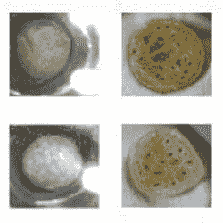

# 有了实验室设备，谁还需要酵母？

> 原文：<https://hackaday.com/2022/03/26/who-needs-yeast-when-you-have-lab-equipment/>

这个关于研究人员成功制作无酵母披萨面团的故事已经流传开来。像通常从科学角度写的故事一样，值得挖掘一些有趣的细节。我们看了一下[的实际研究论文](https://aip.scitation.org/doi/full/10.1063/5.0081038)，有一些有趣的细节值得分享。事实证明，这并不是第一种开发出来的无酵母烘焙方法，但它是第一种将发酵和烘焙结合在一起的方法，其效果与传统的面包制作过程相当。

Some different results from varying the amount of pressure released during the baking process.

基本上，一个由水、面粉和盐组成的面团进入一个热的[高压灭菌器](https://en.wikipedia.org/wiki/Autoclave)(标题图像显示的是通过视窗看到的一块面团。高压釜加压，迫使气体进入面团，过程类似于碳酸饮料。当面团烘烤和凝固时，压力以可控的方式释放，这个过程的仔细调整就是控制面包结果的原因。

通过正确的热量和压力曲线，研究人员创造出了一种比萨饼，其外壳不仅令人愉悦和美味，而且质量可与传统方法相媲美。

这个想法是如何产生的，这本身就很有趣。其中一名研究人员开发了一种热固性聚氨酯的新方法，并意识到面包和聚氨酯有一些共同点:它们都需要发泡(面包的醒发)和固化(面包的烘焙)过程。以正确的平衡同时进行这两个过程会产生最好的产品:对于聚氨酯来说是最佳的隔热效果，对于比萨饼面团来说是美味和口感愉悦的结果。在那之后，找到正确的平衡只是一个实验的问题。

相对而言，所涉及的压力(高达 6 [巴](https://en.wikipedia.org/wiki/Bar_(unit)))和温度(145 摄氏度)甚至相当温和，这对于[家庭披萨实验者来说是个好兆头](https://hackaday.com/2020/02/11/portable-pizza-oven-does-the-job-and-fast/)。