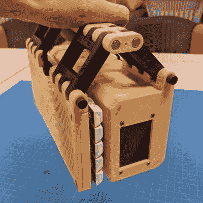
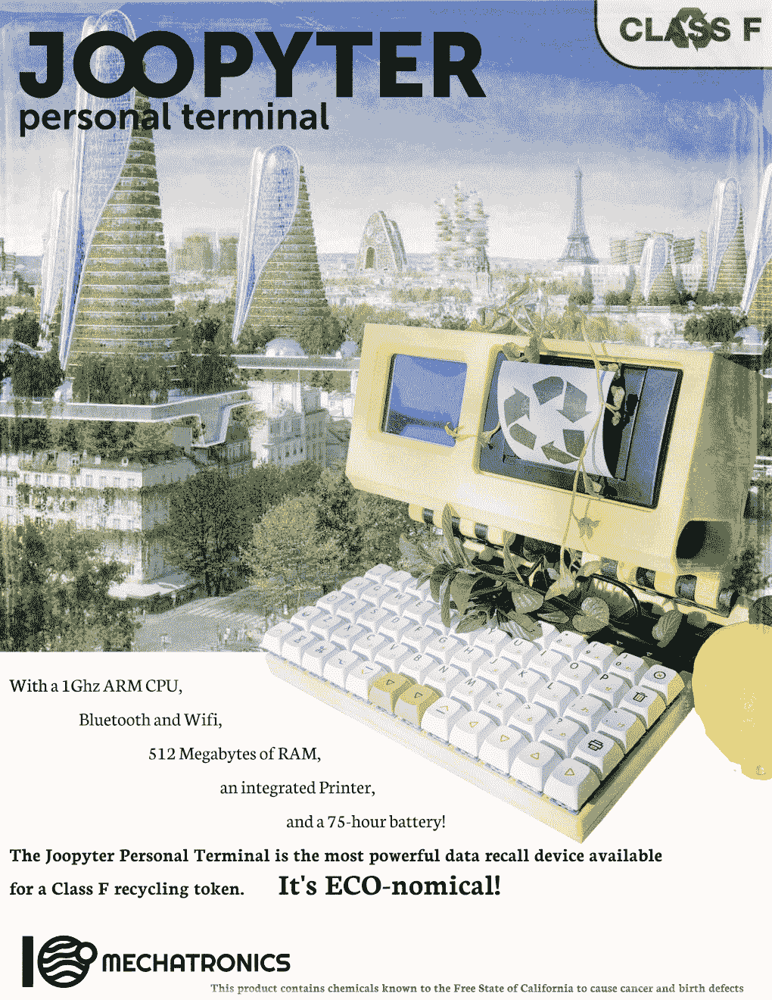

# 旅行用复古便携式电脑包打印机

> 原文：<https://hackaday.com/2022/03/28/retro-portable-computer-packs-printer-for-the-trip/>

看起来像是从 20 世纪 80 年代的另一个现实版本中掉出来的， [Joopyter 个人终端是一台 3D 打印的便携式计算机](https://github.com/gian-tronic/joopyter)，它包括你在复古未来主义快车道上生活所需的一切:机械键盘、热敏打印机和必备的微型胶印屏幕。这也是一个真正的移动机器，感谢它的板载电池和一个聪明的铰链设计，让你可以将整个东西折叠成类似解放军手袋的东西。没有它你不会想离开家的。

 这台华丽的机器来自【吉安】，虽然设计并不完全开源，但 GitHub 库中有足够的信息，如果你愿意，你肯定可以组装出类似的东西。虽然它们可能不是传统意义上的文档，但我们确实喜欢其中包含的仿古董广告。

Joopyter 的上半部分有一个 Raspberry Pi Zero W(尽管新的 [Pi Zero 2 将是一个受欢迎的嵌入式升级](https://hackaday.com/2021/10/27/new-raspberry-pi-zero-2-upgrades-to-quad-core-processor/))，一个 Adafruit PiTFT 2.8 英寸显示屏，一个 CSN-A2 面板安装热敏打印机，以及一个 Anker PowerCore 15600 电池，以保持所有运行。在铰链的另一边是一个由运行 KMK 的覆盆子 Pi Pico 供电的有线键盘。

说到那个印刷的铰链，[Gian]说它是从[YARH]借来的。在过去的几年里，[黑客读者可能还记得](https://hackaday.com/2021/01/05/new-micro-yarh-io-designed-for-skilled-operators/)已经生产了许多[非常光滑的 3D 打印便携式 Linux 机器](https://hackaday.com/2020/09/03/yarh-io-is-the-hackable-pi-portable-of-our-dreams/)由 Raspberry Pi 驱动。

