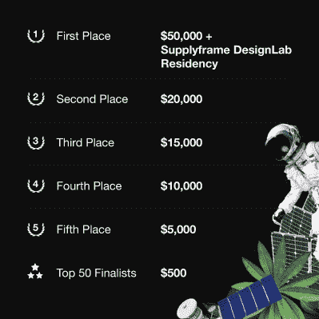

# 参加 2022 年黑客日大奖，帮助拯救世界

> 原文：<https://hackaday.com/2022/03/29/enter-the-2022-hackaday-prize-and-help-save-the-world/>

下个世纪人类面临的最大挑战是如何在减少环境影响的情况下做同样多或更多的事情。减少我们在地球上的集体足迹当然不是任何一个人单独的责任，如果它需要一百万个聪明的解决方案来创造一个可持续的未来，那么我们知道只有一群黑客开始工作。

 今年的 [2022 年黑客日奖](https://prize.supplyframe.com/)挑战*你*想出或大或小的方法来创造更绿色的能源，使回收更容易，破解旧设备以将其从垃圾填埋场中拯救出来，或者建立网络来保持我们当地社区的团结并意识到我们的集体努力。如果你有一个超级太阳能采集器，一个回收机器人，甚至是逆向工程工具来帮助对抗被迫的技术过时，我们希望看到你的黑客。或者，如果你愿意，你可以简单地在通配符回合中拯救世界。

像往常一样，承蒙 Supplyframe 的老板和 Digikey 的慷慨赞助，我们已经获得了大量的奖金，用于奖励最佳项目。五轮挑战中的前十名项目将获得 500 美元的现金奖励，五个获胜项目将在 11 月的决赛中获得 5000 至 50000 美元的奖金。但是你不应该等待——第一轮，地球友好力量，现在就开始！

召集你的团队，开始头脑风暴一个想法，[把它发布到 Hackaday.io，参加奖品](https://hackaday.io/contest/184555-supplyframe-designlab-2022-hackaday-prize)，你就上路了。独立于评审，我们将通过实地考察，写出我们发现的令人敬畏的项目。这是你被关注的机会，帮助创造一个更好的世界，甚至赢得大奖。

<colgroup><col width="20%"> <col width="25%"> </colgroup> <colgroup> <col width="50%"></colgroup>
| 挑战 | 日期 | 细节 |
| --- | --- | --- |
| 环保能源 | 3 月 29 日至 5 月 1 日 | 您的解决方案应该通过提高能源采集和/或存储效率来降低清洁能源的成本。 |
| 再利用、回收、翻新 | 5 月 1 日至 6 月 12 日 | 您的项目有助于材料的回收，否则这些材料将会进入废物流。 |
| 黑回去 | 6 月 12 日至 7 月 24 日 | 您的项目为旧的电气设备增加了新的功能，以保持其有用性。 |
| 适应气候变化的社区 | 7 月 24 日至 9 月 4 日 | 设计设备，帮助社区更好地抵御天气和气候灾害，并/或从其环境中收集数据，以便他们可以倡导当地基础设施的变革。 |
| 拯救世界通配符 | 9 月 4 日至 10 月 16 日 | 这是任何事情发生的地方，你的设计应该从其他挑战中脱颖而出，但仍然为所有人创造一个更有前途的未来。 |

## 奖品发布峰会

今年，我们以一个关于可持续发展、分散式无线通信基础设施、开放硬件和开放供应链如何帮助拯救地球等主题的大型会谈日拉开了发布前庆祝活动的序幕。今天，从太平洋时间上午 8 点开始，[我们将直播整个过程](https://www.youtube.com/watch?v=lXPqHgGh1vk)。(嵌在下面。)

如果你正在寻找一些灵感来开始你的项目规划头脑风暴会议，这肯定会有所帮助。在侧边栏中随意开始对话！想把自己的想法和其他志同道合的黑客一起放在流后？加入我们的 [Hackaday.io](https://hackaday.io/messages/room/2369) 和[Discord](https://discord.gg/NkbHrAW7NG)。

 [https://www.youtube.com/embed/lXPqHgGh1vk?version=3&rel=1&showsearch=0&showinfo=1&iv_load_policy=1&fs=1&hl=en-US&autohide=2&wmode=transparent](https://www.youtube.com/embed/lXPqHgGh1vk?version=3&rel=1&showsearch=0&showinfo=1&iv_load_policy=1&fs=1&hl=en-US&autohide=2&wmode=transparent)

The [HackadayPrize2022](https://prize.supplyframe.com) is Sponsored by: