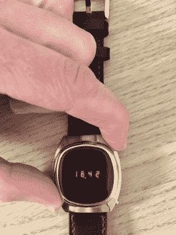

# 现代、节俭的 PCB 为苏联制造的 LED 手表注入了新的活力

> 原文：<https://hackaday.com/2022/03/31/modern-frugal-pcb-breathes-new-life-into-soviet-made-led-watch/>

第一批电子数字手表在 20 世纪 70 年代推出时，因其领先的技术而受到称赞，如果不是因为它们的日常实用性的话。它们耗电的 LED 显示屏只有在你按下按钮时才会亮起，即便如此，显示的数字也很小。他们的表壳又大又重，即使不显示时间，他们也会很快耗尽电池。尽管如此，他们显示器的深红色光芒给了他们某种美学，这是今天的技术很难复制的。

Pressing the top-right button enables those beautiful LED modules

当[Benjamin slberg]得到 Elektronika-1(苏联设计的第一代数字手表)时，他开始设计内部结构的现代替代品。原来的几个定制芯片直接引线键合到基板上，新板包含 MSP430 系列微控制器和 AS1115 显示驱动器。PCB 通过巧妙利用城堡形孔与手表的按钮接触。

对于显示器，[本杰明]配备了惠普制造的周期校正 LED 模块，这使显示器的外观尽可能接近原始外观。虽然这些消耗了相当多的电流，但手表的其余部分已经变得更加节省:待机时间现在估计约为 10 年，而旧设计往往需要在一年内更换新电池。[Benjamin]每天都在使用他的翻新手表，显然没有任何问题。

如果你有一个旧的苏联数字手表，你想升级，你会很高兴听到整个设计是开源的。就像[这款复古手表](https://hackaday.com/2016/06/25/easy-bubble-watch-oozes-retro-charm/)，其实那个用的就是类似的 LED 显示屏。如果你喜欢原创复古手表，我们[也会深入报道它们](https://hackaday.com/2018/11/28/collecting-repairing-and-wearing-vintage-digital-watches/)。