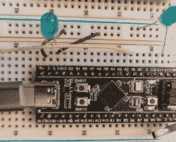
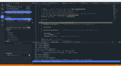

# 用操作系统武装

> 原文：<https://hackaday.com/2022/04/13/arming-with-an-os/>

我们看到许多项目使用臭名昭著的“蓝色药丸”STM32 板。它们便宜又丰富，有很多很棒的功能，或者至少在芯片短缺之前是这样。我最近拿起一个“黑色药丸”，它非常相似，但有一个更强大的处理器。花几块钱，你就能得到一个可以运行 100 MHz 的 ARM CPU(但用 USB 的话，可能是 96 MHz)。有 512 kB 的闪存和 128 kB 的内存。有一个 USB type C 端口，甚至还有一个按钮和一个板载 LED。这个东西可以放在一块试验板上，你可以用一个便宜的大约 10 美元的 STLink dongle 对它进行编程。

[](https://hackaday.com/wp-content/uploads/2022/04/bp.jpg)

The Black Pill module on a breadboard.

当然，你必须考虑软件。STM32Cube 有很多东西需要设置和学习，但它确实可以让你做任何你可以想象的事情。然后是 STM32Duino 插件，可以让你把它当作一个强大的 Arduino 来使用。这是可行的，也很容易设置。然而，还有 Mbed。唯一的问题是 Mbed 不能开箱即用。不过，事实证明，这并不难设置。我将向您展示让事情运转起来是多么容易，下一次，我将向您展示一个使用 mBed RTOS 功能的 USB 外设的实际例子。

## 第一步

显然，你需要一粒黑色药丸。至少有两种选择，但因为便宜，没有理由不买内存更大的 STM32F411 版本。DIP 外形尺寸适合您拥有的任何试验板，USB C 电缆将为板供电，因此除非您驱动大量外部电路，否则您可能不需要外部电源。

不过，与一些主板不同，USB 端口不会帮助你编程，除非你烧录了引导程序。理论上，如果你在复位期间按住 BOOT0 按钮，主板可以做 DFU。然而，我的董事会只会偶尔进入 DFU 模式。阅读互联网这听起来是一个常见的问题。诀窍似乎是拔掉 USB 并重新插入，而不是使用复位按钮。插入板时按 BOOT0。几秒钟后，松开 BOOT0 按钮。这让它更可靠一点。然后，您需要一个 DFU 闪存程序对一个`.bin`文件进行编程，以将 alt 0 写入 DFU 设备的 0x08000000 位置。所有这些，你仍然没有得到调试。

幸运的是，从 USB 到 10 针连接器的 STLink v2 加密狗非常便宜——10 美元或更少。这将让您进行编程和调试。但是，还有一个跟踪功能是这些加密狗不支持的。

没有跟踪你也可以做得很好，但是方便的是，你可以通过一个叫做 SWO(串行线输出)的特性来做“printf 风格”的输出，而不必使用 USB 端口作为串行端口。如果你想要 SWO，你要么需要一个更贵的 STLink 版本(有更大的连接器)，要么当然有一个黑客。你也可以使用其他类似的探针，如[黑魔法探针](https://hackaday.com/2016/12/02/black-magic-probe-the-best-arm-jtag-debugger/)。在某些情况下，您也可以使用半托管，但最好是获得正确的探测，破解 SWO 输出，或者只使用调试器。当然，如果您正在设置 USB 串行端口——很容易做到——那么您可以毫无问题地使用它。

[](https://hackaday.com/wp-content/uploads/2022/03/2x10.png) 我用的 STLink 加密狗有 10 个 pin。不幸的是，并非所有的克隆都有相同的引脚排列。Blackpill 上的四个引脚(从左侧看连接器)是:3.3 V、SWDIO、SWCLK 和地。如果你不介意从 USB 口获得电源，你只需要最后三个引脚。

通常，这些克隆适配器在外壳上有一个引脚。对我来说，我需要的三根线分别在第 6、7 和 8 针上。如果您从该器件汲取 3.3 V 电压，请小心。电流过大或电源线短路会导致加密狗死亡。

克隆的另一个问题是它们经常加载过期的固件。你可以得到知道如何更新它们的官方 [STM32CubeProgrammer](https://www.st.com/en/development-tools/stm32cubeprog.html) 。只要记得在更新和刷新程序员列表后拔掉设备，然后再插上电源。

## 软件

正如我提到的，有很多选项和大量的工具集。我一般喜欢 [Mbed 工具](https://hackaday.com/2015/08/11/getting-started-with-arm-using-mbed/)。当我们第一次看到 Mbed 时，它是一个类似 Arduino 的生态系统。IDE 是联机的，但是您可以通过一些选项脱机。然而，从那时起，它已经成长起来，现在有各种各样的工具，甚至一个成熟的操作系统，如果你想要的话。如果您试图构建简单的东西，有一种方法可以选择“裸机”模式，但是对于像 Black Pill 这样的东西，您有足够的内存，因此向它推送大量代码并不是真正的问题。即使没有裸机模式，链接器也会尝试删除你不使用的东西，所以也没那么糟糕。

然而，坏消息是生态系统并不直接支持黑药丸。然而，它支持具有相同 CPU 的 Nucleo 板。这将工作，并为简单的测试，这并不坏。当然，管脚名是错误的，但是你可以指定真实的名字，比如`PC_13`而不是`LED1`。然而，真正的坏消息是，目标板没有 USB 支持。如果你试图使用 USB 驱动程序，你会简单地停止，因为系统认为你没有硬件来处理它。

有好消息和坏消息。好消息是，有一个用户贡献的黑色药丸设置。它具有更稳定的时钟参考，支持 USB，并具有正确的引脚定义。不太好的消息是，它似乎只能在本地运行的 Mbed IDE 上工作。这并不坏，因为我想用一些当地的东西。如果您使用不同的工具集，您可能会发现自己需要自己来定义目标。 [PlatformIO](https://hackaday.com/2017/04/07/platformio-and-visual-studio-take-over-the-world/) 和[似乎也在为蓝色药丸工作](https://forums.mbed.com/t/stm32f411ce-black-pill-usb/13457)。

 [https://www.youtube.com/embed/Vn0Mip00je0?version=3&rel=1&showsearch=0&showinfo=1&iv_load_policy=1&fs=1&hl=en-US&autohide=2&wmode=transparent](https://www.youtube.com/embed/Vn0Mip00je0?version=3&rel=1&showsearch=0&showinfo=1&iv_load_policy=1&fs=1&hl=en-US&autohide=2&wmode=transparent)


## 我们走吧！

一旦你把所有的东西都组装好了，运行一个程序就很容易了。下一次，我将向您展示 USB 的更多乐趣，但现在，让我们做一个简单的 LED 闪光器，在 USB 串行端口上有一些输出。例如，你可以在在线模拟器中运行“Blinky”示例。问题是`printf`在我们的板上没有任何用处。

没问题:

```

#include "mbed.h"
#include "USBSerial.h"

DigitalOut led(LED1);
USBSerial usbSerial(false); // don't wait for connection

int main() {
   usbSerial.connect();  // set up serial port
   while (1) {
     led = !led;
    usbSerial.printf("Blink! LED is now %d\n", led.read());
    ThisThread::sleep_for(500ms);
    }
}

```

就这么简单。只需按照黑药丸配置中的描述建立一个项目。那就是:

*   在 Mbed IDE 中创建新项目。
*   右键单击程序的根文件夹，并在弹出窗口中选择添加库…
*   输入`[https://os.mbed.com/users/hudakz/code/BLACKPILL_Custom_Target](https://os.mbed.com/users/hudakz/code/BLACKPILL_Custom_Target)`并点击下一步按钮。
*   打开下拉列表，选择默认，然后单击完成。
*   打开 BLACKPILL_Custom_Target 文件夹，将 TARGET_BLACKPILL_F411CE 文件夹拖动到项目根文件夹。
*   将 custom_targets.json 从 BLACKPILL_Custom_Target 文件夹拖到根文件夹中。
*   从项目中删除 BLACKPILL_Custom_Target 文件夹。
*   打开目标下拉列表，点击带有“芯片”图标的按钮。
*   打开 USB 设备下拉列表，选择您的 STM32 ST-Link 编程器(或者 DFU 设备，如果您要走这条路线)。
*   选择 BLACKPILL_F411CE 作为目标。
*   点击“全部保存”按钮。

如果您使用的是 STLink，只需单击 run 按钮或 debug 按钮即可开始。如果选择了“DFU ”, IDE 将告诉您它离开。bin 文件。这就是你需要养活你的 DFU 程序员。如果您使用 Linux，dfu-util 行将类似于:

```
dfu-util -d 0483:df11 -a 0 -s 0x80000000:leave -D blackpill-program.bin
```

## 关于这个例子

`USBSerial`的默认构造函数导致程序挂起，直到你真正打开串口，这可能是你想要的行为，也可能不是。然而，在黑药丸和我的设置下，它无论如何都无法使用默认构造函数可靠地枚举串行端口。

在模拟器中，他们使用`wait_ms`功能暂停，但我将其改为更现代的`ThisThread::sleep_for`。事实是，上面的程序有一个成熟的 RTOS，它有排定优先级的任务和从邮箱到互斥的各种同步方法。还有各种 USB 设备、CAN 总线、文件系统等等的驱动程序。我们现在没有使用这些东西，但是它们确实存在。我们仍然有一个单线程，可以使用像`sleep_for`这样的方法来处理它。

## 普通旧印刷品 f

如果您希望默认情况下只让`printf`和另一个控制台 I/O 连接到 USB 端口，您可以添加下面的代码，假设您也有对该代码可见的`usbSerial`对象。

```

namespace mbed
{
   FileHandle *mbed_override_console(int fd)
   {
   return &usbSerial;
   }
}

```

那么你可以用`printf`代替`usbSerial.printf`结果也是一样的。只有一个条件。如果您使用默认的`USBSerial`构造函数，您的程序将会挂起，直到 USB 端口连接。但是如果你把第一个构造函数参数设置为 false，那就不会发生。将会发生的是当你的程序试图写输出时，那里什么也没有,`stdio`库将帮助你决定你不需要做任何进一步的尝试，所以什么也不会出现。为了解决这个问题，你需要定期调用`clearerr(stdout)`或者其他你可能用到的句柄。还有其他选择。例如，当`usbSerial::connected()`返回 false 时，可以避免调用类似`printf`的东西。或者，当您检测到端口从未连接变为连接时，调用`clearerr`。如果你感兴趣，我在 [GitHub](https://github.com/wd5gnr/blackpill-mbed-stdio) 上留下了另一个例子来帮助你开始。

## 后续步骤

[](https://hackaday.com/wp-content/uploads/2022/03/mbedide.png)

The Mbed IDE in Debugger Mode

您可以通过调试器轻松运行代码，这非常好。当然，还有很多其他的调试选项，因为在核心上，它基本上是一个 gdb 服务器通过 STLink 连接与硬件对话。

不过，下一次，我们将把黑色药丸变成一个假的 USB 键盘，并用它向 PC 发送音量控制命令，这些命令对应于连接到模拟输入的电位计的运动。在这个过程中，我们将创建一些线程，并使它们相互合作。