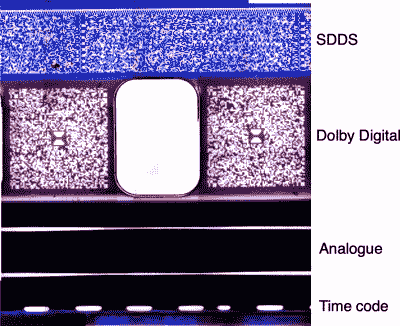

# 杜比数字音效在胶片上是如何工作的？

> 原文：<https://hackaday.com/2022/04/05/how-did-dolby-digital-sound-work-on-film/>

当我们在 2022 年去电影院看电影时，我们看到的不太可能是电影。我们将观看高质量数字投影仪的输出，而不是通过投影仪放映大片透明胶片。电影业在更容易发行和质量稳定方面的优势是显而易见的。在 20 世纪 90 年代的一段时间里，虽然剧院仍然有电影放映机，但数字技术开始取代声音。[纳瓦·怀特福德]发现了一些 20 世纪 90 年代的 35mm 预告片，[分析了其中的杜比数字声音信息](https://everydaything.substack.com/p/35mm-cinema-film-and-digital-audio)。

 这部电影是向后兼容的一次有趣的练习，它用画面之外的每一部分来编码信息。有模拟声道和两种数字格式，但我们感兴趣的是杜比数字包。这些编码为表面上类似于链轮孔之间的 QR 码的图案。

在查看专利时，他发现他们使用了里德-所罗门纠错技术，这使得解码变得相对容易。这项专利令人着迷，因为它详细描述了如何使用 20 世纪 90 年代初的技术读取数据，每一行都由线性 CCD 扫描，然后详细描述了检索音频数据的信号处理步骤。如果你还记得三十年前你第一次体验杜比影院音响，现在你知道这个系统是如何工作的了。

这部电影也有模拟配乐，如果你想知道它们是如何工作的，[我们已经为你准备好了](https://hackaday.com/2014/03/04/retrotechtacular-lighting-the-way-for-talkie-pictures-with-optical-sound-recording/)！