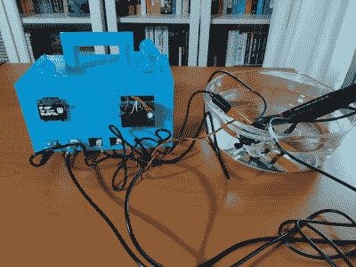

# 使用大量传感器和机器学习来监测水质

> 原文：<https://hackaday.com/2022/04/02/monitoring-water-quality-using-lots-of-sensors-and-machine-learning/>

尽管在过去的一个世纪里取得了巨大的进步，但今天仍有超过 10 亿人无法获得干净的饮用水。地球表面的大部分水都被污染了，但是要区分一条干净的溪流和一条脏的溪流并不容易。用于水分析的专业工具包可能会很昂贵，这就是为什么[kutluhan_aktar]决定设计一种[便携式、联网的水污染监测器](https://hackaday.io/project/184621-gsm-sms-enabled-water-pollution-monitor)。

Calibrating the system using a bowl of clean water.

没有一个单一的参数决定水样的质量，因此污染监测器至少有五个不同的传感器。这些可以确定氧化还原电位(一种化学指示剂)、pH 值(酸度)、总溶解固体(主要是盐)、浊度(悬浮颗粒)和温度。为了将所有这些数字组合成一个简单的“是/可能/否”指标，[kutluhan]用从他家乡周围的大量地方收集的数据训练了一个神经网络。

这个神经网络运行在 Arduino MKR GSM 1400 模块上。虽然不是人工智能应用的典型平台，但由于内乌顿框架，神经网络在其上运行良好，这是一个软件平台，旨在在 Arduino 等微控制器系统上运行机器学习应用。它还有一个 GSM/3G 调制解调器，可以将测得的水质报告给中央数据库。

所有这一切都装在一个 3D 打印的外壳中，使整个设置易于携带和在任何位置操作。在大范围内收集数据应该有助于定位污染源，并有望改善每个人的水质。在 Hackaday，我们喜欢这样的公民科学倡议:以前我们有测量各种事物的项目，如空气质量、T2、海浪和 T3。