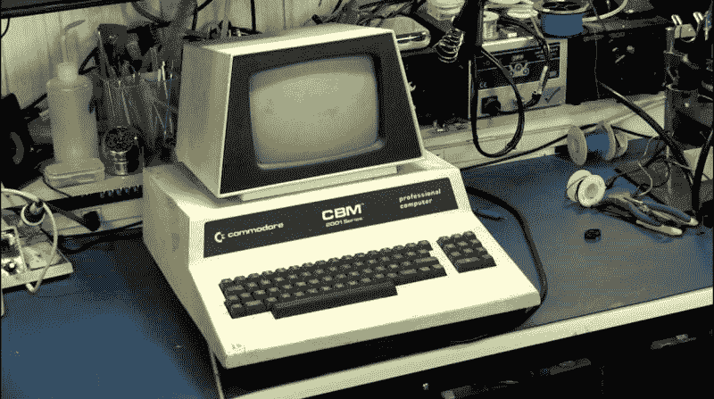
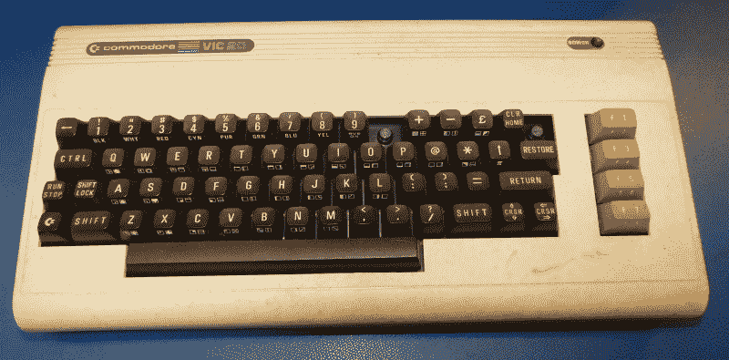
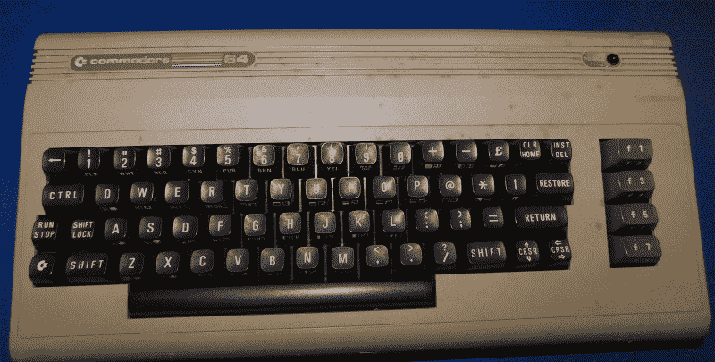
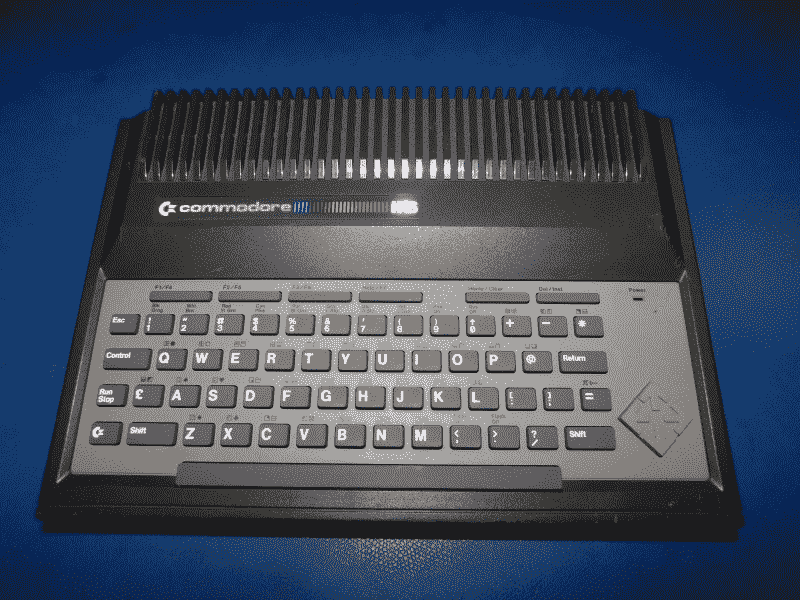
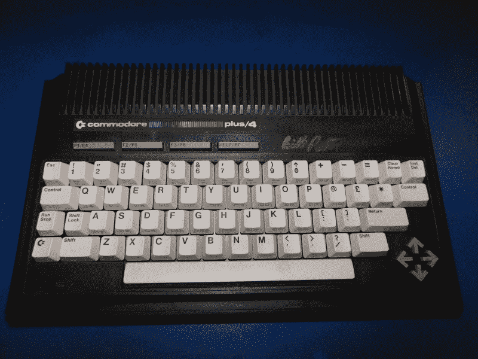
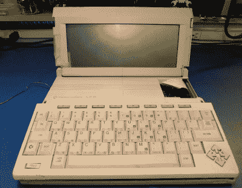
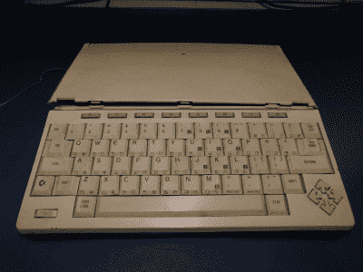
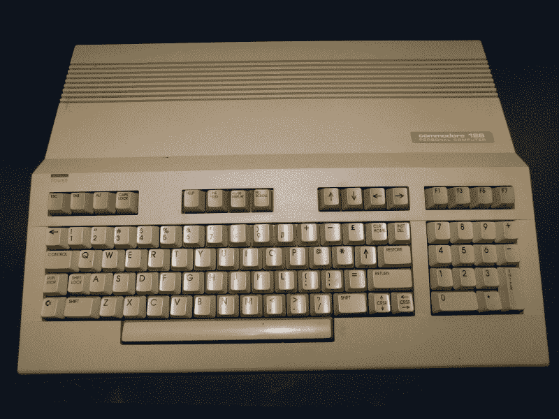
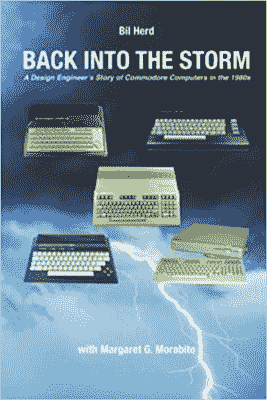

# 准将 C64:40 岁前最受欢迎的家用电脑

> 原文：<https://hackaday.com/2022/04/20/commodore-c64-the-most-popular-home-computer-ever-turns-40/>

今年是有史以来最畅销的家用电脑 Commodore 64 的周年纪念，它于 1982 年首次亮相。注意，我说的是“家用电脑”而不是个人电脑(PC ),因为那时 PC 这个词还没有被家用电脑用户使用。

你们中的一些人可能没有听说过 Commodore，这有点令人难过，尽管有一个简单的原因——Commodore 不再存在，无法维持它的遗产。如果人们观看一部关于上世纪 80 年代的纪录片，他们可能会看到苹果电脑或其创始人的照片，但很可能不会看到 Commodore 电脑的照片，尽管它已售出数千万台。

为了理解 C64 的成功，我首先要回顾一下，谈谈传说中的家用电脑时代，这要从理解当时的微处理器，古老的 6502 开始。查看视频并跟随以下内容。

 [https://www.youtube.com/embed/ktk0z51OzYM?version=3&rel=1&showsearch=0&showinfo=1&iv_load_policy=1&fs=1&hl=en-US&autohide=2&wmode=transparent](https://www.youtube.com/embed/ktk0z51OzYM?version=3&rel=1&showsearch=0&showinfo=1&iv_load_policy=1&fs=1&hl=en-US&autohide=2&wmode=transparent)

## 6502

6502 是 Chuck Peddle 和一个工程师团队的想法，他们是 Bill Mensch、Wil Mathes 和其他人，他们都在摩托罗拉工作——我们称他们为 Motorla Five，尽管他们有 7 个人。Chuck 的团队成功地将被称为主处理器板的全尺寸 PCB 缩小到单个芯片上，现在被称为微处理器，确切地说是 6800。虽然对于你我这样的人来说，这一进化步骤似乎是完整而自然的，但微处理器的存在被认为是对摩托罗拉那些以数万美元而非 6800 预定售价 250 美元的价格出售主处理器板赚钱的人的威胁。佩德尔先生基本上收到了摩托罗拉的“停止和终止”信，停止了 6800 的工作，查克认为这意味着他们放弃了这个项目和它所代表的知识产权。查克和他的公司随后加入了宾夕法尼亚州诺里斯敦的 MOS Technology，随后发布了 6502 微处理器，最初售价为 25 美元，最终不到 1 美元。律师不同意恰克的意见是另一回事。

## 金正日 1 号

KIM-1

6502 是那个时代许多家用电脑的核心，从雅达利、苹果、BBC Micro，当然还有 Commodore。6502 最早的例子之一是被称为 KIM-1 的系统。与普遍的看法相反，KIM-1 不是由 Chuck Peddle 设计的，而是由 John May 领导的 MOS 计算器小组的某个人设计的。当被问及他对计算机的总体贡献时，Peddle 先生的回答是，他对当时的输入/输出(I/O)芯片感到自豪，因为没有 I/O 的计算机只是一个处理器，但增加了 I/O，你就有了终端、收银机、打印机等。

70 年代末，我在一家名为 Pennsylvania Scale Company 的公司担任年轻的工作台技术员时，开始接触 6502，从事处理器控制仪器的开发，这在当时是一个相当新兴的领域。事实证明，我对微处理器如何“思考”有着浓厚的兴趣，在我申请 Commodore 的工作时，我已经晋升为硬件设计工程师，公平地说，如果没有 6502 的存在，我就不会有电子行业的职业生涯。

在此期间的某个时候，Commodore 在其创始人 Jack Tramiel 的领导下，收购了 MOS technologies，成为一家拥有芯片制造厂(简称芯片厂)的计算机公司。虽然收购芯片厂最初是着眼于计算器市场，但 Commodore 发现自己是一家可以制造自己的(定制)集成电路或芯片的计算机公司。这将改变未来家用电脑的设计方式。

## 正电子发射计算机断层扫描（Positron Emission Computed Tomography）

查克的下一个努力集中在被统称为 PET 的计算机系列上。查克曾告诉过我，在他的脑海中，PET 代表着什么，但后来我忘记了几种解释中哪一种是正确的。宠物电脑有一个内置的键盘和显示器，这在当时很重要，因为可用的显示器很少。这种宠物在商业、学术和工业用途中找到了一个家，因此在我的书中它是“家用电脑”的前身。

Commodore PET. Computer courtesy of [Bill Taylor]

## 受害者芯片

与此同时，一位以设计只读存储器(ROM)而闻名的芯片设计师 Albert Charpentier 将设计一种新的视频接口芯片作为他的目标，这种芯片由于可以产生颜色和运动而使计算机令人兴奋。为了证明这种芯片在 20 世纪 70 年代是可行的，艾伯特设计了一个 PCB 来制作新的视频控制器 IC 的原型，这种芯片后来被称为 VIC-1 芯片。这种芯片是专门设计来与 6502 处理器集成的，并与地址/数据总线和控制信号紧密集成。故事发生在晚上 11 点，突然彩色显示器开始工作，VIC 芯片的遗产开始了。

## 维克 20

有一次，为了展示芯片的能力，围绕着 VIC 芯片建立了一个系统，这个系统是由 Charpentier 和一位名叫鲍勃·张晞彤的年轻芯片设计师设计的，他后来设计了流行的 SID 芯片——稍后将详细介绍。然后，谈话转向将该系统作为一种新的计算机产品进行销售。一位名叫鲍勃·拉塞尔的相对年轻的程序员说服了老板杰克·特拉梅尔，如果准将要出售一台基于 VIC 芯片的计算机，它应该是一台“真正的”计算机，该项目被转移到查克·佩德尔的小组，他们有设计和生产宠物的经验。最终，这台计算机被称为 VIC-20，由一位名叫比尔·塞勒的工程师设计，软件代码由约翰·费甘斯和鲍勃·拉塞尔编写。

VIC-20

VIC-20 是 Commodore 的“TI 黑仔”,因为它瞄准了德州仪器 TI-99 计算机系统销售的同一空间。VIC-20 有 4-5kb 的随机存取存储器，16 kB 的只读存储器，并在 VIC 芯片中内置了三个声音发生器。

正是在这一时期，Commodore 开始发挥其海外制造能力，这将使其与其他家用电脑公司区分开来。

接下来，Albert Charpentier 将目光投向了 VIC 芯片的新版本，这一次包含了业内称为“精灵”的可移动对象块。这些是预定义的图形块，可以通过简单地改变指针来移动，而不是不断地使用处理器在屏幕上移动对象。精灵还能够让处理器知道它们何时相互碰撞，这是游戏时的一个重要方面，从而进一步释放处理器。

在幕后，Albert 已经教会了 VIC 芯片以某种方式与 6502 处理器共享主内存总线，以便及时利用未使用的窗口来完成大多数图形:它以多路复用的方式“共享”内存总线。依我拙见，做多路复用的决定是明智的，并且将成为大多数 Commodore 计算机的特征，包括 Amiga 系列计算机。

## 希德和 C64

SID 芯片包括包络发生器、振荡器和滤波器等功能，这些都是当时音乐合成器的组成部分。

就像之前的 VIC-20 一样，这些惊人的芯片被组合成一个演示，并展示给杰克·特拉梅尔，然后决定生产 C64 准将。C64 在吉尼斯世界纪录中被列为最受欢迎的家用电脑，销量达到 2700 万台。从那以后，对序列号的一些分析表明，实际上售出的数量更少，但毫无疑问，它远远超过了竞争对手。

C64 成为 Commodore 的“苹果黑仔”,因为它的目标是与 Apple II 共享市场。C64 的价格从 595 美元开始，降低到 299 美元，最后降低到 199 美元，当时竞争成本超过 1000 美元。在此期间，Commodore 的创始人杰克·特拉梅尔(Jack Tramiel)发表了一句名言:我们制造“面向大众而非阶级的计算机”，强调以合理的价格销售硬件，这将为大规模软件销售打开大门。

 

C64 承蒙【吉姆大脑】

C64 成功后，特拉梅尔将目光投向了小型企业市场和目前由 Timex Sinclair 系列电脑占据的极低成本市场。这导致了 TED 系列电脑的出现，TED 代表文本显示。TED 系列从一家三款开始；C116、C264 和 C364V。

## C116

C116 是我第一次接触 Commodore 的内部运作，当时我是一名年轻、热情的设计工程师，受雇于 MOS Technologies/Commodore Business Machines。我的老板 Shiraz Shivji 向我展示了天美时 Sinclair 制造的色谱计算机，并说这就是我们要找的东西。

 

C116 由【Rob Clarke】

提供，现在感觉就像一眨眼的功夫，我们已经生产出了下图所示的 C116，它以单芯片为中心，或者说是我们所能得到的最接近单芯片的计算机。除了 6502 的定制版本之外，中央芯片是 TED 芯片，它产生 121 种颜色——实际上它产生 128 种颜色，但有 8 种黑色——和单个芯片中的声音。C116 有 16 kB 的 DRAM，是当时全新的 16kb x4(64kb)DRAM，装在由 Ira Velinski 设计的漂亮盒子里。C116 的设计售价为 49 美元。

## C264/C364V

接下来是 C264 计算机，一台 64 kB 字节的计算机，有着同样的 121 种颜色和简单的声音。这款电脑远不如 C64 具有交互性，因为它缺少精灵和专用的 SID 声音芯片，但我们的态度是，想要一台游戏机的人应该“买一台 C64”。这意味着是一个专用的文本和静态彩色机器的业务。我们开发了新的打印机、磁盘驱动器和显示器来充实这个家庭。C264 的设计售价为 79 美元。

TED 系列的最后一款是 C364V，其中“V”代表语音。准将已经获得了一些创造突破性的 TI Speak-and-Spell 的才能。凭借在语音交互市场上的优势，Commodore 准备推出“会说话的魔法桌”，这是一种桌面主题，在 1984 年非常具有侵略性。

我们在 1984 年的 CES 展会上展示了整套“TED”电脑和外围设备。在离开节目之前，我们开始听到传言说，准将的创始人杰克·特拉米尔已经辞职，我们很遗憾地发现这是真的。

 

Plus/4 承蒙【比尔·佩尔顿】

TED 系列将因此被砍掉，因为 C116、C364V 和所有外设都被取消了。C264 将增加内置软件，并被重新命名为“PLUS/4 ”,这并没有让我们中的任何人感到兴奋。延迟*确实*给了我们时间来构建一个真正的 UART (MOS 6551 ),它增强了它的文本功能，但最终该产品作为一个独立的计算机而不是一个功能和外设家族表现不佳。

TED 项目的一个积极方面是，Commodore 最终制造出了一款售价 79 美元的电脑，名为 C16。我们仍然听到在欧洲长大的人说他们的第一台电脑是 C16。

TED 的硬件是由我和戴夫·海尼完成的——当我到达那里时，设计已经完成了——软件是由弗雷德·鲍文、特里·瑞安和约翰·库珀完成的，如 TED 复活节彩蛋所示。

## Commodore LCD

随着 TED 系列的工程进展，我们开始认真研究我们的下一台电脑，Commodore LCD。Commodore 没有闲着，收购了一家名为 Eagle Pitcher 的 LCD 组件制造商，并成为唯一一家能够生产的美国公司。我们做了基于中央内存管理单元(MMU)的 LCD 的初始架构，因为我们试图通过一些内存管理技巧来加速当时的 6502。最终，我们将硬件工作移交给了杰夫·波特和伊恩·科奇曼，软件工作由赫德利·戴维斯、安迪·芬科和卡里奥林·舍普纳完成。LCD 系统被定为 Commodore 产品线的下一个进化步骤，但遗憾的是，它被取代杰克·特拉梅尔的人取消了。

Commodore LCD

Commodore LCD

最后，我们听说 16/32 位 Amiga 计算机是 8 位时代的终结，Commodore 最近收购了一批前 Atari 工程师，他们设计了下一代 coin op 视频游戏，Commodore 准备将其转变为商业机器。只有一个问题，阿米加至少一年内不会完工。

## C128

一群工程师聚在一起，决定我们可以在 Amiga 完全成功之前的可用时间内制造出最终的 8 位计算机。我们所有人都从经验中知道，一台需要全新软件的电脑是不可能成功的，至少没有上层管理人员的承诺是不可能成功的，而现在特拉梅尔走了，上层管理人员似乎也不在了。

C128

Back Into the Storm – A Design Engineer’s Story of Commodore Computers in the 1980s

包括 C64 兼容模式对美国工程师来说是有意义的，因为 C128 这个名字反映了拥有 C64 两倍的内存。(C128 的设计支持总共 512 kB 的内存，但那是另一回事了。)设计基本完成，并且向管理层展示了运行 C64 游戏的工作示例，这引起了所述管理层的共鸣，他们渴望流行的 C64 大卖的日子。

C128 开发的整个故事可以在《回到风暴:一个设计工程师在 20 世纪 80 年代的 Commodore 计算机的故事》一书中找到但是在它完成之前，我们会有两个微处理器，外加一个 Z80，以及三个操作系统和同时的 40 列和 80 列输出。它的设计售价为 199 美元，但可能更经常以 299 美元出售。硬件由 Bil Herd、Dave Haynie 和 Frank Palaia 完成，软件由 Fred Bowen、Terry Ryan 和 Von Ertwine 完成。

## 老式电脑节

如果你不能获得足够的 8 位计算能力，将于本周末在新泽西州沃尔举行的[老式计算机节](https://hackaday.com/2022/04/18/vintage-computer-festival-east-is-this-weekend/)上庆祝今年 C64 的周年纪念日。艾伯特·查彭迪埃、戴夫·海尼、鲍勃·拉塞尔、安迪·芬科、赫德利·戴维斯、我自己以及其他人都将出席。