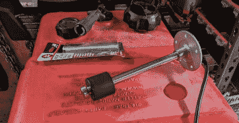

# 真的，把一个燃料传感器黑进一个便携式油箱

> 原文：<https://hackaday.com/2022/04/06/hacking-a-fuel-sensor-into-a-portable-tank-literally/>

定期阅读 Hackaday 的读者会知道，我们的专题项目通常都是高科技类型的。微控制器、3D 打印部件、嵌入式 Linux、许多电线，诸如此类的东西。但这并不是说，我们不欣赏更多的内在构建；毕竟，黑客是创造性地解决问题和跳出框框思考的，这并不局限于修复实际上有多复杂。

以[R. Preston McAfee]最近发给我们的这个快速破解为例。为了寻找一种方法来检查他的舷外发动机的小型便携式油箱中还剩多少燃料，而不用爬回去查看，[他决定给它安装一个发送单元](https://mcafee.cc/Bin/FuelGauge/)。虽然它们在技术上是为永久安装在船体中的较大水箱设计的，但他认为只要可以安全安装，浮子传感器就不会妨碍它在他的箱子中工作。

 为此，【普雷斯顿】开始在坦克最厚的地方钻一个 38 毫米(1.5 英寸)的洞，并用砂纸打磨开口周围的区域，使之平滑。然后，他测量了该处水箱的深度，并订购了一个大小合适的浮子传感器。他钻了五个安装螺栓的孔，并通过更大的整体插入它们，这样它们的头就会在水箱内。通过用一对虎钳夹住暴露的螺纹，他能够向下转动每个螺栓上的螺母，以形成对垫圈的紧密密封，尽管应该注意到，对螺纹造成的损坏可能会使将来难以移除螺母。

诚然，这是一个非常简单的修复，但它是经过深思熟虑的，我们感谢[普雷斯顿]为记录整个过程所做的努力。[我们当然已经介绍了更详细的方法来查看油箱里还剩下什么](https://hackaday.com/2019/04/30/teardown-refuel-propane-tank-monitor/)，但是仅仅因为一个解决方案更炫并不意味着它一定更好。