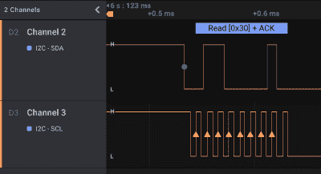

# 一堆木板组成了 I2C 的游乐场

> 原文：<https://hackaday.com/2022/04/06/a-gaggle-of-boards-makes-for-an-i2c-playground/>

不难假设大多数 Hackaday 读者至少熟悉 I2C。事实上，任何曾经使用 Arduino 而不是闪烁板载 LED 的人都很有可能曾经使用串行通信协议与传感器、显示器或其他外部设备进行通信。当然，仅仅因为我们大多数人在一些项目中使用过它，并不意味着我们真正理解了它。

如果你想重温一下你的 I2C 知识，你最好还是按照安德拉什·特维斯最近写的指南去做。有了像*硬件黑客 101: E01 I2C 嗅探，如何收听你的 Arduino 的 I2C 总线*这样的标题，你就知道你会过得很好。虽然可以说该文档更适合于安全研究人员而不是电子爱好者，但其中介绍的概念可能非常有用，即使您只是想调试自己的项目。

 虽然你当然可以调整硬件来适应你在零件箱中找到的任何东西，但设置[András] details 使用 BeagleBone Black 作为主设备，通过 I2C 与 Adafruit 小饰品和 Arduino 通信。他为所有三个设备提供代码，当一切正常运行时，微控制器将及时闪烁 led，信号由 BeagleBone 通过总线发出。

这本身就有教育价值。当然，我们大多数人都用过交钥匙 I2C 设备，但是有多少人真的做过呢？但除此之外，它还为您提供了一个简单且用户可控的总线。[András]连接一个 Saleae 逻辑分析仪(不要担心，你在易贝买到的 10 美元的也能工作)并研究它们通过电线传输的实际消息。如果您曾经想仔细研究这个无处不在的协议的具体细节，这是一个很好的入门方式。在这个问题上，一定要看看我们自己的[【埃利奥特·威廉姆斯】在 2016 年](https://hackaday.com/2016/07/19/what-could-go-wrong-i2c-edition/)写的优秀指南。

【感谢 zh4ck 的提示。]