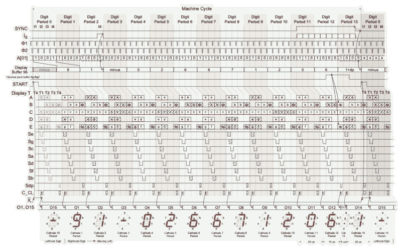

# Remoticon 2021 // Rob Weinstein 从专利开始制造 HP-35

> 原文：<https://hackaday.com/2022/04/07/remoticon-2021-rob-weinstein-builds-an-hp-35-from-the-patent-up/>

50 年前，惠普公司推出了第一台手持科学计算器 HP-35。这是相当大的工程壮举，因为当时同等的机器是笨重的桌面事务，如果不是机架安装的话。[Rob Weinstein]长期以来一直是惠普计算器的粉丝，多年来一直使用 HP-41C，直到它磨损。从那以后，他逐渐对这些旧计算器产生了好奇心，并对它们的工作原理产生了兴趣。他越读越入迷。[Rob]最终决定开始为期三年的逆向工程之旅，最终在一个与 1972 年的原始设计完全相同的原型机(尽管不是很袖珍)上重建原始设计。在这次演讲中，他带领我们回顾了计算器设计的历史，以及他在理解并最终使用现代 FPGAs 复制计算器方面所做的努力。

惠普专利([美国专利 4，001，569 )](https://patents.google.com/patent/US4001569A/en) 包含了计算器几乎每个方面的极其详细的解释。设计中有许多新颖的概念，[Rob]在他的演示中深入探讨了其中的两个概念。早期的 LED 设备消耗电池，惠普工程师想出了一个聪明的解决方案。在一个由多路开关组成的复杂管弦乐队中，它们通过电感器和 LED 段控制电流，临时存储能量，并消除了对低效降压电阻的需求。但更复杂的是计算器的串行处理器架构。当惠普开始这项设计时，第一个微处理器还不可用，所以整个处理器是在门级完成的。一切都在 56 位寄存器上运行，这些寄存器在循环移位寄存器中不断循环。[Rob]在这方面确实做了功课，非常深入地仔细研究了设计的每个部分，在可能的情况下利用旧文档和书籍，在没有的情况下制作自己的材料。例如，在搞清楚所有事情的过程中，[Rob]除了专利中的那些之外，还准备了 338 页的时序图。

LED Driver Timing Chart

一个被称为“微程序控制器”的部分在专利中只是一个黑匣子。这是系统的核心，对计算器的运行至关重要。然而，所有其他与控制器对话的部分在专利中描述得非常清楚，以至于[Rob]能够收回这些细节。控制器和计算器的所有部分都在 Verilog 中实现，并在他为测试每个模块而构建的仪器化工作台上进行了测试。

一旦模拟中的一切工作正常，[Rob]就开始构建一个工作模型。使用 TInyFPGA 模型，每个定制芯片一个。对最初的设计做了一些可以理解的改动。一块 18650 锂离子电池为电路板供电，由一个现代电池充电控制器保持充电。电路板比原来的更大，是的，他在通电电路中使用了黑客必须使用的 555 芯片。在这个[简短的演示视频](https://vimeo.com/648116637)中，您可以看到最终的原型正与原始的 HP-35 一起通过用户手册中的示例进行测试。

这是一个令人难以置信的研究和全面记录的项目。[Rob]已经将该设计开源，并在[项目的 GitLab 库](https://gitlab.com/robweinstein/patently-obvious)上共享。[Rob]为 Remoticon 制作的[幻灯片不仅对项目进行了很好的概述，还包含了一些很好的参考资料。很明显，他对这些旧计算器有着真正的热情，并在探索 HP-35 方面做了出色的工作。但是即使过了三年，还会有更多。他正在考虑制作一个 PCB 版本，使用独立逻辑门的分立实现可能正在进行中。](https://hackaday.com/wp-content/uploads/2022/04/rob-weinstein-hp35-remoticon-2021-v3.pptx)

在之前，我们写过 HP-35 的[历史。如果你喜欢破解这些旧计算器，看看我们对辛克莱科学计算器](https://hackaday.com/2018/05/13/shirt-pocket-slide-rule-history-of-the-hp-35/)的类似探索[的报道。](https://hackaday.com/2013/08/30/ken-shirriff-completely-reverse-engineers-the-1974-sinclair-scientific-calculator/)

 [https://www.youtube.com/embed/IZKi4_BScqc?version=3&rel=1&showsearch=0&showinfo=1&iv_load_policy=1&fs=1&hl=en-US&autohide=2&wmode=transparent](https://www.youtube.com/embed/IZKi4_BScqc?version=3&rel=1&showsearch=0&showinfo=1&iv_load_policy=1&fs=1&hl=en-US&autohide=2&wmode=transparent)

